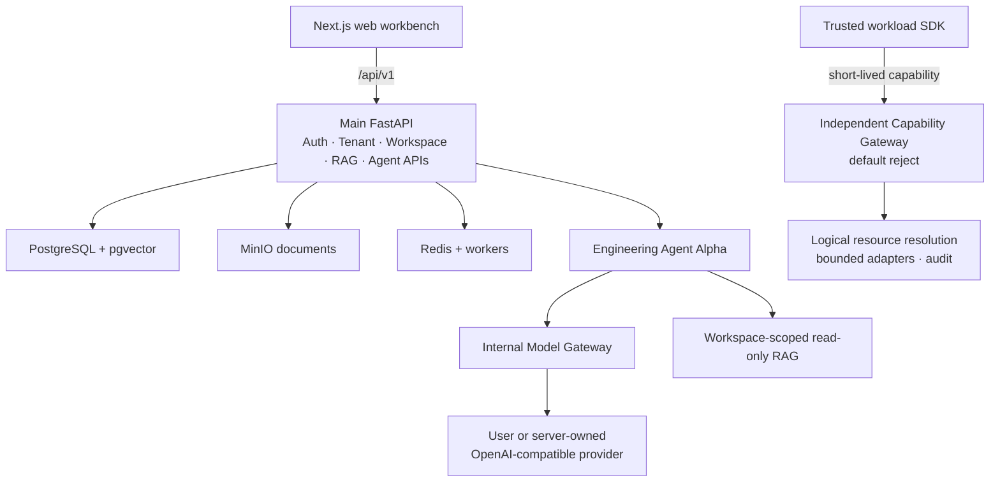

<div align="center">
  <picture>
    <source media="(prefers-color-scheme: dark)" srcset="frontend/public/brand/omnibase-mark-white.svg">
    <source media="(prefers-color-scheme: light)" srcset="frontend/public/brand/omnibase-mark.svg">
    
  </picture>

# OmniBase

**Your self-hosted AI workspace for knowledge, models, and user-built agents.**

Bring documents, structured data, OpenAI-compatible providers, and purpose-built AI employees into one controlled workspace—without turning a browser session into unrestricted infrastructure access.

[English](README.md) · [简体中文](README.zh-CN.md)

[](docs/handover-report.md)
[](https://github.com/lss100200/omnibase/actions/workflows/infrastructure-gates.yml)
[](backend/src/omnibase/migrations/versions/0012_user_profiles_provider_credentials.py)
[](LICENSE)

[Public website](https://omnibase.chat/public-preview) · [Quick start](#quick-start) · [Build your first agent](#build-your-first-agent) · [Architecture](#architecture) · [Safety boundaries](#safety-boundaries)

</div>

> [!IMPORTANT]
> OmniBase is an open-source **Public Preview**, not a production Agent Runtime admission. The repository includes a usable self-hosted product slice and multiple engineering-sealed control-plane components, but the three Phase 5 production Feature Gates remain off. Production multi-Agent orchestration, hostile-code execution, and the complete P34.7 production composition are still `blocked/not_proven`.

## Start with an AI workspace—not an infrastructure dashboard

OmniBase is designed around three connected jobs:

1. **AI workbench** — ask questions, stream answers, inspect citations, and keep model identity and usage visible.
2. **Knowledge and data workspace** — organize documents, RAG indexes, Workspace membership, controlled resources, and durable metadata on PostgreSQL + pgvector.
3. **Agent builder** — create a sealed, low-risk AI employee with a role, instructions, response style, model-provider policy, and read-only Workspace knowledge scope.

The product is deliberately fail-closed: browser identity is not runtime authority, logical resource IDs are not physical database locators, and a normal Docker or WSL container is not treated as a secure hostile-code sandbox.

## What is available today

| Area | Current state | What it means |
|---|---|---|
| Core workspace | **Available in Public Preview** | Authentication, live tenant/user checks, Workspaces, membership and lifecycle metadata, documents, hybrid RAG, citations, and the monochrome web workbench are in the public source tree. |
| User settings | **Available in Public Preview** | Real user profile/preferences plus encrypted, user-owned OpenAI-compatible provider credentials and bounded connection tests. Provider secrets are never returned by browser DTOs. |
| Agent Builder | **Engineering preview** | Users can create an owned AgentDefinition, seal version `1.0.0`, optionally install it into a Workspace, and use the existing tool-free Agent Alpha workbench. |
| Agent Alpha | **Engineering-only, default off** | A single Agent can use the internal Model Gateway and read-only Workspace-derived RAG. It has durable task/run bookkeeping, SSE streaming, cancellation, citations, model identity, usage, and latency. |
| Capability platform | **Engineering-sealed, production default reject** | Capability Gateway, Workspace/Run/Node control records, fencing, independent Linux Runner evidence, PrivateNetwork Broker, Headscale adapter, and split-process mTLS Gateway have engineering Gates. They are not a complete production composition. |
| Skills | **Compile-only contract** | P5.6A validates first-party, exact-version Skill manifests. Skill persistence, installation, execution, MCP, and Marketplace remain disabled. |
| Planner / multi-Agent / hostile code | **Blocked / roadmap** | Planner execution, multi-Agent scheduling, arbitrary shell/SQL/HTTP tools, MCP Runtime, and hostile-code Sandbox activation are not authorized. |

For the exact source/evidence boundary, read [the handover report](docs/handover-report.md) and [security invariants](docs/maintainers/security-invariants.md).

## Build your first agent

Once the local stack is running:

1. Open `http://localhost:3000` and register or sign in.
2. Open **Spaces** and create or select a Workspace.
3. Open **Settings → Model Providers**, add an OpenAI-compatible endpoint and API key, test it, then make it the default provider.
4. Open **Agents → New employee** and define the name, role, responsibilities, instructions, response style, token budget, and deadline.
5. Install/select the new Agent in the Workspace and ask a question. The workbench streams the response and shows citations, actual model identity, usage, latency, and durable task state.

The current builder intentionally creates a low-risk, tool-free Agent:

```text
Workspace read-only knowledge
No shell
No SQL
No arbitrary HTTP
No MCP or Skill execution
No Planner or multi-Agent delegation
No hostile-code Sandbox
```

## Quick start

### Requirements

- Git
- Docker Desktop or Docker Engine with Compose v2
- About 8 GB RAM minimum for the core stack; more memory is recommended for local embedding/reranking workloads
- `make` is optional; native PowerShell and shell commands are documented below

### 1. Clone the repository

```bash
git clone https://github.com/lss100200/omnibase.git
cd omnibase
```

### 2. Create a local configuration

Windows PowerShell:

```powershell
Copy-Item .env.example .env
```

macOS / Linux / Git Bash:

```bash
cp .env.example .env
```

Keep `.env` local. Never commit API keys, JWT secrets, cookies, private keys, or provider credentials.

For the engineering Agent workbench, edit the local `.env` and set only the dedicated engineering flag:

```env
ENV=development
AGENT_ALPHA_ENGINEERING_ENABLED=true

# These production Feature Gates must remain off.
AGENT_RUNTIME_ENABLED=false
AGENT_PLANNER_ENABLED=false
MULTI_AGENT_ENABLED=false
```

Provider API keys can then be added through **Settings → Model Providers**. A server-level `LLM_API_KEY` is optional and should only be stored in the local `.env`, never in Git.

### 3. Start and migrate

Cross-platform Docker Compose:

```bash
docker compose --env-file .env up -d --build
docker compose --env-file .env exec -T backend alembic upgrade head
docker compose --env-file .env ps
```

Or, if `make` is available:

```bash
make up COMPOSE_ENV_FILE=.env
make migrate COMPOSE_ENV_FILE=.env
make ps COMPOSE_ENV_FILE=.env
```

### 4. Open OmniBase

| Surface | URL |
|---|---|
| Web workbench | <http://localhost:3000> |
| Backend API docs | <http://localhost:8000/docs> |
| Backend health probe | <http://localhost:8000/health> |
| MinIO console | <http://localhost:9001> |

The operator-hosted public website is [omnibase.chat/public-preview](https://omnibase.chat/public-preview). Its availability depends on the current preview host and Cloudflare tunnel; it is not a high-availability hosted service.

### 5. Troubleshoot

```bash
docker compose --env-file .env ps
docker compose --env-file .env logs --tail 200 backend
docker compose --env-file .env logs --tail 200 frontend
```

Common first-run checks:

- `backend` or `frontend` still starting: wait for image build and dependency health checks.
- Login/API returns 500: confirm migration `0012` is applied and inspect backend logs.
- Agent surface is unavailable: confirm `ENV=development`, `AGENT_ALPHA_ENGINEERING_ENABLED=true`, all three production gates are false, and a tested default provider exists.
- First RAG query is slow: CPU reranker cold start can take minutes; subsequent queries are normally faster.

## Architecture



The browser API and Capability Gateway are separate ASGI applications. The Gateway is not silently mounted into the browser application and rejects workloads until trusted verification and adapter wiring are injected.

## Safety boundaries

OmniBase treats these boundaries as product behavior, not optional hardening:

- Protected browser requests revalidate the live tenant, live user, role, and tenant schema.
- Public DTOs use logical identifiers; physical PostgreSQL schema/table/column locators remain server-owned.
- High-risk approval, idempotency, audit, capability, and mutation lifecycles remain transactionally bound.
- Audit records are append-only, with database enforcement introduced by migration `0006`.
- A normal Docker/WSL host is not authorized to run hostile code.
- A Sandbox or Runner must never connect directly to PostgreSQL, Redis, or MinIO.
- P34.5 engineering Gates do not prove the complete production Core→Runner/Broker/Gateway/Overlay composition.
- The three Phase 5 production Feature Gates remain `false`; production Runtime activation requires a separate explicit admission.
- Migration head is `0012`; migration `0013` is not part of the current public product.

Security issues should be reported through [SECURITY.md](SECURITY.md), not a public issue.

## Roadmap

| Stage | Status |
|---|---|
| Foundation, authentication, tenant isolation, documents, RAG | **Available** |
| Controlled data and Capability Gateway | **Available / engineering-sealed by boundary** |
| Workspace governance, lifecycle, lease/fencing, Node metadata | **Available** |
| Hardened Runner/Broker/Gateway/Overlay components | **Engineering-sealed; production composition blocked** |
| User profile, personal provider, first Workspace and Agent Builder | **Engineering product preview** |
| Tool-free single-Agent Alpha | **Engineering-only; default off** |
| Planner execution and multi-Agent orchestration | **Blocked / roadmap** |
| First-party Skill contract | **Compile-only engineering admission** |
| Skill Runtime, MCP and third-party Marketplace | **Roadmap** |
| Production hostile-code Sandbox and P34.7 admission | **Blocked/not_proven** |

## Development

Every repository-root Compose command must use an explicit environment file. The safe configuration-shape default is `.env.example`; use `.env` only when local credentials are intentionally required.

```bash
# Safe configuration/health diagnostics
docker compose --env-file .env.example config --quiet
docker compose --env-file .env.example ps

# Local product stack with intentional local configuration
docker compose --env-file .env up -d --build
docker compose --env-file .env exec -T backend alembic upgrade head

# Tests and static checks
docker compose --env-file .env.example exec -T backend pytest -m "not integration" -q
docker compose --env-file .env.example exec -T backend mypy src
docker compose --env-file .env.example exec -T frontend pnpm test
docker compose --env-file .env.example exec -T frontend pnpm typecheck
docker compose --env-file .env.example exec -T frontend pnpm lint
```

Before changing authentication, tenancy, migrations, P34, Agent contracts, SDKs, or recovery tooling, follow the repository maintenance order:

1. [AGENTS.md](AGENTS.md)
2. [Machine-readable maintenance map](docs/maintainers/maintenance-map.json)
3. [Security invariants](docs/maintainers/security-invariants.md)
4. [AI maintainer map](docs/maintainers/ai-maintainer-map.md)
5. [Current handover and evidence](docs/handover-report.md)

## Contributing

Documentation, onboarding improvements, focused tests, and small boundary-preserving fixes are welcome. Changes involving authentication, tenancy, migrations, Capability Gateway, Sandbox, Agent execution, provider credentials, or recovery require the verification commands and invariant updates listed in the maintenance map.

Read [CONTRIBUTING.md](CONTRIBUTING.md) before opening a pull request.

## License

[Apache License 2.0](LICENSE) © 2026 OmniBase Contributors.
