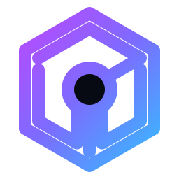
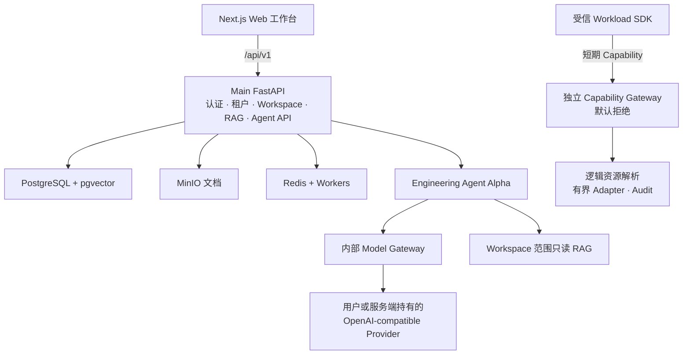

<div align="center">
  <picture>
    <source media="(prefers-color-scheme: dark)" srcset="frontend/public/brand/omnibase-mark-white.svg">
    <source media="(prefers-color-scheme: light)" srcset="frontend/public/brand/omnibase-mark.svg">
    
  </picture>

# OmniBase

**面向文件、模型、Skills 与可审计 Agent 工作的自托管个人 AI 工程工作台。**

把文档、结构化数据、OpenAI-compatible Provider 和用户创建的 AI 员工放进同一个受控 Workspace，同时避免把一次浏览器登录变成无限制的基础设施权限。

[English](README.md) · [简体中文](README.zh-CN.md)

[](docs/handover-report.md)
[](https://github.com/lss100200/omnibase/actions/workflows/infrastructure-gates.yml)
[](backend/src/omnibase/migrations/versions/0016_p6_0_workspace_agent_model_overrides.py)
[](LICENSE)

[公网预览](https://omnibase.chat/public-preview) · [快速开始](#快速开始) · [创建第一个-agent](#创建第一个-agent) · [产品方向](#产品方向) · [社区](COMMUNITY.md) · [安全边界](#安全边界)

</div>

> [!IMPORTANT]
> OmniBase 当前是聚焦完整个人版的开源 **Public Preview**：一个 Owner、一个默认活动的父 Agent、九个只有在明确 `@` 提及时才唤醒的专家、个人模型 Provider、文件上下文、会话连续性、第一方 Skills 与可审查改动。它不是 production Agent Runtime 的正式准入；Runtime、Planner、Multi-Agent 和 MCP Runtime Gate 仍关闭，企业 P34.7 轨道作为独立资产继续冻结保存。

## 首先是 AI 工作台，而不是基础设施看板

OmniBase 围绕三个连续任务设计：

1. **AI 工作台**：提问、查看流式回答、引用、实际模型身份、Token 用量和延迟。
2. **知识与数据工作区**：以 PostgreSQL + pgvector 组织文档、RAG 索引、Workspace 成员、受控资源和持久元数据。
3. **Agent Builder**：创建带有角色、指令、回答风格、Provider 策略和 Workspace 只读知识范围的封存 AI 员工。

系统默认 fail-closed：浏览器身份不等于 Runtime 权限，逻辑资源 ID 不等于物理数据库定位符，普通 Docker/WSL 容器也不等于可以安全运行敌对代码的沙箱。

## 当前可以使用什么

| 范围                          | 当前状态                       | 含义                                                                                                                                                                                                                                                                                   |
| ----------------------------- | ------------------------------ | -------------------------------------------------------------------------------------------------------------------------------------------------------------------------------------------------------------------------------------------------------------------------------------- |
| 核心工作区                    | **Public Preview 可用**        | 认证、实时租户/用户校验、Workspace、成员和生命周期元数据、文档、混合 RAG、引用和黑白工作台已经进入公开源码。                                                                                                                                                                           |
| 用户设置                      | **Public Preview 可用**        | 真实用户资料/偏好、用户自有 OpenAI-compatible Provider 凭据和有界连接测试。Browser DTO 不返回 Provider 密钥。                                                                                                                                                                          |
| Agent Builder                 | **Engineering Preview**        | 用户可以创建自有 AgentDefinition、封存 `1.0.0` Version、选择性安装到 Workspace，并进入现有 tool-free Agent Alpha 工作台。                                                                                                                                                              |
| Agent Alpha                   | **Engineering-only，默认关闭** | 单 Agent 可使用内部 Model Gateway 和 Workspace 范围的只读 derived RAG；支持持久 Task/Run 记录、SSE、取消、引用、模型身份、用量和延迟。                                                                                                                                                 |
| 个人工程工作台                | **Engineering Preview**        | Owner 授权文件树、有限会话连续性、一个父 Agent 加九名静默专家、逐角色模型设置、ChangeSet 审查、精确回滚预检与浏览器本地恢复日志。                                                                                                                                                      |
| Capability 平台               | **工程封板，生产默认拒绝**     | Capability Gateway、Workspace/Run/Node 元数据、fencing、独立 Linux Runner、PrivateNetwork Broker、Headscale Adapter 和 split-process mTLS Gateway 已有工程 Gate。P34.7 Trust Policy Candidate R0 已能校验候选治理、生命周期、密钥轮换/吊销、制品覆盖和评审人隔离，但不会批准生产策略。 |
| 原生 Skills                   | **Engineering Preview**        | 十五个 source-owned、第一方、instruction-only Skills 可由个人 Owner 查看、安装、解析和停用；它们没有工具、网络、秘密或 Capability 扩张，本机第三方候选仍只扫描不安装。                                                                                                                 |
| 只读 MCP                      | **独立 Engineering Preview**   | 六个有界本地工具覆盖文件列举/读取/摘要、字面量文本搜索、Git status/log 与 diff 元数据。stdio server 需手工单独启动，不接 Agent Alpha，`MCP_RUNTIME_ENABLED` 保持 false。                                                                                                               |
| Windows Companion             | **未签名 Engineering Preview** | 自包含 `win-x64` CLI 可验证和安装 canonical release archive、生成不回显秘密的本地配置、报告推荐安装位置并进行离线诊断；不会修改 Docker、WSL、VHDX 或系统服务。                                                                                                                         |
| Planner / 多 Agent / 敌对代码 | **阻断 / 路线图**              | Planner 执行、多 Agent 调度、任意 shell/SQL/HTTP、MCP Runtime 和敌对代码 Sandbox 尚未授权。                                                                                                                                                                                            |

准确源码与证据边界见 [交接报告](docs/handover-report.md) 和 [安全不变量](docs/maintainers/security-invariants.md)。

## 创建第一个 Agent

本地服务启动后：

1. 打开 `http://localhost:3000`，注册或登录。
2. 打开 **Spaces**，创建或选择 Workspace。
3. 打开 **Settings → Model Providers**，添加 OpenAI-compatible 地址和 API Key，完成连接测试并设为默认 Provider。
4. 打开 **Agents → New employee**，设置名称、角色、职责、系统指令、回答风格、Token 预算和 deadline。
5. 在 Workspace 中安装/选择新 Agent 并开始提问。工作台会显示流式回答、引用、实际模型身份、用量、延迟和持久任务状态。

当前 Builder 只创建低风险、无工具 Agent：

```text
Workspace 只读知识
无 shell
无 SQL
无任意 HTTP
第一方 instruction-only Skills 可以扩展提示词
无可执行 workflow/script Skill，也不连接 MCP
无 Planner/多 Agent 委派
无敌对代码 Sandbox
```

## 快速开始

### 前置条件

- Git
- Docker Desktop，或支持 Compose v2 的 Docker Engine
- 核心服务建议至少 8 GB RAM；本地 Embedding/Reranker 建议更多内存
- `make` 可选，下面同时提供 PowerShell 和跨平台 Compose 命令

### 1. 克隆仓库

```bash
git clone https://github.com/lss100200/omnibase.git
cd omnibase
```

### 2. 创建本地配置

Windows PowerShell：

```powershell
Copy-Item .env.example .env
```

macOS / Linux / Git Bash：

```bash
cp .env.example .env
```

`.env` 只能保留在本地。不要提交 API Key、JWT Secret、Cookie、私钥或 Provider 凭据。

如需启用 engineering Agent 工作台，在本地 `.env` 中只打开专用工程开关：

```env
ENV=development
AGENT_ALPHA_ENGINEERING_ENABLED=true

# 三个生产 Feature Gate 必须保持关闭
AGENT_RUNTIME_ENABLED=false
AGENT_PLANNER_ENABLED=false
MULTI_AGENT_ENABLED=false
```

随后可在 **Settings → Model Providers** 中添加个人 Provider API Key。服务端 `LLM_API_KEY` 是可选项，也只能写入本地 `.env`，不能进入 Git。

### 3. 启动并迁移

跨平台 Docker Compose：

```bash
docker compose --env-file .env up -d --build
docker compose --env-file .env exec -T backend alembic upgrade head
docker compose --env-file .env ps
```

已安装 `make` 时也可使用：

```bash
make up COMPOSE_ENV_FILE=.env
make migrate COMPOSE_ENV_FILE=.env
make ps COMPOSE_ENV_FILE=.env
```

### 4. 打开 OmniBase

| 页面             | 地址                           |
| ---------------- | ------------------------------ |
| Web 工作台       | <http://localhost:3000>        |
| Backend API 文档 | <http://localhost:8000/docs>   |
| Backend 健康探针 | <http://localhost:8000/health> |
| MinIO 控制台     | <http://localhost:9001>        |

公网展示页为 [omnibase.chat/public-preview](https://omnibase.chat/public-preview)。它依赖当前预览主机和 Cloudflare Tunnel，不是高可用托管 SaaS。

### 5. 排查问题

```bash
docker compose --env-file .env ps
docker compose --env-file .env logs --tail 200 backend
docker compose --env-file .env logs --tail 200 frontend
```

常见首次启动问题：

- `backend` 或 `frontend` 仍为 starting：等待镜像构建和依赖健康检查。
- 登录/API 返回 500：确认 migration `0016` 已应用，并查看 backend 日志。
- Agent 页面不可用：确认 `ENV=development`、`AGENT_ALPHA_ENGINEERING_ENABLED=true`、三个生产 Gate 均为 false，并存在测试通过的默认 Provider。
- 第一次 RAG 查询很慢：CPU reranker 冷启动可能需要数分钟，后续查询通常更快。

## 架构



Browser API 和 Capability Gateway 是两个独立 ASGI 应用。Gateway 不会被静默挂载到 Browser 应用，未注入受信验证器和 Adapter 时拒绝所有 Workload。

## 安全边界

OmniBase 把以下边界视为产品行为，而不是可选加固：

- 受保护 Browser 请求必须重新验证实时 Tenant、User、Role 和 tenant schema。
- 公共 DTO 只使用逻辑 ID，物理 PostgreSQL schema/table/column 定位符保持 server-owned。
- 高风险审批、幂等、审计、Capability 和数据 mutation 生命周期保持事务绑定。
- Audit append-only，migration `0006` 提供数据库约束。
- 普通 Docker/WSL 主机不得运行敌对代码。
- Sandbox/Runner 不得直接连接 PostgreSQL、Redis 或 MinIO。
- P34.5 工程 Gate 不等于完整生产 Core→Runner/Broker/Gateway/Overlay 组合通过。
- 三个 Phase 5 生产 Feature Gate 保持 `false`，production Runtime 激活必须单独审批。
- 当前 migration head 为 `0016`；migration `0017` 不存在，P6.3 不增加数据库迁移。
- DeepSeek、GPT、GLM、Claude、Kimi 的 model-name-first 档案只优化提示词与上下文；模型名或中转 URL 不能证明厂商原生参数、缓存、工具或 MCP 已受支持。
- 六工具 MCP server 仍是独立本地预览，Agent Alpha 保持 `no_tool`。

安全问题请通过 [SECURITY.md](SECURITY.md) 报告，不要公开创建 Issue。

## 产品方向

OmniBase 将沿两条相互连接的轴演化，而不是拆成彼此无关的产品：

| 轴                 | 演化路径                                                                   | 设计目标                                                                                                     |
| ------------------ | -------------------------------------------------------------------------- | ------------------------------------------------------------------------------------------------------------ |
| Runtime 与操作系统 | 完整个人版 → 不依赖 hardened kernel 的 Lite PC 形态 → macOS 与更多宿主系统 | 让更多电脑都能使用 Workspace、知识、模型和 Agent；某台宿主无法安全证明的能力只降级该能力，不让整个产品失效。 |
| 组织与治理         | 个人版 → 团队版 → 企业版 → 定制部署                                        | 复用同一套 Tenant、Workspace、Agent、Capability、Audit 和 Policy 合同，逐步增加协作、管理、合规与部署控制。  |

这个坐标系的原点是完整的自托管个人版：一个用户能够创建 Workspace、接入模型 Provider、组织知识并构建 Agent。纵向扩展可运行的平台和设备，横向扩展组织规模。Hardened isolation 是明确的能力层级，而不是让低配置 PC 或 macOS 整体无法使用产品的隐藏前提。

项目交流、入门帮助和社区渠道统一维护在 [COMMUNITY.md](COMMUNITY.md)。请勿通过社区渠道发送漏洞或凭据；安全问题请遵循 [SECURITY.md](SECURITY.md)。

## 路线图

| 阶段                                                       | 状态                                                    |
| ---------------------------------------------------------- | ------------------------------------------------------- |
| 地基、认证、租户隔离、文档、RAG                            | **可用**                                                |
| 受控数据与 Capability Gateway                              | **按边界可用 / 工程封板**                               |
| Workspace 治理、生命周期、Lease/Fencing、Node 元数据       | **可用**                                                |
| Hardened Runner/Broker/Gateway/Overlay 组件                | **工程封板；生产组合阻断**                              |
| 用户资料、个人 Provider、第一个 Workspace 和 Agent Builder | **工程产品预览**                                        |
| Tool-free 单 Agent Alpha                                   | **Engineering-only；默认关闭**                          |
| Planner 执行与多 Agent 编排                                | **阻断 / 路线图**                                       |
| 个人工作台、文件上下文、1+9 请求级角色                     | **Engineering Preview**                                 |
| 十五个第一方 instruction-only Skills                       | **可安装 Engineering Preview**                          |
| 六工具独立只读 MCP                                         | **Engineering Preview；未接 Agent Alpha**               |
| Windows Companion                                          | **未签名 Engineering Preview；release images 尚未发布** |
| 第三方 Skill 导入、可执行 Skills 与 Marketplace            | **延期**                                                |
| MCP Runtime、写工具与任意 shell/SQL/HTTP                   | **延期 / 阻断**                                         |
| P34.7 Trust Policy Candidate 治理                          | **已合入 `main`；仅候选合同，未批准**                   |
| 生产敌对代码 Sandbox 与 P34.7 总准入                       | **blocked/not_proven**                                  |

## 开发与验证

仓库根目录的每条 Compose 命令都必须显式指定环境文件。安全的配置形状文件是 `.env.example`；只有确实需要本地凭据时才使用 `.env`。

```bash
# 安全配置和健康诊断
docker compose --env-file .env.example config --quiet
docker compose --env-file .env.example ps

# 使用本地配置启动产品
docker compose --env-file .env up -d --build
docker compose --env-file .env exec -T backend alembic upgrade head

# 测试和静态检查
docker compose --env-file .env.example exec -T backend pytest -m "not integration" -q
docker compose --env-file .env.example exec -T backend mypy src
docker compose --env-file .env.example exec -T frontend pnpm test
docker compose --env-file .env.example exec -T frontend pnpm typecheck
docker compose --env-file .env.example exec -T frontend pnpm lint
```

修改认证、租户、迁移、P34、Agent 合同、SDK 或恢复工具前，请按以下顺序阅读：

1. [AGENTS.md](AGENTS.md)
2. [机器可读维护者地图](docs/maintainers/maintenance-map.json)
3. [安全不变量](docs/maintainers/security-invariants.md)
4. [AI 维护者地图](docs/maintainers/ai-maintainer-map.md)
5. [当前交接和证据](docs/handover-report.md)

## 贡献

欢迎文档、入门体验、focused tests 和边界清晰的小型修复。涉及认证、租户、迁移、Capability Gateway、Sandbox、Agent 执行、Provider 凭据或恢复的改动，必须执行维护者地图中规定的验证命令并同步不变量。

创建 Pull Request 前请阅读 [CONTRIBUTING.md](CONTRIBUTING.md)。

问题咨询、入门交流和社区联系方式只在一个位置维护：[COMMUNITY.md](COMMUNITY.md)。

## 协议

[Apache License 2.0](LICENSE) © 2026 OmniBase Contributors。
