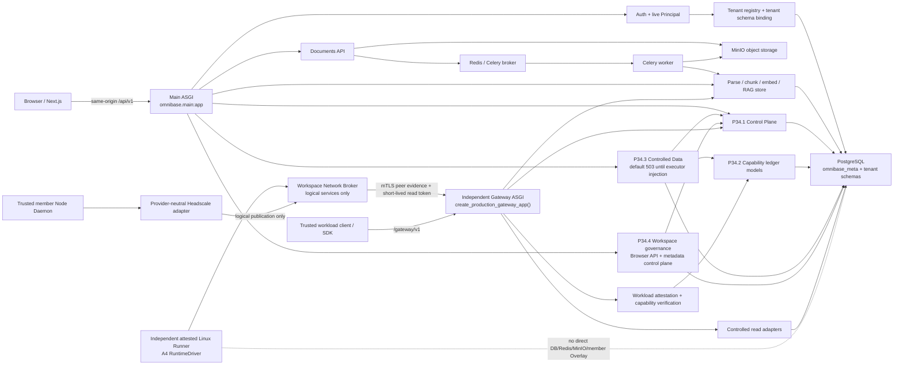

# OmniBase 本地 AI 维护者地图

本文面向未来在本地仓库中工作的 AI 维护者。目标不是复述产品愿景，而是给出一条可以从公开源码重建、定位、修改、验证和恢复 OmniBase 的最短可靠路径。

本文只描述当前源码已经存在的边界。阶段完成情况和历史验证证据仍以 `docs/handover-report.md` 为准；本文中的模块关系不能代替源码、数据库约束、迁移、契约快照或测试结果。

## 1. 开始任何修改前

按以下顺序读取：

1. `AGENTS.md`：仓库级维护契约、冻结边界和安全工作流。
2. `docs/maintainers/maintenance-map.json`：机器可读模块、依赖、不变量、验证和恢复入口。
3. `docs/maintainers/security-invariants.md`：INV-001 至 INV-021 的权威维护约束。
4. 本文：运行入口、调用方向、边界和影响矩阵。
5. 目标模块源码，以及机器地图列出的迁移、契约和测试。
6. `docs/handover-report.md`：当前阶段状态、最近验证证据和尚未授权的动作。

发生冲突时，不要猜测。运行时源码、数据库约束、Alembic 迁移、OpenAPI/SDK 契约和通过的测试优先于叙述性文档；阶段是否解锁、是否迁移过业务数据库等历史事实则以交接报告中的直接证据为准。发现维护文档过期时，应在获得相应修改范围后同步修正，不能让本地记忆或私有对话成为隐藏的事实来源。

## 2. 当前系统总图



图中的两个 HTTP 入口不是同一个应用：

- 浏览器和用户 API 的组合根是 `backend/src/omnibase/main.py:app`，Dockerfile 当前以 `uvicorn omnibase.main:app ...` 启动。
- Capability Gateway 由 `backend/src/omnibase/capability_gateway/app.py:create_gateway_app` 创建，是独立、非浏览器 ASGI 应用；P34.5D 的 production composition 入口是 `create_production_gateway_app()`。当前源码没有把它挂载到 Main ASGI，也没有在主 `docker-compose.yml` 中定义 Gateway 服务。
- Gateway 的默认 `RejectingWorkloadAttestor`、`RejectingCapabilityVerifier` 和 unavailable adapters 会拒绝或不可用；只有部署方显式注入可信 attestation、capability verifier、cursor secret 和 adapters 后才能开放对应能力。
- 不得为了“先跑起来”把 Gateway 挂入 `/api/v1`、用浏览器 JWT/cookie 替代 workload identity，或让 SDK 直连数据库。

## 3. Main ASGI 与 `/api/v1` 路由

`backend/src/omnibase/main.py:create_app` 负责：

- 初始化 Request Body Limit、CORS 和 Request Context middleware；
- 在 lifespan 中预热数据库、确保 `omnibase_meta` schema 和 `public.vector` extension 存在，并检查 MinIO；
- 把业务 Router 统一挂到 `APIRouter(prefix="/api/v1")`；
- 提供根路径 `/health`、`/health/ready` 作为探针兼容入口；
- 在开发环境开放 `/docs`、`/redoc` 和 `/openapi.json`，生产环境关闭这些入口。

应用启动只确保基础 schema/extension 存在，不会代替完整 Alembic migration。数据库版本变更必须走受控 migration 流程。

### 3.1 当前路由面

| 路由族 | 当前入口 | 身份/权限 | 关键边界 |
|---|---|---|---|
| Health | `/health`, `/health/ready`, `/api/v1/health`, `/api/v1/health/ready` | 探针 | liveness 不访问依赖；readiness 检查 PostgreSQL、MinIO、Redis |
| Auth | `/api/v1/auth/register`, `/login`, `/refresh`, `/me` | register/login/refresh 按各自契约；`me` 需用户身份 | Access token 只作为重新解析实时 Principal 的起点 |
| Tenant 管理 | `/api/v1/tenants`, `/by-slug/{slug}`, `/{tenant_id}` | `require_platform_admin`；默认配置关闭时返回 404 | 平台管理 token 与用户 JWT 是不同边界；删除是停用，保留 schema |
| Documents | `/api/v1/documents...` | `get_current_tenant` | 不接受 tenant 参数；MinIO key 以 tenant schema 命名空间隔离 |
| Database browser | `/api/v1/database/tables` | `get_current_tenant` + tenant DB | 仅允许列出白名单表/列的 metadata；没有任意 SQL HTTP 接口 |
| RAG | `/api/v1/rag/search`, `/playground`, `/ask` | `get_current_tenant` + RAG rate limit | Browser 用户通道；`ask` 使用 SSE，和 workload Gateway 通道不同 |
| P34.1 Control Plane | `/api/v1/control-plane/resources`, `/operations`, `/approvals`, `/audit/events` 及单项读取 | tenant admin + tenant DB | 当前 HTTP 面只读；跨 tenant ID 与不存在统一按 404 处理 |
| P34.3 Controlled Data | `/api/v1/controlled-data/rows/mutate` | `get_current_principal` | 只接受逻辑 Resource/Column UUID 和结构化 mutation；默认未安装 executor 时稳定 503 |
| P34.4 Workspace governance | `/api/v1/workspace-templates`, `/api/v1/workspaces...` | `get_current_tenant` + tenant DB；模板 POST 额外要求实时 tenant admin；其余按 Workspace membership/RBAC | Browser 只管理模板注册/读取、Workspace、成员、scope grant、命名 lifecycle、Run、snapshot/restore；不暴露 Node attestation、lease、fencing、Overlay activation 或 authority |

当前没有公开的任意 SQL、公开 DDL apply、浏览器 Capability 签发、Node/lease/fencing/Overlay 内部入口、真实 Workspace Runtime 或 Agent Runtime 路由。

## 4. Auth、Principal 与 Tenant schema 链

受保护的浏览器请求必须沿以下链路完成，不能删减为“JWT 验签通过”：

```text
Authorization: Bearer <access token>
  -> auth.security.decode_access_token()
     验证签名、过期时间和 access token 类型
  -> 要求 token 含 tenant_id 与 sub
  -> tenants.service.get_tenant_by_id()
     从 omnibase_meta.tenants 重新读取当前有效 Tenant
  -> validate_schema_name(tenant.schema_name)
  -> set_current_schema() 写入请求 ContextVar
  -> _load_active_user()
     创建显式 tenant-bound Session，重新读取当前 active User 与角色
  -> CurrentPrincipal(tenant, user, token)
  -> get_current_tenant() / require_tenant_admin() / get_tenant_db()
  -> SQLAlchemy after_begin hook
     校验 ContextVar 与 Session schema 一致
     SET LOCAL search_path TO tenant_schema, omnibase_meta, public
```

维护要点：

- `tenant_id` 和 `sub` 来自已验证 token，但 tenant 是否启用、user 是否启用、user 当前角色必须重新查数据库。
- token 中历史 `schema_name` 或角色信息不是当前授权事实。Refresh 也会重新解析 canonical Tenant 和 active User。
- `get_tenant_db()` 同时设置 `TENANT_SCHEMA_SESSION_KEY` 与 `TENANT_CONTEXT_REQUIRED_SESSION_KEY`。缺少活跃 context、context/session 不一致或 schema 名不合法都必须失败。
- 连接从池中 checkout 时先恢复 `omnibase_meta, public` baseline；tenant search path 使用事务级 `SET LOCAL`，避免连接复用残留。
- 业务表 ORM 位于无固定 schema 的 `TENANT_METADATA`，因此正确的 tenant binding 是访问 `users`、`documents`、`embeddings` 等表的前置安全条件。
- Login 在 tenant 尚未知时会遍历 active tenant schemas 查找用户，这是登录发现流程，不得复制为受保护请求的授权捷径。

## 5. Documents、Celery 与 RAG

### 5.1 上传和异步摄取

当前调用方向：

```text
POST /api/v1/documents
  -> documents.router.upload_endpoint
  -> documents.service.upload_document
     -> 校验 filename / MIME / size
     -> MinIO put_object: <tenant_schema>/<document_id>/<filename>
     -> tenant documents row: pending
     -> 可选同步 PDF metadata 提取
     -> 持久化 queued
     -> enqueue_ingest() 只发送五个 durable identifiers
  -> Redis broker
  -> workers.tasks.ingest_document_task
     -> 从 MinIO 下载对象
     -> tenant_scope(schema_name)
     -> documents row: processing
     -> rag.ingest.ingest_document
        -> parse -> chunk -> embedding
        -> 删除该 document 的旧 V1 chunks
        -> 写入 authoritative V1 embeddings
        -> 配置允许时 best-effort 写入 V2 shadow lane
     -> documents row: indexed 或 failed
```

关键语义：

- 上传在 dispatch 前先持久化 `queued`，避免快速 Worker 把状态推进后又被上传线程覆盖。
- Broker dispatch 失败只在 row 仍为 `queued` 时 compare-and-set 为 `failed`。
- Celery task 只接收 `schema_name`、`document_id`、`minio_key`、`filename`、`mime_type`，不传文件字节、JWT、Header 或请求上下文。
- Worker 对有限的基础设施异常做有界重试；终止错误写入安全裁剪后的 `failed` 状态，不能伪造 `indexed`。
- 删除文档时，`pending`、`queued`、`processing` 状态会阻止删除；对象存储、数据库和 RAG chunks 的一致性修改必须一起审查。
- Phase 1.6 当前仍以 V1 为唯一权威主通道。V2 是可重建 shadow lane；生产回填、cutover 和删除 V1 均冻结。

### 5.2 Browser RAG 与 Gateway RAG

Browser RAG：

- `rag.router` 通过 `get_current_tenant` 获得 schema；
- `hybrid_search()` 在同一个 index lane 中执行 vector 与 BM25，RRF 融合后可进入 reranker；
- `/rag/ask` 把检索结果作为 citation context 交给 LLM，并以 SSE 输出 citations、chunks 和 done/error；
- embedding/reranker/LLM 的可用性和降级语义由各自模块与测试约束，不能通过在线下载或无界线程绕过配置边界。

Gateway RAG：

- workload 只能调用 `/gateway/v1/rag/search` 和 `/gateway/v1/rag/citations/read`；
- Gateway 先完成 workload attestation、capability verification、budget reservation、logical Resource 解析和 policy 检查，再调用 `CanonicalRagReadAdapter`；
- Gateway adapter 可以复用 canonical retriever/reranker，但身份、预算、审计和响应 DTO 仍由 Gateway 强制执行；
- Browser JWT、前端 localStorage token 和 Gateway capability 不可互换。

## 6. P34.1–P34.4 调用方向

### 6.1 P34.1 Control Plane：治理事实底座

`backend/src/omnibase/control_plane` 定义和管理：

- `resource_registry`：逻辑资源、tenant/workspace/owner、版本、状态与 policy class；
- `resource_lineage`：资源派生关系；
- `operations`：持久操作状态、版本、风险、进度和 deadline；
- `approval_requests`：高风险审批及其 operation/resource/request hash 绑定；
- `idempotency_records`：actor scope + operation name + key 的幂等事实；
- `audit_events`：append-only 审计事件。

Control Plane 是 Capability 与 Controlled Data 的上游，不应反向依赖具体 UI 或 SDK。当前 HTTP Router 只给 tenant admin 提供 tenant-scoped 读取；mutation service 保持内部调用。

### 6.2 P34.2 Capability Ledger 与独立 Gateway：只读 workload 能力

调用方向：

```text
Python/TypeScript SDK
  -> 每次请求向 WorkloadCredentialProvider 取短期 credential
  -> POST /gateway/v1/*
  -> WorkloadAttestor
  -> CapabilityVerifier
     -> capabilities.service.verify_capability
     -> grant ancestry / tenant / workspace / runtime / workload / action
     -> resource/version / time window / revocation / online budgets
  -> budget reservation commit
  -> Resource Registry logical lookup
  -> policy check
  -> data or RAG read adapter
  -> durable allowed/denied/error audit
  -> bounded DTO response
```

公开 Gateway 动作只有：

- `data.schema.read`
- `data.rows.read`
- `rag.search`
- `rag.citation.read`

Gateway 不接受任意 SQL、物理 schema/table/column、浏览器 cookie 或长期静态 service secret 作为授权替代。Capability grants、usage、revocations 和 signing-key registry 位于 `omnibase_meta`；revocation 是 append-only。

### 6.3 P34.3 Controlled Data：结构化写入与内部 DDL

当前浏览器写入调用方向：

```text
POST /api/v1/controlled-data/rows/mutate
  -> live CurrentPrincipal
  -> 必须存在显式安装且声明 supports_atomic_lifecycle 的 executor
  -> server 在同一 lifecycle 中解析/锁定：
     Tenant -> User -> Resource -> DataTableBinding -> DataColumnBindings
     -> AuthorizationContext -> Operation -> Idempotency
  -> 从 logical UUID 深冻结 TrustedMutationLocator
  -> executor 在锁内重新验证 tenant/schema/resource/version/authorization
  -> 参数化 INSERT / UPDATE / DELETE
  -> mutation + Operation + Idempotency + success Audit 同事务提交
  -> 失败时写事务回滚，再以独立事务写 code-only failure Audit
```

必须保留的边界：

- HTTP 请求只接受逻辑 Resource/Column UUID、结构化 predicate、版本、幂等键和预算；不接受 SQL、schema、table、column、CTID、AuthorizationContext 或 Operation ID。
- User-RBAC row mutation 当前直接从 Main ASGI 进入 Controlled Data lifecycle，不通过 Capability Gateway；它仍使用实时 tenant/user/role 复核。
- `create_table_bootstrap`、DDL plan/authorize/apply、outbox 和 compensation 是内部服务契约，没有公开任意 DDL HTTP 面。
- Workspace/Agent write capability 未开放。不能把现有 User-RBAC route 改名后当成 Agent 写入口。
- Main ASGI 默认不安装 `controlled_crud_executor`；缺失或 marker 不可信时返回 `503 controlled_write_unavailable`。这是生产 feature gate，不是待删除的临时代码。

P34 的依赖方向应保持为：

```text
Control Plane
  -> Capability Ledger
  -> Capability Gateway / SDK read path

Control Plane + Capability model bindings + Tenant/Principal
  -> Controlled Data CRUD/DDL lifecycle

Gateway adapters
  -> Controlled read/RAG implementation

不得形成：Adapter -> 绕过 Gateway 的公共入口，或 Controlled Data -> 接受公共 physical locator。
```

### 6.4 P34.4 Workspace 控制面：治理、生命周期与 fake/local harness

Browser 调用方向：

```text
/api/v1/workspace-templates + /api/v1/workspaces/*
  -> live TenantContext / tenant-bound Session
  -> template registration re-locks and revalidates the live tenant admin in the write transaction
  -> Workspace aggregate lock + locked actor/target membership + closed role/action matrix
  -> template/scope/generation/version validation
  -> named lifecycle or aggregate service
  -> Resource/Idempotency/Audit facts in caller-owned transaction
  -> strict logical DTO (no tenant self-claim, locator, secret, provider handle or fencing)
```

内部 trusted-service 方向：

```text
trusted Node/Reconciler context
  -> Run lease + heartbeat + generation + Node fencing + live attestation validation
  -> Node attestation / Peer Grant / Service Advertisement / logical Network Lease cursor
  -> Workspace authority epoch + SyncEnvelope digest/sequence validation
  -> unavailable production component or isolated metadata-only fake/local harness
```

关键入口：

- `workspaces.router`：`template_router`、`register_template_version` 与 Browser `router`；模板 POST 是 tenant-admin-only。
- `workspaces.service`：`register_template`、`create_workspace`、`authorize_workspace_action`、`request_workspace_state`、`reconcile_workspace`、`create_run`、`claim_run_lease`、`heartbeat_run_lease`、`submit_run_state`、`get_active_attested_node`、`create_snapshot`、`restore_snapshot_new_workspace`。
- `workspaces.overlay`：`register_attested_node`、`revoke_node`、`create_peer_grant`、`publish_service`、`acquire_network_lease`、`validate_network_lease` 与可替换 `PeerOverlayProvider`。
- `workspaces.collaboration`：`claim_workspace_authority`、`heartbeat_workspace_authority`、`mark_workspace_authority_offline`、`validate_sync_envelope`、`commit_sync_envelope`。

必须保留的边界：

- 同 Tenant 不自动跨 Workspace；membership/scope/grant 缺失时 fail-closed。
- membership mutation 先锁 tenant-bound Workspace aggregate，再锁后重验 actor 与 target；改变 active owner 时才在该串行化边界内判断 last-owner，不能使用事务外角色快照或未串行化 owner count。
- scope grant 公共 action allowlist 只有 `resource.read` 与 `resource.list`；模板、membership 与 scope-grant mutation 都必须写脱敏 Audit。
- 模板 POST 保留实时 `require_tenant_admin` 早期拒绝，并在 `register_template()` 的 caller-owned transaction 中再次锁定、重验 active tenant-admin User；PostgreSQL `(tenant_id, template_key, version)` 自然键通过 `ON CONFLICT DO NOTHING` 支持并发 exact replay，spec/display name/supersedes/digest 任一不同均冲突。
- 新建 Workspace 默认 stopped；创建逻辑治理资源不得隐式启动 runtime、分配 lease 或调用 provider。
- Run Lease 同时绑定 Workspace/Run generation、单调 run fencing token、当前 Node fencing token与实时未过期 attestation；Node 重新 fencing 后旧 lease 失效。Run 进入 stopped/succeeded/failed/cancelled 后关闭或撤销 lease、清除 runtime/workload identity，不能被旧 holder 复活。
- `acquire_network_lease()` 只在数据库事务中推进 `network_lease_cursors` 并签发逻辑授权，不调用真实或 fake provider。production default 不运行代码、不创建 socket/peer/runtime；fake/local provider 只是独立测试 harness。
- authority、Peer Grant、Service Advertisement、Network Lease 与 Node revoke 的权威锁阶段使用共同前缀：Workspace aggregate → 按稳定 ID 的 live-attested Node → authority/peer/service/cursor/lease。撤销 Node 会提高 Node fencing，并级联撤销 Run/Peer/Service/Network/Authority。
- Node/lease/fencing/authority 不挂到 Browser ASGI，不从 Browser Header/JSON 构造可信 Node 或 holder。
- P34.4 不访问真实 Workspace 文件、Git credential、业务 PostgreSQL、MinIO、Redis 或 canonical RAG，也不开放 Workspace/Agent data write capability。

### 6.5 P34.5A0-A4 Sandbox：控制闭环、独立 Runner seam 与宿主攻击 Gate

`backend/src/omnibase/sandbox/` 同时包含 A0-A3 的副作用前控制闭环与 A4 的独立 Linux Runner seam。源码存在不等于任意宿主已经获得生产执行资格：

```text
server-owned P34.4 Run/runtime/Node/lease/fencing facts
        + P34.2 token-free Sandbox capability verifier
        + operation-idempotent capability budget reservation
                         │
                         ▼
              ComposedSandboxAuthorizer
      default rejecting lease/capability verifiers
                         │
                         ▼
                  SandboxProvider
          default UnavailableSandboxProvider
                         │
             test-only explicit injection
                         ▼
        FakeInMemorySandboxProvider
        metadata lifecycle only; exec/cancel denied

trusted controller identity + current generation/fencing
                         │
                         ▼
             SandboxControlAuthorizer
      default RejectingSandboxControlAuthorizer
                         │
                         ▼
       SqlAlchemySandboxOperationStore
  current pointer + append-only transition + Audit
                         │
                         ▼
              RunnerHostAttestor
       profile + identity + Node fencing proof
                         │
                         ▼
           SandboxExecutionCoordinator
                         │
                         ▼
                RunnerTransport
        default UnavailableRunnerTransport
                         │
                         ▼
       AuthenticatedRunnerService / transport auth
                         │
                         ▼
          AttestedLinuxSandboxRunner
                         │
                         ▼
        AttestedLinuxLocalRuntimeDriver
   pinned launcher + per-operation cgroup kill
```

关键入口：

- `sandbox.contracts.SandboxOperationRequest`：只携带待在线复核的 tenant/workspace/run/runtime instance/node/lease/generation/Run fencing/Node fencing/workload identity/action；它不是 bearer token，调用方持有这些值不产生授权。
- `sandbox.contracts.SandboxRuntimeSpec`：强制资源上限、只读 root、non-root、`no_new_privileges`、drop-all capabilities、无 host mount/device/runtime socket，并且 P34.5A0 网络只能 `deny_all`。
- `sandbox.contracts.SandboxCommandSpec` 与 `SandboxRelativePath`：只允许 immutable argv 与 canonical Workspace-relative POSIX path；不接受 shell string、env、绝对/drive/traversal/保留凭据路径。
- `sandbox.provider.UnavailableSandboxProvider`：生产默认全部 unavailable，不能因为 provider 缺失回退到 Core API、Celery、Docker 或宿主 shell。
- `sandbox.provider.FakeInMemorySandboxProvider`：只在内存中演练 create/start/stop/destroy、空 logs/stats、provider-owned metadata-only snapshot 与 restore-new-generation；拒绝伪造 snapshot、同一 Run 的销毁后重建和 restore 重放，`exec`/`cancel` 永久拒绝，没有进程、文件、socket、网络、容器、挂载或 provider side effect。
- `workspaces.service.bind_run_runtime_identity` 与 `verify_run_lease_for_sandbox`：只在 live fenced Run lease 下单次绑定 runtime instance/workload identity，并在每次 Sandbox 操作时重新验证 Workspace/Run/Node/Lease/generation/Run+Node fencing、实时 attestation 和 DB clock。
- `sandbox.authorization.SqlAlchemySandboxLeaseVerifier`：每次验证创建并关闭一个新 SQLAlchemy transaction，把 P34.4 server-owned facts 映射为无 bearer material 的 lease proof；拒绝 stale/unbound runtime identity。`ComposedSandboxAuthorizer` 再与 P34.2 capability proof 做完整 binding 与有效期交集。
- `capabilities.service.create_sandbox_grant`：只创建与 read profile 互斥的 `sandbox.*` lifecycle closed set；Grant 绑定单一 Workspace、runtime instance 与 workload identity，最长五分钟、不可委派，也不能由 `issue_token()` 签发为 Gateway bearer token。
- `capabilities.service.verify_and_reserve_sandbox_capability` 与 `sandbox.authorization.SqlAlchemySandboxCapabilityVerifier`：每次新事务重读 Grant/Workspace，按 operation ID 幂等追加 budget reservation；exact replay 不重复扣 calls/cost，tenant/grant/workspace/runtime/action drift 一律拒绝，verification digest 不含实时 clock，合法重放保持稳定。
- `sandbox.control.SandboxControlRequest`：仅用于可信 controller 的 emergency stop/destroy，独立于 workload capability，绑定 controller identity、runtime handle、generation、Run/Node fencing、reason 与 deadline；缺少控制授权时默认拒绝。
- `sandbox.operations.SandboxOperationStore` 与 `sandbox.persistence.SqlAlchemySandboxOperationStore`：production store 将 immutable intent binding、current state/version、append-only transition 与 redacted Audit 放在同一短事务；Workspace/Run/Grant 使用复合 tenant 外键，transition/reservation 的 UPDATE/DELETE 由数据库 trigger 拒绝。`UnavailableSandboxOperationStore` 仍是未装配时的安全默认，`InMemorySandboxOperationStore` 仅供 test。
- `sandbox.host.RunnerHostAttestor`：绑定 Runner/Node identity、Node fencing、isolation profile digest、有效期和 evidence digest；默认拒绝。`scripts/sandbox/probe_runner_host.py` 只读探测宿主控制，不会降低目标 profile。
- `sandbox.coordinator.SandboxExecutionCoordinator`：按 durable reservation → live authorization → host attestation → dispatch marker → transport → receipt binding 排序；terminal exact replay 不重复 dispatch，崩溃后的 dispatching 与 transport timeout/receipt drift 都进入 ambiguous/reconciliation-required。
- `sandbox.transport.RunnerTransport`：Core 与独立 Runner 的传输 seam；默认 unavailable，Core 文件不导入 Docker、socket、subprocess、HTTP client 或 host filesystem control。
- `sandbox.runner.UnavailableSandboxRunner`：真实独立 Linux Runner 的拒绝默认。`RunnerIsolationProfile` 冻结 cgroup v2、user/PID/mount/network namespace、seccomp、LSM 和有界 kill 契约，但不声称宿主已经实现这些控制。
- `sandbox.dispatch_digest`：Core 与 Runner 共用 request/spec/execution canonical digest；Coordinator 会在 durable begin 前重新计算 request/spec，并要求 receipt 精确绑定 operation、Runner、runtime instance 与 host proof。
- `sandbox.transport_auth` 与 `sandbox.transport_service`：认证 envelope 绑定 Runner、operation、sequence、deadline 和 payload digest；拒绝过期、篡改和 replay。production 入口是 `TrustedRunnerMtlsPeer` + `MtlsRunnerTransportAuthenticator` + 私有显式路径的 `SqliteRunnerReplayStore`；peer certificate thumbprint 必须与 `VerifiedRunnerHost.runner_identity_thumbprint` 精确一致，不能只依赖 runner/node UUID，nonce/sequence replay 在进程重启后仍被拒绝。`HmacRunnerTransportAuthenticator` 和 `InMemoryRunnerReplayStore` 仅用于 local/dev/tests，不是 production identity 或 durability。
- `sandbox.runtime_probe.SystemLinuxRuntimeProbe`：读取目标 Linux cgroup、namespace identity、seccomp、LSM 和受信路径证据；目标 runtime 的 user/PID/mount/network namespace 必须与 host 初始 namespace 不同。host reference 只能是直接 VM 的 `/proc/1/ns/*` namespace symlink handle，或 root-owned、非 group/world-writable 的 `/run/omnibase-host-ns/*` regular snapshot，snapshot 内容严格保存 host namespace `dev:ino`；绝不能比较普通 snapshot 文件自身 inode。
- `sandbox.runtime_driver.AttestedLinuxLocalRuntimeDriver`：只在 attestation 与 profile digest 完整匹配时调用固定 launcher；stdin、stdout/stderr 和 deadline 都有界。超时或输出溢出先对 operation cgroup 写 `cgroup.kill` 并确认 `cgroup.events populated 0`，随后才清理 launcher process group。
- `sandbox.runner_service.AttestedLinuxSandboxRunner`：把 host proof、execution plan、RuntimeDriver receipt 和 canonical binding 聚合为 Runner receipt；非零 exit、截断、binding drift 或无法证明强杀都不能冒充 success。

该包仍没有 Browser Router、Docker/Podman socket、Core 数据凭据或宿主目录注入。A4 源码必须部署到真正独立、满足 profile 的 Linux Runner，并由 `RUN-03/04/05`、`FS-01/02/03`、`NET-01/02`、`PROC-01/02`、`HOST-01` 与 `CROSS-01` 的目标宿主 artifact 决定能否装配。`RUN-05` 专门验证 requested non-root UID/GID、空 supplementary groups、精确单项 uid/gid map 与非法身份拒绝。普通 Docker Desktop/WSL smoke、focused 单测或源码审计都不能替代该 Gate。

### 6.6 P34.5B-D：Broker、Overlay publication 与 Gateway workload bridge

调用方向固定为：

```text
trusted member Node Daemon
  -> HeadscaleOverlayAdapter
     -> live Workspace/Peer/Service/Network Lease + dual Node attestation
     -> durable OverlayOperationLedger
     -> opaque short-lived credential reference
     -> daemon transport
     -> OverlayLogicalServicePublication
  -> VerifiedOverlayLogicalServiceMapper
  -> LogicalNetworkService

isolated Sandbox network namespace
  -> ControlledWorkspaceNetworkBroker
     -> live SandboxNetworkAuthorizer
     -> NetworkNamespaceAttestor
     -> logical service resolve
     -> destination/private/metadata policy
     -> resolve again and require exact service/protocol/port/address/route-kind/digest stability
     -> private SqliteNetworkBudgetLedger (pending/committed/unknown)
     -> private daemon-owned PID/starttime/live netns evidence distinct from host net namespace
     -> dedicated-UID AF_UNIX transport with socket continuity, SO_PEERCRED and pinned-key challenge
     -> independent PrivateNetwork Linux Broker daemon
        -> root-owned short-lived exact permit
        -> durable consumed-operation no-replay marker
        -> verified setns worker + measured TCP receipt
  -> trusted mTLS Gateway peer evidence
  -> independent Capability Gateway read path
```

修复入口与边界：

- `sandbox.network` 冻结 logical service、network authorization、protocol/port/deadline/budget 与 destination classification；Sandbox 不能提交 IP、URL、route、provider handle 或 credential。
- `sandbox.broker.ControlledWorkspaceNetworkBroker` 固定授权 → namespace attestation → 双解析 → durable budget → transport → receipt binding → commit；receipt 必须先验证再 commit，transport/receipt/commit 异常把 reservation 保持为 pending 或单向标记 unknown，禁止自动重放。默认 authorizer/resolver/attestor/ledger/transport/Broker 全部拒绝。
- `sandbox.network_ledger.SqliteNetworkBudgetLedger` 使用私有绝对 POSIX SQLite path、原子创建、`BEGIN IMMEDIATE` aggregate CAS 与 append-only trigger；pending/unknown 继续占用预算，committed exact replay 只返回原 receipt，不再次调用 transport。
- `sandbox.network_runtime.FilesystemNetworkNamespaceAttestor` 从 daemon-owned 私有证据文件重建 Runner/namespace/runtime/workload/generation/fencing 绑定，并重新验证可信 PID/starttime 与 live `/proc/<pid>/ns/net` `dev:ino`；host reference 仅为 `/proc/1/ns/net` 或固定 root/private snapshot。`UnixSocketBrokerTransport` 只走显式私有 AF_UNIX socket，要求专用 daemon UID/GID、连接前后 socket inode 连续、`SO_PEERCRED` PID/starttime 稳定和 pinned-key nonce challenge；它不自行开放公网或加入成员 Overlay。
- `deployment/network-broker/omnibase-network-broker.py` 是独立、非 Browser、非 Core 数据进程。systemd supervisor 使用专用非 root UID、`PrivateNetwork=yes` 与受限 capability；每次请求重开 live PID netns、核对 starttime/`dev:ino`/host snapshot/短期 permit，在网络副作用前 durable 消费 operation，再由短生命周期 worker `setns` 建立一次 TCP 连接。`scripts/network-broker/run-network-broker-attack-gate.py` 必须在独立 Linux Runner 运行，普通 Docker/WSL 不算 production 证据。
- `workspaces.overlay_adapters.HeadscaleOverlayAdapter` 只面向受信 Node Daemon。`OverlayOperationLedger` 必须在 credential issuance/transport 前 reserve；mutation outcome unknown 禁止自动重放。
- `OverlayLogicalServicePublication` 与 `sandbox.overlay_publication.VerifiedOverlayLogicalServiceMapper` 只传 Tenant/Workspace/logical service、协议/端口、generation/fencing/version/expiry；地址、route、provider handle、Headscale/Tailscale key 和 Sandbox identity 不存在于该 DTO。
- `capability_gateway.workload.TrustedGatewayPeerEvidence` 只能由受信 Runner/Broker mTLS ingress 注入 ASGI scope，普通 Header/cookie/source IP 无法构造。
- `SqlAlchemyRunLeaseWorkloadAttestor` 每个请求重新验证 live P34.4 Run/Node/Lease/fencing/runtime/certificate binding；`SqlAlchemyGatewayCredentialIssuer` 在 Core 内加载私钥，token 最长五分钟且不能晚于 Run Lease expiry。
- `create_production_gateway_app()` 显式组合可信 workload attestor、Core capability verifier、只读 PostgreSQL/RAG adapters 与 append-only Audit；它仍是独立 Gateway ASGI，不挂入 Browser Main app。

P34.5B 已在独立 Hyper-V Ubuntu Runner 上完成两轮 26/26 Network Broker Gate，覆盖真实 `setns` namespace-only connect、direct egress default-deny、地址分类、预算、challenge、PID/starttime/netns、socket identity、durable no-replay 与清理；证据位于 `docs/evidence/p34-5/network-broker-attack-gate.{json,md}`。该 Gate 不自动证明 Core↔Broker production mTLS 联合激活。P34.5C 已从 fresh Windows clone 构建专用 Runner 并通过真实 disposable Headscale control-plane Gate：161 文件 source manifest 同时封存 `.gitattributes`、锁文件、完整 build inputs 与 upstream digests；mTLS Node Daemon 对 Headscale provider records 完成 activate/status/rotate/revoke，验证 ambiguous no-replay、离线/重连、凭据 containment 与 `0/0/0` 清理。该 Gate 注册的真实成员设备为 0，因此不能冒充 production Node Daemon、两节点数据面、DERP relay 或节点失陷证据；这些继续属于 P34.7。P34.5D 已从 clean checkout 构建独立 Gateway 与 stdlib-only client 镜像并通过真实 split-process mTLS Gateway Gate：249 文件 source manifest 封存 `.gitattributes`、完整 `backend/src`/`backend/tests` 和全部 build inputs；独立受限 client 经 server-owned registry/live lease/fencing 领取短期 credential，并在 guarded `omnibase_test_*` sentinel 内完成 schema/rows/RAG/citation 四读及 stale/revocation 矩阵，最终 `0/0/0` 清理。该闭环仍不允许 Runner/Sandbox 直连 PostgreSQL、Redis 或 MinIO，也不自动证明非 disposable production tenant/RAG。

### 6.7 P34.6 Workspace 数据、Derived RAG、Promotion 与 Snapshot lineage

P34.6 复用 P34.1–P34.5 的 Resource、Operation、Approval、Idempotency、Audit、Workspace membership、Run/Node/Lease/fencing 和 Controlled CRUD，不建立第二套鉴权或 SQL 执行器：

```text
trusted Runner/Broker mTLS peer
  -> live Run/Node/Lease/generation/fencing attestation
  -> short-lived non-delegable WORKSPACE_DATA grant
  -> independent Gateway logical data route
  -> operation-idempotent calls/bytes/cost reservation
  -> P34.3 private CRUD or explicitly installed WorkspaceDataAdapter
  -> result + Operation/Idempotency/Audit, or pending/unknown reconciliation

Browser control plane
  -> live Workspace membership and tenant-admin decision
  -> R2 Approval + Operation + exact source version/digest/request hash
  -> copy-on-publish to a new controlled_shared Resource
  -> published_from lineage; source remains immutable
```

关键边界：

- `capabilities.service.WORKSPACE_DATA_ACTIONS` 与 READ/SANDBOX profiles 互斥；Grant 绑定单一 Workspace、runtime instance 和 workload identity，最长五分钟、不可委派。Promotion action 不存在于 runtime token。
- `capability_gateway.write_service.WorkspaceDataGatewayService` 只接受逻辑 ID 和 strict DTO；Browser Bearer/read token、canonical/controlled-shared write、physical locator/schema/table/object key/SQL 都在 adapter 前拒绝。Production composition 的 write adapter 默认 unavailable。
- `workspace_data` 的 Artifact、DerivedIndex、Publication、SnapshotItem 和 DataEffect 都是 durable metadata。Artifact/derived output 不可原地覆盖；每次修订创建新的 Resource/generation，并追加 lineage。
- tenant `workspace_derived_chunks_v2` 是独立 derived lane；任何 P34.6 build/search/promotion/restore 都不能写 canonical `documents`、`embeddings`、`embeddings_v2` 或 RAG index metadata。
- provider/object-store/index boundary 前先持久化 pending effect；跨边界后结果不明确进入 `unknown`，禁止自动 replay。不能通过删除 reservation、effect、Audit 或 lineage 伪造 fresh attempt。
- Promotion 只创建新的 `controlled_shared` target 和 `published_from` lineage；P34.6 不允许直接创建/修改 `canonical_readonly`，也不允许 requester self-approval 或 source 原地 policy flip。
- Snapshot 只有在 server-generated resource/version/digest/size inventory 全部验证后才能 ready；Restore 创建新 Workspace/generation 和新 Resource ID，不恢复旧 Run、Lease、token、runtime/workload identity、PID、socket、连接或 provider handle。

P34.6 的 unit/fresh-sentinel Gate 证明源码、migration、DB trigger、逻辑路由和失败语义；真实非 disposable object store/index worker、生产 snapshot payload 传输、恢复演练、容量/SLA 与 production cutover 继续由 P34.7 验收。

### 6.8 P5.0 Phase 5 admission gate（只决策，不运行）

`backend/src/omnibase/production/phase5_admission.py` 是 Phase 5 的唯一
P5.0 交付物：它验证 Phase 5 是否允许开始，不实现、不导入、不启动任何
Agent/Planner/Executor/queue/worker/scheduler。三个 Feature Gate
（`AGENT_RUNTIME_ENABLED`、`AGENT_PLANNER_ENABLED`、`MULTI_AGENT_ENABLED`）
独立解析、默认关闭：缺失/空值等于 `false`，只有精确 `"true"`/`"false"`
被接受，未知值（大小写、空白、非标准字符串、非字符串）报配置错误；
Planner 依赖 Runtime、Multi-Agent 依赖 Planner+Runtime，依赖冲突同样
fail-closed。

- `deployment/production/phase5-admission.example.json` 是 strict 合同：
  feature gates 必须全 `false`、`critical_veto.expected` 必须为 0、
  P34.7 formal state 当前为 `blocked/not_proven`，Runner/Broker/Gateway/
  Overlay/Workspace-data/provider 九项生产证据全部 `not_proven`。
- `scripts/production/validate_p5_0_admission.py --validate-only` 只解析
  合同（exit 0）；`--verify` 从 clean checkout 校验 Git provenance、
  migration head（当前 `0011`）、OpenAPI snapshot、Python/TypeScript SDK
  版本、production composition、runbook 与 P34.7 decision 的 sealed
  digest，并解析环境中的 gate 值。
- 当前正确输出恒为 `blocked/not_proven`（P34.7 非 ready + activation
  关闭 + 九项证据未证明）；即使三个 gate 显式 `true` 也仍然 blocked。
- 该模块不读取根 `.env`、不连接数据库、不执行 migration；report 固定
  输出 `root_env_accessed=false`、`business_database_accessed=false`、
  `business_database_migrated=false`、`hostile_code_executed=false`、
  `phase5_runtime_activated=false`。
- INV-025–INV-034 仍是 Phase 5 计划预留不变量，P5.0 不得把其中任何一条
  标记为已实现。

### 6.9 P5.1A Agent Registry contract preflight（离线，只验证不实现）

`backend/src/omnibase/production/phase5_registry_contract.py` 是 P5.1A 的
唯一交付物：AgentDefinition → AgentVersion → WorkspaceAgentBinding 三层
离线 strict DTO/合同，纯离线 validator，无 ORM、migration、service、
Browser API、SDK 调用、Planner/Executor/worker/scheduler 或 Runtime。

- `deployment/production/phase5-registry-contract.example.json` 是
  closed-set 合同：三个 Phase 5 gate 必须 false、P34.7/P5.0 formal state
  当前 `blocked/not_proven` 且决策文档被 SHA-256 封存、approval policy
  （high/critical 必须 approval）、server-owned budget ceilings、
  forbidden source paths、baseline migration revisions（0001–0011）、
  内嵌 definition/version/binding 正向示例。
- `scripts/production/validate_p5_1_registry_contract.py --validate-only`
  只解析合同（exit 0，永不 ready）；`--verify` 复用 P5.0 修补后的逐分量
  symlink/reparse 路径检查与仓库外 report 规则，校验 sealed digest、
  migration 集合/head、forbidden 包不存在、OpenAPI snapshot 无 agent
  endpoint，并解析环境 gate。
- 当前正确输出恒为 `blocked/not_proven`（P34.7/P5.0 非 ready + registry
  database/API/installation 未实现 + production evidence 未证明）；
  该模块不读取根 `.env`、不连接数据库/网络，import 白名单约束由测试
  用 AST 扫描证明。
- INV-025–INV-034 仍是 Phase 5 计划预留；INV-040 只描述 P5.1A 合同的
  离线属性，不声称数据库约束、RBAC、并发安装或 Runtime 已完成。

### 6.10 P5.1B Agent Registry persistence（内部持久化地基，非公开 API）

`backend/src/omnibase/agent_registry/` 是 P5.1B 的唯一交付物：三张全局
`omnibase_meta` 表（`agent_definitions`、`agent_versions`、
`workspace_agent_bindings`，迁移 `0010`）加内部事务服务
`RegistryPersistenceService`。它**不是**公开 API：无 FastAPI router、
OpenAPI endpoint、SDK surface、Invocation/Task/Run/Plan/Step/Attempt、
Planner/Executor/Dispatcher/Scheduler、Celery、Agent Runtime、
Model/Tool/Memory/Skill Runtime、MCP 或 shell/SQL/HTTP tools；三个 Phase 5
Feature Gate 保持 false，P34.7/P5.0/P5.1 production 保持 blocked/not_proven。

- 数据库本身执行不变量：复合 `(id, tenant_id)` FK 阻断 definition/version/
  workspace/approval/superseded target 跨租户引用；trigger 执行状态机
  （revoked 终态、sealed 身份与内容不可变、binding 安装 payload 不可重连、
  risk 不降级、tool ID 闭集、approval 有效性、superseded/disabled 一致性）；
  partial unique index 保证每个 workspace+definition 只有一个 live
  binding（`pending_approval`/`installed`）。
- 每次变更先在调用方事务内重读 active tenant User，再原子完成：
  `reserve_idempotency`（digest 漂移
  转 `RegistryConflictError`）→ 实体行 + `register_resource` 登记 →
  approval 消费（high/critical 必需，恰好一次）→ `complete_idempotency`
  → append-only audit；安装锁序 Tenant -> tenant User -> Workspace ->
  Definition -> Version -> live Binding -> IdempotencyRecord ->
  ApprovalRequest（首次执行）。exact replay 在 approval 重验前返回原结果。
- `docs/evidence/p5-1/phase5-registry-persistence-design.md` 记录 12 项
  设计判定（全局 scope、composite FK、trigger、partial unique index、
  复用 idempotency/approval/audit）。一次性 sentinel PostgreSQL Gate：
  `make test-p5-1b-registry` 与
  `scripts/production/run_p5_1b_registry_disposable_gate.py --run`，
  证据写入 `docs/evidence/p5-1/phase5-registry-persistence-disposable-gate.json`。
- P5.1A 合同已同步：`forbidden_source_paths` 移除 `agent_registry`，
  baseline migration revisions 扩展到 `0010`，sealed digest 随本文档
  更新；P5.1B 不解锁 P5.2+（保持 frozen）。

### 6.11 P5.2A Agent Task ledger contract preflight（离线，只验证不实现）

`backend/src/omnibase/production/phase5_task_ledger_contract.py` 是
P5.2A 的唯一交付物：AgentTask/Invocation → AgentRun → AgentStep →
AgentAttempt → P34.4 Workspace Run → RuntimeInstance → WorkloadIdentity
的离线 strict DTO/合同，纯离线 validator。无 P5.2 ORM、migration `0011`、
router、Agent Runtime、Planner/Executor/scheduler/worker、模型/工具调用
或 Task Lease 发放。

- 身份层级冻结 36 个逻辑字段与 9 个 identity stages（task_create /
  task_run_claim / attempt_claim / attempt_heartbeat / attempt_finish /
  task_cancel / task_pause / task_resume_request /
  reconciliation_request），每阶段区分 required / not_yet_generated /
  immutable / core_generated / browser|workload submittable / forbidden；
  Browser 永不提交 runtime_instance_id、workload thumbprint、
  request_hash 或 lease/fencing；Browser JWT 永不进入 workload DTO。
- 状态机闭集：Task（10 态）、Step（6 态）、Attempt（9 态）、Effect
  （5 态）、AgentRun（7 态）；终态不可复活；`unknown` 永不自动 replay；
  retry 必须创建新 Attempt 并提高 Task fencing；cancel 不伪装 unknown
  为成功；模型输出不是 committed evidence。Attempt ↔ Task Lease 状态
  矩阵：pending/ready 无 lease、leased/dispatching/running 必须有、
  terminal（含 unknown）不得保留（历史由 append-only lease 记录承载）；
  `attempt_number` 按 (task_id, step_id) 分组且**必须从 1 起精确连续**
  （重复/回退/跳号/非 1 起始均拒绝，排序不得"整理"为合法）；`task_fencing_token`
  是 **per-Task**（非系统级/Run 级）单调序列——同一 Task 内跨 Step 单调，
  不同 Task 各自独立、可各从 token 1 开始；fencing 的**权威数据源是
  append-only TaskLease 账本**（`active`/`completed`/`revoked`/`expired` 全部
  参与，按 `task_lease.created_at` 排序；terminal Attempt 清空
  `task_lease_id`/`task_fencing_token` 不抹除其历史 Lease——Attempt 只用于
  active Attempt ↔ active Task Lease 双向绑定、状态矩阵与 token 一致性）；
  `task_lease.created_at` 必须不早于其绑定的 `attempt.created_at`，禁止通过
  backdated Lease claim 把真实 token 回退重新排序为表面递增；每条 Lease
  （含 completed/revoked/expired 历史）都必须满足 `expires_at > created_at`
  与配置后的 TTL ceiling，任何 heartbeat 必须位于该 Lease 区间内；
  fencing 时间轴是 `task_lease.created_at` 经 `_parse_utc_timestamp` 归一化
  后的 **UTC instant**（timestamp 合同允许 `Z`/`+HH:MM`/`-HH:MM`，原始
  字符串顺序不等于 UTC 顺序，禁止按字符串排序判单调，否则非法 token 回退会
  被"整理"为合法），同一 Task 内两条 Lease 归一化为**同一 UTC instant** 时
  必须 fail closed（无可信第二排序字段，不得用输入数组顺序/
  task_lease_id/attempt_id 字典序/token 自身排序整理为合法）；timestamp
  offset 是闭集（小时 `00–23`、分钟 `00–59`，`+01:60`/`+00:99` 显式拒绝，
  不依赖 fromisoformat 归一化），任何解析/offset 运算/UTC 归一化失败（含
  年份边界溢出）稳定转 `TaskLedgerContractError`，不泄漏原生异常；Attempt
  与 TaskLease **双向**精确
  绑定（active lease 必须绑定恰好一个 leased/dispatching/running Attempt 且
  该 Attempt 指回并共享 fencing token；孤儿 active lease 拒绝）、单 active
  lease、current lease 必须 active。
- Task Lease 独立于 Run Lease 但依赖它：`run_lease_id`/`run_fencing_token`/
  `node_id`/`node_fencing_token`/`workspace_generation` 必须与
  AgentRunBinding 一致；TTL 不得晚于 deadline/Run Lease/Node
  attestation/Grant/policy 的最早 expiry（`LeaseExpiryBounds` 五项
  独立 reason code）。
- 预算 12 维（input/output/reasoning/total tokens、cost_micros、
  model/tool calls、wall_clock_ms、artifact_bytes、sandbox_jobs、
  max_attempts、max_parallel_steps），limit/reserved/committed/released/
  remaining 不变量，strict 非负整数、拒绝 NaN/Infinity/wildcard/超 ceiling；
  `deadline_ceiling_seconds`/`task_lease_ttl_ceiling_seconds` 真正作用于
  每个 Task/Lease DTO（config 只能收紧）。
- 8 个 canonical hash profile（task_create、task_cancel、task_pause、
  task_resume_request、attempt_claim、attempt_heartbeat、attempt_finish、
  reconciliation_request）；attempt 三个 profile 绑定全部安全相关
  immutable identity（agent_run_id、node_id、run_lease_id/
  run_fencing_token、node_fencing_token、task_lease_id/
  task_fencing_token、agent_version_digest、resource_scope_digest、
  budget_policy_digest）；不进 hash 的字段（operation_id、runtime/
  workload 身份、lease 时间）由 durable 记录绑定并在合同文档表中逐项
  证明；同 key+同 operation+同 canonical payload = exact replay，否则
  stable conflict；禁止调用方 request_hash override。
- `scripts/production/validate_p5_2a_task_ledger_contract.py --validate-only`
  只解析合同（exit 0，永不 ready）；`--verify` 校验 P34.7/P5.0/P5.1
  formal state、sealed digest（含 P5.1 registry contract）、migration
  集合/head（0011）、forbidden source paths、OpenAPI 无 agent
  invocation 端点；**gate true 或 activation_requested=true 是 veto**。
- 当前正确输出恒为 `blocked/not_proven`（P34.7/P5.0/P5.1 非 ready +
  production Runtime 未实现 + production evidence 未证明）；
  该模块不读取根 `.env`、不连接数据库/网络，import 白名单约束由测试
  用 AST 扫描证明；报告 `verification_evidence` 区分 static
  source-boundary assertion（本次 verify 实际执行）、import/AST
  assertion（测试证明）、Gate 未执行行为与 direct runtime execution
  （Gate 不执行 pytest/runtime）。evidence 引用校验**真实验证**每条
  `status=passed` 引用（仓库内相对 regular 非链接文件、raw-byte SHA-256
  与 sealed digest 一致、assertions 作为机器可验证闭集逐项解析），报告
  拆分 `evidence_path_verified`/`evidence_digest_verified`/
  `evidence_assertions_verified`/聚合 `evidence_references_verified`，
  只有实际执行并通过才为 true；passed 引用 path 缺失/digest 漂移/assertion
  不匹配均为 veto（fail closed），绝不无条件写 true。
- INV-043 只描述 P5.2A 合同的离线属性；P5.2B persistence ledger、内部
  Model Gateway 与无工具 Alpha 是另行授权的 engineering modules。生产
  Runtime、Planner/Executor/scheduler/worker、工具与多 Agent 仍 frozen。

### 6.12 桌面运行时、诊断与 RAG 性能 profile（INV-052）

`backend/src/omnibase/runtime/**` 提供 provider-neutral 的本地宿主能力
contract（`capabilities.py`：OS/arch/memory/disk/GPU/container engine/
network/ports，全部携带 `EvidenceState` provenance）、递归有界脱敏诊断
（`diagnostics.py`：mapping/list/tuple 递归 redact、大小写不敏感敏感键、
depth/width/string 上限、cycle 确定性标记、JSON 确定性与类型化签名）与
allowlisted Compose 生命周期包装（`lifecycle.py`：
`doctor/ports/start/status/health/logs/stop`，只传参数数组并显式
`--env-file .env.example`，绝不拼接 shell 字符串）。
`backend/src/omnibase/rag/performance.py` 提供有界 CPU/CUDA/MPS profile，
embedding readiness 与 reranker readiness 分离，reranker 缺失时显式
`fallback_rrf`。`scripts/runtime/omnibase_desktop.py` 是对应 CLI。

- 硬性边界：hostname 不是网络证据；Docker/Podman/WSL/Hyper-V 可执行文件
  存在不是 hostile-code isolation 证明；Hardened 模式始终
  `blocked/not_proven`，除非独立 sealed Runner/Broker/Gateway 证据链被注入
  并验证。桌面 wrapper 永不声称 Hardened start 支持。
- **容器引擎共享契约**：capability probe 与 lifecycle 使用同一个
  `resolve_engine_resolution()`（Docker 优先、其次 Podman、都没有则为
  `none`），并且 **绝不只凭 `shutil.which` 推断 Compose Local 能力**：每个
  候选执行有界、`shell=False`、短超时且 stdout/stderr 定向到 `DEVNULL`
  的 `docker compose version` / `podman compose version` 探针（探针只需 exit
  code，DEVNULL 使被替换的可执行文件无法靠退出前海量输出耗尽内存），
  **只有 exit 0 才声明 compose provider 已验证**。探针记录已验证可执行文件
  的规范绝对路径与稳定 stat 身份（dev/ino/size/mtime/ctime + symlink 标志）；
  lifecycle 以该路径作为 `argv[0]` 并在构建任何 Compose 命令前**重新验证
  身份**，绝不再次 `shutil.which` 解析 PATH，因此探针后 `which` 结果被替换的
  TOCTOU 无法重定向执行。删除、替换、symlink/reparse drift 或任何 stat 变化
  都 fail-closed `container_engine_identity_drift`（subprocess 前拒绝）。
  报告区分 `executable_detected`（仅有可执行文件）、
  `compose_provider_verified`（exit-0 探针）与 `local_mode_available`（仅在
  provider 验证后）；Podman 可执行文件存在但 compose provider 缺失时报告
  `detected`/`not_proven` 且绝不 claim Local。只有 Podman 时 Local 之所以被
  claim，是因为 lifecycle 确实执行受控
  `podman compose --env-file .env.example -f docker-compose.yml` 参数数组
  路径；两个引擎都没有或探针失败时 fail-closed `container_engine_not_found`
  （subprocess 前拒绝，Local 绝不 claim）。subprocess 输出**在读取期间**有界
  （每流 64 KiB、合计 128 KiB，超限即终止进程并标记 truncated，绝不先无限
  缓冲到内存或临时文件再截断）；timeout 与 byte cap 是两个独立约束。
  负向矩阵覆盖 Docker-only / Podman-only / 两者都存在但 compose 失败 /
  timeout / not-found / 两者都不存在 / trusted-path→replacement-`which` TOCTOU
  / 已验证可执行文件删除/替换/identity drift / compose-version 输出超限，在
  probe 与 lifecycle 两侧都有测试。
- 脱敏边界：sensitive name policy 是 **normalized token/full-field 闭集 +
  有界 `_` 后缀策略，禁止任意 substring 匹配**——`monkey`、
  `keyboard_layout`、`design`、`session_count` 保留，`api_key`、
  `access_token`、`signature`、`session_token` 及 provider 变体脱敏；
  cased 键在**acronym-aware** 大小写边界分词（同时处理 lower/digit→upper 与
  acronym→CapitalizedWord 边界：`stripeAPIKey`→`stripe_api_key`、
  `OPENAIApiKey`→`openai_api_key`、`openAIApiKey`→`open_ai_api_key`、
  `azureADAccessToken`→`azure_ad_access_token`、`myTOKEN`→`my_token`、
  `providerPASSWORD`→`provider_password`、`xAPIKey`→`x_api_key`）；`_key` 后缀
  **收窄**：`sort_key`/`cache_key`/`foreign_key`/`keyboard_layout`/`monkey`
  保留，`api_key`/`secret_key`/`access_key`/`signing_key`/`private_key`/
  `encryption_key` 脱敏。嵌套 sequence 内的 secret 必须替换；sequence 内
  **跨元素 CLI 参数对**用显式确定性 inline-flag state machine：敏感 flag
  把紧跟的元素整体脱敏（`["--api-key", "SECRET"]`），**即使该值以 `-` 或
  `--` 开头**（`["--api-key", "--q7x9opaque"]`、`["--token", "-opaque"]`、
  `["--password", "--"]`）；无值的敏感 flag 自身 fail-closed；紧跟元素确定
  性属于另一个 allowlisted flag——包括其 inline `--name=value` 形式
  （`--profile=lite`/`--service=backend`）或属于自身结构的敏感 inline flag
  （`--token=value`）——时绝不吞并该结构
  （`["--api-key", "--profile=lite"]`→`["[REDACTED]", "--profile=lite"]`、
  `["--api-key", "--token=value"]`→`["[REDACTED]", "--token=[REDACTED]"]`）；
  未知或歧义状态 fail-closed。分隔符两侧
  **任意有界水平空白**形式（`NAME = value`、`--name = value`、
  `Name : value`）均解析（“超过 8 个空格即放行”必须不成立），超过有界
  空白上限的 parser state 整项 fail-closed；**带引号的赋值值完整消费**
  （`OPENAI_API_KEY = "q7x9opaque rest8v"` 不留 tail 也不留引号），引号扫描
  **escape-aware**（仅在前面连续反斜杠为偶数时终止，`\\` 与转义引号不留
  tail），未闭合/超长/状态不确定的引号整项 fail-closed；**确认敏感 Header
  后整个 value 消费到物理行尾**（`{`/`}`/`;`/引号/逗号/空白均非提前停止边界，
  `Authorization: q7x9{rest8v}`、`Authorization: q7x9}rest8v}`、
  `X-Api-Key: q7x9;rest8v,more` 不留 tail；为保留 JSON 右花括号而泄漏 secret
  不成立）；异常文本/
  命令行/env/URL/DSN 中的凭据不得泄漏；超出深度/宽度/长度用确定性 marker
  而非递归或泄漏。**敏感 Header/JSON/assignment 的 value 超过单项解析上限
  时整项 fail-closed 为 `[REDACTED]`，绝不只截断前 512 字符而泄漏尾部。**
  字符串值经过有界、确定性的行级 parser（URI/DSN userinfo、敏感 query
  key/fragment、`NAME=value`、CLI `--name=value`、`Name: value` header、
  JSON-ish log line），opaque secret（不含 token/secret/password 关键字）
  也按结构化位置脱敏，不依赖关键字或 secret 前缀猜测；解析全部线性有界，
  禁止灾难性回溯。攻击测试矩阵见
  `backend/tests/test_runtime_redaction_attacks.py`；生命周期 wrapper 的
  focused 测试（精确参数数组与 `--env-file .env.example`、无 shell、
  allowlist、Hardened 拒绝、timeout/可执行文件缺失、有界脱敏输出、bind
  failure 传播、`logs --tail` 上限、status/health 失败行为、Windows 路径
  无注入、根 `.env` 永不选中、容器引擎探针负向矩阵）见
  `backend/tests/test_runtime_lifecycle.py`。
- 平台证据矩阵：只有当前实测 host 标记 detected；Windows/macOS/Linux、
  x86_64/ARM64、NVIDIA/MPS 与容器变体未在本机运行的一律 `not_proven`。
- 维护者 map 模块 `desktop-runtime`（INV-052）与验证命令见
  `docs/maintainers/maintenance-map.json`；本机 CLI 验证用
  `PYTHONPATH=backend/src python scripts/runtime/omnibase_desktop.py doctor`
  及 `start --profile hardened` 负向测试。

## 6.16 P5.4D master-review Round 2: lease settlement, SSE and proxy boundaries

- **server-owned settlement**: `settle_terminal_outcome` (task_ledger/service.py)
  is the only clock-authoritative decision — database `clock_timestamp()` under
  lock. A terminalization at or after `expires_at` NEVER settles `committed`;
  it derails to `unknown` (terminal, reconciliation-only, never replayed).
  `finish_attempt` closes Lease+Attempt atomically with the settled outcome and
  returns it; `_terminalize` drives budget/effect/reconciliation/task/run with
  the SAME settled outcome.
- **double-lease expiry boundary**: when the Workspace Run Lease has also
  lapsed/been revoked, `submit_run_state` refuses (never relaxed). The
  server-owned `close_historical_run_holder` (workspaces/service.py) is the
  ONLY alternative and is restricted to `failed`/`cancelled`: it validates the
  exact historical holder (workspace run, run lease, node binding, generation,
  run fencing, lease node fencing) under lock, then revalidates the current
  persisted Node, live attestation and current Node fencing. It accepts only an
  already revoked/expired RunLease or an active RunLease whose database-clock
  expiry has actually elapsed; a live active lease, advanced/revoked Node or
  stale attestation fails closed. The eligible RunLease is never renewed or
  revived; the path terminalizes the WorkspaceRun, clears
  runtime/workload bindings (freeing the `workspace_runs_one_active_uq`
  interactive slot) and creates the reconciliation case — all in the caller's
  transaction. `committed` never falls back to this path; stale/replaced
  identities, generation drift, wrong node/workspace fail closed.
- **workspace slot release**: a closed historical holder leaves zero
  `leased/starting/running/pausing/stopping` workspace runs, and the next
  invocation begins immediately (proven by disposable-PostgreSQL scenario H).
- **SSE terminal event is the success condition**: `consumeAgentAlphaStream`
  (frontend/lib/agent-alpha-stream.ts) only produces a successful Agent message
  from a legal `done` terminal; EOF without a terminal
  (`agent_alpha_stream_incomplete`), malformed payloads, duplicate terminals or
  events after a terminal all fail closed; `error` fails; `cancelled` and fetch
  AbortError map to the user-cancellation message; UI text derives from stable
  codes only.
- **Stop/reinvoke generation ownership**: `InvocationGuard`
  (frontend/lib/invocation-state.ts) gives every invocation a unique generation
  + AbortController; `begin()` is refused while running/cancelling; `stop()`
  aborts and enters `cancelling` (UI is never prematurely idle); `settle()`
  only clears the current generation/controller pair so a stale invocation's
  finally can never clear a newer one.
- **compressed response consistency**: the proxy forces
  `Accept-Encoding: identity`; an upstream that still answers with a compressed
  `Content-Encoding` is failed closed (502) — decompressed bytes are never
  forwarded under a stale compression header, so the browser never
  double-decodes and never waits on a wrong Content-Length.

## 7. 数据库与 migration 边界

### 7.1 物理边界

| 区域 | 当前数据 |
|---|---|
| `omnibase_meta` global schema | Tenant registry；P34.1 Resource/Lineage/Operation/Approval/Idempotency/Audit；P34.2 signing keys/grants/usage/revocations；P34.3 table/column/index bindings、authorization contexts、schema plans、outbox、compensations；P34.4 Workspace/Run/Node/Network/Authority 元数据；P34.5 Sandbox durable dispatch；P34.6 `workspace_artifacts`、`workspace_derived_indexes`、`workspace_publications`、`workspace_snapshot_items`、`workspace_data_effects`、`workspace_data_usage_reservations`；P5.1B registry 三表；P5.2B migration 0011 的 11 张 Task ledger 表 |
| 每个 `tenant_*` schema | users、documents、V1/V2 canonical embeddings、RAG index state、P34.3 `controlled_data_operation_payloads` 与受控动态业务表，以及 P34.6 独立 `workspace_derived_chunks_v2` lane |
| MinIO | 原始文档对象，key 以 tenant schema 前缀隔离 |
| Redis | Celery broker/result backend、限流与相关短期状态；不是 tenant 业务事实的最终来源 |

### 7.2 Alembic 方向

- migration 链当前为 `0001` 至 `0010`。
- `migrations/env.py` online 模式先迁移 `omnibase_meta`，再读取 registry 中所有 retained tenants（包括 inactive tenants），逐一迁移各自 schema。
- 每个 schema 有自己的 Alembic version table；不能只检查 global revision。
- `migration_schema_scope` 是闭集 `global | tenant`。缺失、大小写错误或未知值必须失败。
- offline `--sql` 只生成 global SQL，不能代替 tenant online staging 演练。
- `0006` downgrade 在存在动态资源、payload、outbox 或 compensation 状态时会拒绝执行，避免静默丢失数据。
- `0007` 只在 global scope 创建 17 张 P34.4 控制面表（包括持久化 Network fencing 的 `network_lease_cursors`）并收紧现有 Resource tenant 复合绑定；ResourceScopeBinding→Workspace/Run、Workspace→restore snapshot、CollaborationEvent→artifact/parent event 均使用 tenant/workspace 复合 FK。tenant scope 为显式 no-op。populated downgrade fail-closed，避免静默丢失 Workspace/lease/authority 元数据。
- `0010` 只在 global scope 创建 P5.1B Agent Registry 三表、复合 FK、状态/
  不可变 trigger 与 live-binding 部分唯一索引；tenant scope 显式 no-op，
  populated downgrade fail-closed。它不迁移普通业务数据库，也不解锁 Agent
  Runtime 或任何 Phase 5 Feature Gate。
- ORM 模型、迁移约束和运行服务必须同步审查；只修改 ORM 不会改变已部署数据库。
- 普通业务数据库 migration、downgrade、restore、cleanup 都需要部署所有者明确授权。单元测试或 sentinel integration 通过不等于已经迁移业务数据库。

## 8. SDK、Frontend 与 Operator 边界

### 8.1 Python/TypeScript SDK

- `sdk/python` 与 `sdk/typescript` 只包装独立 Gateway 的四个 P34.2 只读动作。
- SDK transport 只允许 `POST /gateway/v1/...`，每次请求重新获取 workload credential，并限制 base URL、deadline、响应大小和 DTO 类型。
- SDK 不是 Browser API client，不负责 `/api/v1/auth`、Documents、Control Plane 或 Controlled Data User-RBAC。
- `sdk/contracts/p34-2-openapi.snapshot.json` 是冻结契约证据。Gateway DTO 有意变更时必须同步 Gateway、snapshot、Python SDK、TypeScript SDK 和各自测试。
- SDK 不能接受或输出物理 locator、数据库 URL、凭据字段、宽松数值转换或额外未声明字段。

### 8.2 Next.js Frontend

- `frontend/lib/api.ts` 使用同源 `/api/v1`，由 Route Handler 流式代理
  `frontend/app/api/v1/[...path]/route.ts`（核心 `frontend/lib/proxy.ts`）转发到 Main
  ASGI；`next.config.js` **只保留 `/health` 探针 rewrite**，不再有 `/api/:path*`
  rewrite（rewrites 会缓冲 SSE body，破坏流式与 cancel 语义）。proxy 绑定调用方
  AbortSignal、双侧剥离 hop-by-hop/Connection-named headers、保留
  Authorization/Idempotency-Key/Content-Type、强制 `Accept-Encoding: identity` 并对
  无视 identity 的压缩响应 fail closed（绝不转发已解压 body + 旧压缩头），upstream
  失败返回不泄露内部地址的稳定 502。
- Frontend 当前消费 Auth、Documents、metadata-only Database 和 Browser RAG；未消费独立 Gateway SDK。
- 浏览器 access/refresh token 当前保存在 localStorage，并由 Axios interceptor/Bootstrap 管理。这是用户会话实现，不是 workload credential 实现。
- UI 隐藏不能代替后端授权。新增页面或按钮时，后端 route、Principal、tenant predicate 和错误边界仍是权威。
- 主 Compose 的 backend 使用 Uvicorn reload、frontend 使用 Next dev；`docker-compose.frontend-production.yml` 是独立 frontend production smoke/benchmark 配置，不会把后端或 Gateway 自动变为生产部署。

### 8.3 Operator、Compose 与恢复工具

- 主 Compose 当前编排 PostgreSQL/pgvector、MinIO、Redis、Main backend、Celery worker 和开发 frontend；普通 `omnibase-net` 是开发 bridge，不是 P34.5 Sandbox 网络隔离证明。
- 当前 Compose 没有 Capability Gateway、Workspace Runtime、Sandbox Broker、Overlay provider 或 Agent Runtime 服务。
- `omnibase migrate`、Makefile migration targets 和 Alembic 是 schema 变更入口；应用 startup 不是 migration runner。
- `scripts/database/backup.py`、`restore_to_new_database.py`、`verify_restore.py` 和 `docs/runbooks/*` 是 operator 恢复边界。
- 恢复只能创建新的 `omnibase_restore_*` 数据库，校验后由人工切换；不能覆盖、自动删除或原地猜修普通业务数据库。
- `.github/workflows/infrastructure-gates.yml`、锁文件、Dockerfile 和 Compose 是 clean checkout 可重建性的组成部分。直接修改 `.venv`、运行容器、`site-packages`、`node_modules` 或本地数据库不构成源码修复。

## 9. Source of Truth 顺序

判断“系统实际上做什么”时使用以下顺序：

1. 当前运行路径的源码和数据库级约束/trigger。
2. Alembic `0001`–`0008`，包括 upgrade、downgrade 和 scope guard。
3. OpenAPI 与 SDK contract snapshot，以及严格 DTO parser。
4. 与目标行为对应且刚刚通过的单元测试、HTTP contract 测试和 disposable PostgreSQL integration tests。
5. `security-invariants.md` 和 `maintenance-map.json` 中的维护契约。
6. `handover-report.md` 中的阶段状态、授权边界和历史验证证据。
7. Roadmap/实施计划中的未来设计。

未来设计不能证明当前实现已经存在。P34.5A4 旧目标 Hyper-V/Linux 11/11 artifact 只证明旧 launcher 哈希；当前 UID/GID hardening 已把矩阵扩展为 12 项并使旧 artifact 失效，新的 12/12 target-host evidence 在真实 VM 重跑前明确为 `pending/not_proven`。P34.5B 已有独立 PrivateNetwork Broker daemon 两轮 26/26 artifact；P34.5C 已有 fresh-clone/source-built Headscale control-plane + mTLS Node Daemon test-double disposable artifact；P34.5D 已有 clean-checkout/source-built split-process mTLS guarded disposable 四读 artifact。它们都不自动证明 Core↔Runner/Broker production mTLS 联合激活、非 disposable production tenant/RAG、production Node Daemon、真实成员数据面、DERP relay、节点失陷、容量/SLA 或生产总验收。普通 Docker bridge、fake provider、in-memory ledger 或 metadata-only reconciler不能作为这些外部部署证据。

## 10. 模块改动影响矩阵

| 修改区域 | 直接影响 | 必须联动检查 | 最容易破坏的不变量 |
|---|---|---|---|
| `main.py`, middleware, `core/config.py` | 所有 Browser API、health、CORS、request ID、body limit | Frontend proxy、HTTP boundary、Compose healthcheck | INV-005, INV-010 |
| `auth/**`, `tenants/**`, `core/db.py` | 所有受保护路由、tenant schema、当前角色 | Documents、RAG、Database、Control Plane、Controlled Data、Celery tenant scope | INV-001, INV-002, INV-005 |
| `documents/**`, `storage/**`, `workers/**` | 上传、MinIO、durable status、异步 ingest | RAG chunks、delete 一致性、Redis/Celery、tenant object prefix | INV-002, INV-005, INV-010 |
| `rag/**`, embedding/index config | Browser RAG、Gateway RAG、V1/V2 lane | Workers、Gateway adapter、citations、reranker/LLM fallback | INV-002, INV-003, INV-005 |
| `control_plane/**` | Resource、Operation、Approval、Idempotency、Audit | Capability ledger、Gateway resolver/policy、Controlled Data lifecycle、0004/0006 | INV-003, INV-006, INV-007 |
| `capabilities/**` | Grant、token、delegation、revocation、usage budget | Gateway security/service、authorization contexts、SDK contract | INV-003, INV-004, INV-005, INV-006 |
| `capability_gateway/**` | 独立 workload read surface、P34.5D mTLS peer evidence/live lease attestation/短期 read credential | Capability ledger、Control Plane、Workspace Run/Node/Lease、RAG/data adapters、OpenAPI snapshot、两种 SDK | INV-003–INV-006, INV-012–INV-015, INV-021 |
| `controlled_data/**` | User-RBAC mutation、内部 CRUD/DDL、atomic lifecycle | Principal、Control Plane、Capability FK、0006、integration concurrency/timeout | INV-002–INV-007 |
| `workspaces/**` | Workspace aggregate membership/scope、lifecycle、Node-fenced Run lease、logical Network lease cursor、authority/collaboration metadata，以及 provider-neutral Overlay adapter | Principal、Control Plane、0007、Browser OpenAPI、Network Broker、真实 Node Daemon Gate | INV-001–INV-008, INV-011–INV-016, INV-019, INV-020 |
| `sandbox/coordinator.py`, `runner*.py`, `runtime_*.py`, `transport_*.py`, `scripts/sandbox/**`, `deployment/sandbox/**` | P34.5A durable dispatch、mTLS Runner identity、跨进程 replay ledger、attested Linux RuntimeDriver、canonical binding、全异常 cgroup fail-safe cleanup、namespace/seccomp/LSM 与 bounded kill | Workspace Run/Node/lease/fencing、Capability ledger、目标 Linux profile、deployment fault tests 与 attack artifacts | INV-003–INV-005, INV-010, INV-012–INV-018 |
| `sandbox/network.py`, `broker.py`, `network_ledger.py`, `network_runtime.py`, `overlay_publication.py`, `deployment/network-broker/**`, `scripts/network-broker/**` | P34.5B logical-service-only Broker、双解析、durable network budget、private namespace proof、AF_UNIX/SO_PEERCRED transport、独立 PrivateNetwork daemon 与 Linux attack Gate | Workspace Network Lease、Overlay publication、Gateway mTLS ingress | INV-003, INV-005, INV-012–INV-015, INV-017–INV-019 |
| `workspaces/overlay_adapters/**`, `scripts/overlay/**`, `deployment/overlay/**` | P34.5C trusted Node Daemon mutation、durable operation seam、短期 credential reference、真实 Headscale control-plane Gate 与 logical publication | P34.4 Peer/Service/Network/Node facts、Network Broker、P34.7 production Node/relay/compromise Gate | INV-003, INV-005, INV-013–INV-015, INV-019, INV-020 |
| `migrations/**`, ORM models | fresh install、升级、所有 global/tenant schema | backup/restore、downgrade guard、sentinel tests、应用兼容窗口 | INV-002, INV-006, INV-008, INV-009 |
| `sdk/**` | workload client public contract | Gateway OpenAPI、snapshot、Python/TS parsers、deadline/credential handling | INV-003, INV-004, INV-005, INV-010 |
| `backend/src/omnibase/production/phase5_admission.py`、`scripts/production/validate_p5_0_admission.py`、`deployment/production/phase5-admission.example.json` | P5.0 Phase 5 admission 决策（gate 解析、Evidence Manifest、clean-checkout verify） | P34.7 decision/composition、migration head、SDK/OpenAPI snapshot、runbook、maintainer map | INV-005, INV-010, INV-035, INV-039 |
| `backend/src/omnibase/production/phase5_task_ledger_contract.py`、`scripts/production/validate_p5_2a_task_ledger_contract.py`、`deployment/production/phase5-task-ledger-contract.example.json` | P5.2A 离线 Task/Run/Lease/fencing 账本合同（身份层级、状态机、Task Lease TTL/fencing、预算、hash profile、checkpoint 限制） | P34.7/P5.0/P5.1 formal state、migration 基线（0001–0010）、P5.1A 合同 sealed digest、维护者文档 sealed digest | INV-005, INV-010, INV-035, INV-039, INV-040, INV-043 |
| `frontend/**` | Browser UX、same-origin `/api/v1` client、session bootstrap | Main API paths、production build、production frontend smoke | INV-001, INV-005, INV-010 |
| Compose、Dockerfile、CI、operator scripts | clean rebuild、服务连通、migration/recovery 操作 | 锁文件、health、secret injection、restore verification | INV-008, INV-009, INV-010 |

跨两行以上的修改应取各行验证命令的并集；涉及 Principal、tenant binding、Gateway、Controlled Data 或 migration 时，不能只运行局部 happy-path 测试。

## 11. 最小验证命令

命令默认从仓库根目录运行。项目以容器为首选执行环境，宿主机没有 Python 不应成为跳过 Backend Gate 的理由。

所有仓库根目录 Compose 命令必须显式使用 `--env-file .env.example`。禁止裸运行 `docker compose config --format json`：它会隐式读取并展开根 `.env`。只有受保护的 disposable overlay 可改用其专用 Compose/env 文件，且不得把业务数据库或真实凭据带入测试。

### 11.1 任意维护者地图或共享 Backend 边界改动

```powershell
docker compose --env-file .env.example run --rm --no-deps -v "${PWD}:/workspace" -w /workspace backend `
  python scripts/maintenance/validate_maintainer_map.py --repo-root .
docker compose --env-file .env.example config --quiet
docker compose --env-file .env.example run --rm --no-deps backend mypy src
docker compose --env-file .env.example run --rm --no-deps backend pytest -m "not integration" -q
```

维护者地图 validator 还会对 `backend/src/omnibase` 做保守的 source→map
反向 HTTP 入口审计。扫描范围只包括 AST 可无歧义确认的顶层
`APIRouter`/`FastAPI` 赋值、直接创建并返回 `FastAPI` 的顶层应用工厂，以及
同文件对该工厂的顶层实例化；发现项必须被某个 module `entrypoints` 覆盖。
它有意不枚举所有 public function、dependency 或被 router decorator 修饰的
handler，避免把实现细节误报为架构入口。新增未映射入口时，错误会列出完整的
`relative/path.py:symbol`。

Ruff 当前由 `.github/workflows/infrastructure-gates.yml` 维护精确的基础设施
路径 Gate；各模块的最小路径在 `maintenance-map.json` 中。维护者必须将明确
的本次修改路径传给 `ruff check` 与 `ruff format --check`，不能把占位符直接
交给 shell。未实际运行并通过 `ruff check src tests` 时，不得声称全仓 Ruff
已清零。

### 11.2 Identity/Tenant

```powershell
docker compose --env-file .env.example run --rm --no-deps backend pytest `
  tests/test_auth_service.py `
  tests/test_auth_security.py `
  tests/test_tenants.py `
  tests/test_p0_exposure_lockdown.py -q
```

### 11.3 Documents/Celery/RAG

```powershell
docker compose --env-file .env.example run --rm --no-deps backend pytest `
  tests/test_documents.py `
  tests/test_document_lifecycle.py `
  tests/test_workers.py `
  tests/test_rag_store.py `
  tests/test_rag_sse.py `
  tests/test_reranker_boundary.py -q
```

### 11.4 P34.1/P34.2/P34.3

```powershell
docker compose --env-file .env.example run --rm --no-deps backend pytest `
  tests/test_p34_1_control_plane_api.py `
  tests/test_p34_1_control_plane_models.py `
  tests/test_p34_1_control_plane_service.py `
  tests/test_p34_2_capability_models.py `
  tests/test_p34_2_capability_service.py `
  tests/test_p34_2_gateway_api.py `
  tests/test_p34_2_gateway_query.py `
  tests/test_p34_3_controlled_data_api.py `
  tests/test_p34_3_controlled_data_crud.py `
  tests/test_p34_3_controlled_data_executor.py `
  tests/test_p34_3_controlled_data_execution_service.py -q
```

涉及 migration、锁、并发、timeout、append-only trigger、真实 PostgreSQL transaction 或 downgrade 的修改，还必须运行受 sentinel/一次性数据库保护的：

```powershell
make test-destructive
```

不得把该命令指向普通业务数据库，也不得删掉 sentinel、数据库名或受限角色 guard。

### 11.5 P34.4 Workspace 控制面

```powershell
docker compose --env-file .env.example run --rm --no-deps backend pytest `
  tests/test_p34_4_api_contract.py `
  tests/test_p34_4_workspace_service.py `
  tests/test_p34_4_overlay_collaboration.py -q
docker compose --env-file .env.example run --rm --no-deps backend mypy src/omnibase/workspaces
docker compose --env-file .env.example run --rm --no-deps backend ruff check `
  src/omnibase/workspaces `
  src/omnibase/migrations/versions/0007_p34_4_workspace_control_plane.py `
  tests/test_p34_4_api_contract.py `
  tests/test_p34_4_workspace_service.py `
  tests/test_p34_4_overlay_collaboration.py `
  tests/integration/test_p34_4_workspace_foundation.py
docker compose --env-file .env.example run --rm --no-deps backend ruff format --check `
  src/omnibase/workspaces `
  src/omnibase/migrations/versions/0007_p34_4_workspace_control_plane.py `
  tests/test_p34_4_api_contract.py `
  tests/test_p34_4_workspace_service.py `
  tests/test_p34_4_overlay_collaboration.py `
  tests/integration/test_p34_4_workspace_foundation.py
```

`0007`、17 表清单、复合 tenant/workspace FK、partial unique active lease/authority、Network lease cursor fencing 和 populated downgrade 必须在 fresh `omnibase_test_*` sentinel PostgreSQL 中验证。使用 guarded destructive target；不得把普通业务数据库作为 migration 或 downgrade 目标。P34.4 tests 通过只证明 metadata control plane、逻辑授权和 fake harness，不证明 P34.5 Sandbox、VPN 或真实 Overlay 安全。

### 11.6 P34.5A-D Sandbox、Broker、Overlay 与 Gateway workload bridge

```powershell
docker compose --env-file .env.example run --rm --no-deps backend pytest `
  tests/test_p34_5_sandbox_foundation.py `
  tests/test_p34_5_sandbox_a1_control.py `
  tests/test_p34_5_sandbox_a2_dispatch.py `
  tests/test_p34_5_sandbox_a3_persistence.py `
  tests/test_p34_5_sandbox_a4_runtime.py `
  tests/test_p34_5_sandbox_a4_transport.py `
  tests/test_p34_5_sandbox_deployment_launcher.py `
  tests/test_p34_5_sandbox_network_broker.py `
  tests/test_p34_5_overlay_adapter.py `
  tests/test_p34_5_gateway_workload.py `
  tests/test_p34_2_capability_models.py `
  tests/test_p34_2_capability_service.py `
  tests/test_p34_2_gateway_api.py `
  tests/test_p34_2_gateway_query.py `
  tests/test_p34_4_overlay_collaboration.py `
  tests/test_p34_4_workspace_service.py -q
docker compose --env-file .env.example run --rm --no-deps backend mypy `
  src/omnibase/capabilities `
  src/omnibase/sandbox `
  src/omnibase/workspaces
docker compose --env-file .env.example run --rm --no-deps backend ruff check `
  src/omnibase/sandbox `
  src/omnibase/workspaces/contracts.py `
  src/omnibase/workspaces/service.py `
  tests/test_p34_5_sandbox_foundation.py `
  tests/test_p34_5_sandbox_a1_control.py `
  tests/test_p34_5_sandbox_a2_dispatch.py `
  tests/test_p34_5_sandbox_a3_persistence.py `
  tests/test_p34_5_sandbox_a4_runtime.py `
  tests/test_p34_5_sandbox_a4_transport.py `
  tests/test_p34_5_sandbox_network_broker.py `
  tests/test_p34_5_overlay_adapter.py `
  tests/test_p34_5_gateway_workload.py `
  tests/integration/test_p34_5_sandbox_persistence.py `
  tests/test_p34_4_workspace_service.py
docker compose --env-file .env.example run --rm --no-deps backend ruff format --check `
  src/omnibase/sandbox `
  src/omnibase/workspaces/contracts.py `
  src/omnibase/workspaces/service.py `
  tests/test_p34_5_sandbox_foundation.py `
  tests/test_p34_5_sandbox_a1_control.py `
  tests/test_p34_5_sandbox_a2_dispatch.py `
  tests/test_p34_5_sandbox_a3_persistence.py `
  tests/test_p34_5_sandbox_a4_runtime.py `
  tests/test_p34_5_sandbox_a4_transport.py `
  tests/test_p34_5_sandbox_network_broker.py `
  tests/test_p34_5_overlay_adapter.py `
  tests/test_p34_5_gateway_workload.py `
  tests/integration/test_p34_5_sandbox_persistence.py `
  tests/test_p34_4_workspace_service.py
python scripts/sandbox/probe_runner_host.py
python scripts/sandbox/probe_linux_runtime.py --config <target-host-config>
python scripts/sandbox/run_a4_attack_matrix.py <target-host-config>
make test-destructive
```

这些命令覆盖 A0-A3 strict DTO/authorization/durable ledger、A4 canonical digest/Runner transport/RuntimeDriver/deployment fault cleanup、B logical Network Broker、C provider-neutral Overlay adapter/publication，以及 D mTLS workload identity/read Gateway bridge。`0008`、append-only trigger、并发和 downgrade 必须只在 guarded disposable `omnibase_test_*` sentinel PostgreSQL 中验证。最后两个 host 命令必须在目标独立 Linux Runner 上使用真实配置执行；占位符不能直接交给 shell，也不能用普通 Docker/WSL 结果替代。Overlay 单元测试仍不能替代 `scripts/overlay/run_disposable_overlay_gate.ps1`，而该 disposable Gate 又不能替代 P34.7 的真实成员节点、DERP relay 与节点失陷生产 Gate。

### 11.7 P34.6 Workspace 数据与 RAG 通道

```powershell
docker compose --env-file .env.example run --rm --no-deps backend pytest `
  tests/test_p34_6_workspace_data_contracts.py `
  tests/test_p34_6_workspace_data_service.py `
  tests/test_p34_6_gateway_workload_write.py `
  tests/test_p34_6_artifact_derived_lifecycle.py `
  tests/test_p34_6_promotion_snapshot.py -q
docker compose --env-file .env.example run --rm --no-deps backend mypy `
  src/omnibase/workspace_data `
  src/omnibase/capabilities `
  src/omnibase/capability_gateway `
  src/omnibase/controlled_data
docker compose --env-file .env.example run --rm --no-deps backend ruff check `
  src/omnibase/workspace_data `
  src/omnibase/capabilities `
  src/omnibase/capability_gateway `
  src/omnibase/controlled_data `
  src/omnibase/migrations/versions/0009_p34_6_workspace_data.py `
  tests/test_p34_6_workspace_data_contracts.py `
  tests/test_p34_6_workspace_data_service.py `
  tests/test_p34_6_gateway_workload_write.py `
  tests/test_p34_6_artifact_derived_lifecycle.py `
  tests/test_p34_6_promotion_snapshot.py `
  tests/integration/test_p34_6_workspace_data_foundation.py
docker compose --env-file .env.example run --rm --no-deps backend ruff format --check `
  src/omnibase/workspace_data `
  src/omnibase/capabilities `
  src/omnibase/capability_gateway `
  src/omnibase/controlled_data `
  src/omnibase/migrations/versions/0009_p34_6_workspace_data.py `
  tests/test_p34_6_workspace_data_contracts.py `
  tests/test_p34_6_workspace_data_service.py `
  tests/test_p34_6_gateway_workload_write.py `
  tests/test_p34_6_artifact_derived_lifecycle.py `
  tests/test_p34_6_promotion_snapshot.py `
  tests/integration/test_p34_6_workspace_data_foundation.py
make test-destructive
```

`0009`、canonical/policy transition guard、lineage append-only/cycle、workspace-data reservation/effect state、tenant derived lane、跨 Workspace/tenant 和 populated downgrade 必须只在 fresh `omnibase_test_*` sentinel PostgreSQL 中验证。真实对象存储/index worker、production snapshot payload/restore rehearsal 和 canonical cutover 仍是 P34.7 Gate；不得用 metadata/unit 结果冒充。

### 11.8 SDK contracts

```powershell
Set-Location backend
uv run pytest ../sdk/contracts/test_openapi_contract.py -q
$env:PYTHONPATH = "../sdk/python/src"
uv run pytest ../sdk/python/tests -q
Set-Location ../sdk/python
& ../../backend/.venv/Scripts/ruff.exe check .
Set-Location ../..
pnpm --dir frontend install --frozen-lockfile
& ./frontend/node_modules/.bin/tsc.cmd -p sdk/typescript/tsconfig.json
node --test sdk/typescript/tests/client.test.mjs
& ./frontend/node_modules/.bin/tsc.cmd -p sdk/typescript/tsconfig.json --noEmit
```

### 11.9 Frontend

```powershell
cd frontend
pnpm test
pnpm typecheck
pnpm lint
$env:NODE_ENV = "production"
pnpm build
```

只报告实际运行过的命令、退出码和测试数量。未执行 disposable integration、production build、restore rehearsal 或业务 migration 时必须明确写“未执行”。

### 11.10 P34.7 production readiness

```powershell
python scripts/production/validate_p34_7_composition.py --validate-only
docker compose --env-file .env.example run --rm --no-deps -v .:/workspace -w /workspace/backend backend pytest `
  tests/test_p34_7_production_composition.py `
  tests/test_p34_7_workspace_provider.py `
  tests/test_p34_7_overlay_production_gate.py `
  tests/test_p34_7_overlay_sla.py -q
docker compose --env-file .env.example run --rm --no-deps -v .:/workspace -w /workspace/backend backend mypy `
  src/omnibase/production `
  src/omnibase/workspace_data
docker compose --env-file .env.example run --rm --no-deps -v .:/workspace -w /workspace/backend backend ruff check `
  src/omnibase/production `
  src/omnibase/workspace_data/provider_adapters.py `
  tests/test_p34_7_production_composition.py `
  tests/test_p34_7_workspace_provider.py `
  tests/test_p34_7_overlay_production_gate.py `
  tests/test_p34_7_overlay_sla.py `
  ../scripts/production `
  ../scripts/workspace-data `
  ../scripts/overlay/p34_7_overlay_common.py `
  ../scripts/overlay/p34_7_production_gate.py `
  ../scripts/overlay/p34_7_sla_report.py
```

`--validate-only` 只证明配置合同能被严格解析，不验证外部生产证据，也不启动服务。P34.7 总 Gate 必须在提交后的 public clean checkout 使用 `scripts/production/validate_p34_7_composition.py --verify`，并同时提供 current-source Runner 12/12、两轮 Broker 26/26、四条 production component roundtrip、真实 provider/non-disposable tenant/RAG、两成员 Overlay/DERP/node-compromise、双签名与 SLA 样本。缺少任一项时正确结果是 `blocked/not_proven`，Phase 5 继续冻结。

joint gate（`scripts/production/validate_p34_7_joint_gate.py`）是证据真实性边界：component/attack/cleanup/posture evidence 必须解析为 canonical JSON 并验证 detached Ed25519 signature，签名对照**证据目录之外**的独立 trust policy（allowlisted producer 公钥、source seal、approved artifact manifest、argv 模板、env allowlist、gateway certificate pins）；policy 原始字节必须命中 `joint_gate._APPROVED_TRUST_POLICY_SHA256`（当前为空，因此任何 bundle 恒为 `blocked/not_proven`）。执行体三重绑定：receipt 声明 digest == policy pin digest == 实际文件字节 SHA-256，且每个 executable 必须出现在 approved artifact manifest（path/size/sha256 对照真实字节）。evidence seal 的 canonical binding 覆盖 schema/schema_version/environment/disposable/完整 provenance（repository/source_commit/source_tree/dirty）与全部当前顶层安全姿态，任何外层字段改写都会导致重算 binding 与 recorded digest/签名不符。七个 producer 角色（六组件 + sealer）公钥必须全部唯一（重复 fail-closed，sealer 必须不同于所有 producer）；gateway 证书必须 `valid_from <= now < valid_until`（未来证书被拒绝）。`scripts/production/forge_p34_7_evidence_bundle.py` 从零伪造完整 bundle（文件、sidecar、全部匹配哈希），证明 unsigned/forged signature/bundle-supplied trust root/swapped key/replay/stale cert/modified bytes/safety absence 都永不 `passed`；测试套件含唯一 TRUE positive control（monkeypatch 临时批准 policy digest，不写入 production approved set）与 post-approval 攻击矩阵（替换实际 executable 字节、executable 缺席 artifact manifest、environment/disposable/dirty 改写不重签、七角色共用一把 key、sealer 与 producer 共用 key、valid_from 未来、executable/manifest/receipt 三方 digest 漂移），全部必须 `passed=false` 或 `ConfigurationError`。每个 safety `not_proven` 项都会成为 blocker。

Review-Fix Round 2（2026-08-08）追加的强制执行要求：Git object format 闭集 `sha1 | sha256`（provenance/policy source seal/component evidence 必须一致；sha1=40 位小写 hex、sha256=64 位小写 hex；commit/tree 保留原始 Git OID 不二次哈希；manifest 仍为原始字节 SHA-256；未知 format/长度/大小写/跨层 drift 全部 fail-closed——当前仓库 `git rev-parse --show-object-format` = sha1，真实 40 位 HEAD/HEAD^{tree} OID 已被证明可进入解析与签名链，但 approved set 空集下仍不可能 PASS）。Evidence 有效期窗口：`run_started_at <= run_completed_at <= evidence_issued_at < evidence_valid_until`，receipt/posture/attack/cleanup 时间戳必须在 run window 内，`now` 必须满足 `evidence_issued_at <= now < evidence_valid_until`，age 与窗口长度均受 policy bounded `max_evidence_age_seconds` 约束；单次验证只读一次时钟（`verify_joint_evidence(now=...)` seam）；四个时间字段与 object format 进入 seal binding；过期/未来/超长窗口/跨窗口/改写不重签/policy max-age drift 全部拒绝；同一未过期 bundle 幂等复验允许，过期 bundle 永不重判 PASS。证书精确过期边界：`valid_until == now` fail-closed（`valid_until <= now`），`valid_from == now` 允许。

> P34.7 Integration R1（2026-08-08）：joint gate 已随四个冻结输入提交（09cd09d/6418a91/a2c5a3b/867a506，HEAD `867a506`）按序移植到最新 main-derived engineering branch `codex/p34-7-joint-gate-integration-r1`（base `dfd4b20` = PR #18 merge commit）。这只是工程 Gate 进入统一主线：`_APPROVED_TRUST_POLICY_SHA256` 仍为空、P34.7 仍 `blocked/not_proven`、production activation 仍关闭、migration 0013 未创建、三个 Phase 5 Feature Gates 保持 false；真实 Linux Runner 12/12、两成员 Overlay、DERP、node-compromise、non-disposable tenant/RAG 与 SLA 证据仍缺失。下一阶段是独立 trust-policy 设计/审批与真实生产证据采集，不是打开 Feature Gates。

### 11.11 P5.0 Phase 5 admission gate

```powershell
python scripts/production/validate_p5_0_admission.py --validate-only
python scripts/production/validate_p5_0_admission.py --verify
python scripts/production/validate_p5_0_admission.py --verify --gate AGENT_RUNTIME_ENABLED=false
docker compose --env-file .env.example run --rm --no-deps -v .:/workspace -w /workspace/backend backend pytest `
  tests/test_p5_0_admission.py `
  tests/test_p34_7_production_composition.py -q
docker compose --env-file .env.example run --rm --no-deps -v .:/workspace -w /workspace/backend backend mypy `
  src/omnibase/production
docker compose --env-file .env.example run --rm --no-deps -v .:/workspace -w /workspace/backend backend ruff check `
  src/omnibase/production/phase5_admission.py `
  tests/test_p5_0_admission.py `
  ../scripts/production/validate_p5_0_admission.py
docker compose --env-file .env.example run --rm --no-deps -v .:/workspace -w /workspace/backend backend ruff format --check `
  src/omnibase/production/phase5_admission.py `
  tests/test_p5_0_admission.py `
  ../scripts/production/validate_p5_0_admission.py
```

`--validate-only` 只证明合同有效；`--verify` 必须在提交后的 fresh clean
checkout 运行。当前外部证据未齐时正确结果是 `blocked/not_proven`（exit 2，
veto 0）：P34.7 formal state 非 ready、activation 关闭、九项 production
证据未证明。`--gate NAME=VALUE` 只覆盖单个 gate 的解析输入，仍受依赖规则
约束；任何 gate 解析为 `true` 都只增加 blocker，永不改变"P34.7 非 ready
即 blocked"的结论。该 validator 不读取根 `.env`、不连接数据库、不启动
任何 Phase 5 运行时组件。

### 11.12 P5.2A Agent Task ledger contract preflight

```powershell
python scripts/production/validate_p5_2a_task_ledger_contract.py --validate-only
python scripts/production/validate_p5_2a_task_ledger_contract.py --verify
docker compose --env-file .env.example run --rm --no-deps -v .:/workspace -w /workspace/backend backend pytest `
  tests/test_p5_2a_task_ledger_contract.py `
  tests/test_p5_1_registry_contract.py `
  tests/test_p5_0_admission.py `
  tests/test_p34_7_production_composition.py -q
docker compose --env-file .env.example run --rm --no-deps -v .:/workspace -w /workspace/backend backend mypy `
  src/omnibase/production
docker compose --env-file .env.example run --rm --no-deps -v .:/workspace -w /workspace/backend backend ruff check `
  src/omnibase/production/phase5_task_ledger_contract.py `
  tests/test_p5_2a_task_ledger_contract.py `
  ../scripts/production/validate_p5_2a_task_ledger_contract.py
docker compose --env-file .env.example run --rm --no-deps -v .:/workspace -w /workspace/backend backend ruff format --check `
  src/omnibase/production/phase5_task_ledger_contract.py `
  tests/test_p5_2a_task_ledger_contract.py `
  ../scripts/production/validate_p5_2a_task_ledger_contract.py
```

`--validate-only` 只证明合同有效；`--verify` 必须在提交后的 fresh clean
checkout 运行。当前外部证据未齐时正确结果是 `blocked/not_proven`（exit 2，
veto 0）：P34.7/P5.0/P5.1 formal state 非 ready、activation 关闭、
production Runtime 未实现。P5.2A 与 P5.0/P5.1A 的差异：**任何
Feature Gate 解析为 `true` 或 `activation_requested=true` 都是 veto**
（不是 blocker）。该 validator 不读取根 `.env`、不连接数据库、不启动
任何 Phase 5 运行时组件，也不创建 Task Lease 或真实 Task/Run/Attempt。
P5.2A 不需要 disposable PostgreSQL Gate（合同禁止访问数据库；若实现
需要数据库才能验证，说明已越过 P5.2A 边界）。

## 12. 故障恢复路径

### 12.1 身份或跨 Tenant 风险

1. 立即关闭受影响 Router 或恢复严格的 `get_current_principal`/tenant-bound dependency。
2. 撤销可能仍有效的用户会话和相关 capabilities；保留日志与数据库证据。
3. 在隔离数据库中复现 inactive user、role downgrade、same UUID、decoy schema 和 mismatched session/context。
4. 恢复实时 Tenant/User/role 复核和显式 tenant predicate 后再开放。
5. 禁止以默认 Tenant、管理员 fallback 或延长 token TTL 止血。

### 12.2 Capability Gateway 风险

1. 切回 `RejectingWorkloadAttestor`、`RejectingCapabilityVerifier` 和 unavailable adapters。
2. 撤销受影响 grant/JTI；若 signing key 可能泄露，走审计化 key rotation/forward-fix。
3. 停止真实 adapter，验证 ancestry、revocation、budget race、resource/version 和 workload binding。
4. Gateway 不可用时返回稳定拒绝/503；不得回退到浏览器 JWT、cookie、raw identifier 或直连数据库。

### 12.3 Controlled Data 风险

1. 移除或不安装 `controlled_crud_executor`，让 HTTP 写入口恢复默认 503。
2. 停止新的 operation dispatch，保留 Operation、Approval、Idempotency、Audit、outbox 和 compensation 证据。
3. 不直接 UPDATE operation/approval/audit 行；修复必须保持锁序、version、request hash 和同事务 success audit。
4. 在 fresh sentinel PostgreSQL 中重跑 CRUD/DDL、wrong schema、timeout、concurrency、replay 和 audit rollback Gate。
5. 无法证明 atomic lifecycle 完整时，回退整个 lifecycle 变更，而不是只保留 mutation。

### 12.4 Documents/Celery/RAG 风险

1. 停止 Celery consumer 或对应 queue，防止继续推进错误状态。
2. 以 `documents.status`、MinIO object 和 tenant RAG rows 作为取证对象；不要把未知状态直接标为 indexed。
3. 修复后仅使用 durable identifiers 重新入队；保留有界重试和 tenant prefix。
4. V2 shadow/backfill 异常时关闭 shadow lane，继续使用 V1；不得删除或覆盖 V1。

### 12.5 Migration 或数据库故障

1. 停止 migration 和新版本写流量，记录 global 与每个 retained tenant 的 revision、对象、锁、WAL 和错误。
2. 默认使用 forward-fix；不要改写已发布 revision 或手工伪造 `alembic_version`。
3. 若数据库不可继续服务，使用已验证 backup 恢复到新的 `omnibase_restore_*` 数据库。
4. 运行 `verify_restore.py`、tenant/schema/trigger 检查和应用 smoke 后，由人工批准切换。
5. 保留原故障数据库只读取证；不得原地覆盖、自动 drop 或用普通业务数据库跑 destructive tests。

### 12.6 Frontend 或 SDK 故障

- Frontend 可独立回退到上一 production build；不要通过放宽后端授权来兼容 UI。
- Gateway 契约不兼容时先恢复原 OpenAPI/DTO，或显式升级 contract version并同步两种 SDK；不要只修改生成产物或关闭严格 parser。

### 12.7 P34.4 Workspace/Run/Node/authority 风险

1. 关闭 `/api/v1/workspaces*` 与 `/api/v1/workspace-templates` 受影响入口；保留 Resource、Idempotency 和 append-only Audit 证据。
2. runtime 路径切回 `UnavailableWorkspaceReconciler`，真实 Overlay adapter 保持未装配/拒绝；P34.4 的 logical Network Lease 签发本来就不调用 provider，也不应启动容器、打开 socket 或连接真实数据。
3. 撤销可疑 Workspace scope grant、Run/Network lease、Node/Peer/Service 和 Workspace authority；过期/旧 fencing holder 不得续租或提交。
4. generation/fencing/authority 冲突时进入 stopped/failed/只读，不手工降低 generation/token/epoch，不改写旧 collaboration digest/sequence。
5. 在 fresh sentinel 重跑跨 Workspace、复合 FK、partial unique、lease expiry、fencing、authority conflict、restore-new-identity 和 populated downgrade Gate 后再开放。

### 12.8 P34.5 Runner/Broker/Overlay/Gateway 风险

1. 立即恢复 `UnavailableSandboxRunner`、`UnavailableLinuxRuntimeDriver`、`UnavailableRunnerTransport`、rejecting Broker/Overlay/Gateway defaults；禁止把失败 workload 转交 Core/Celery/宿主 shell。
2. 撤销相关 Run/Network Lease、Sandbox/Read Grant、workload certificate、Peer Grant、Service Advertisement 与 credential reference；保留 fencing、operation、budget、receipt、cgroup 和 Audit 证据。
3. Runner outcome、cgroup empty、Broker receipt 或 Overlay mutation 任一不明确时进入 reconciliation-required，不自动重放，也不删除 reservation/transition。
4. 真实 Overlay 故障先隔离 Node Daemon 和 service publication；禁止把物理 IP/key/route 暴露给 Sandbox 作为临时绕行。
5. Gateway 故障返回拒绝/503；禁止回退 Browser JWT/cookie、静态 service secret、数据库连接串或直接 infrastructure route。
6. 分别重跑目标 Linux attack matrix、Broker/DNS/跨 Workspace负例、真实 disposable Overlay Gate 和 Gateway live lease/mTLS tests 后再逐层装配。

### 12.9 P34.6 Workspace 数据、Promotion 或 Snapshot 风险

1. 立即恢复 unavailable `WorkspaceDataAdapter` 和 rejecting workload-data Grant issuance，撤销受影响 Grant/Run Lease/workload certificate；Browser Controlled Data 的 `workspace_private` 拒绝保持不变。
2. 停止 derived build、publication、snapshot/restore worker，保留 reservation、effect、Operation、Approval、Idempotency、Audit、snapshot inventory 和 lineage；pending/unknown 不自动重放。
3. canonical 或物理 locator 边界不明确时，关闭全部 Workspace data route并对 canonical tables/index metadata做 count/digest取证；禁止通过 policy flip、直接 SQL、删除 lineage 或改写 Audit修复。
4. Promotion 重新执行必须使用新的、由另一名 live tenant admin 决定的 Approval 和精确 source version/digest/request hash；P34.6 目标仍只能是新的 `controlled_shared` Resource。
5. Snapshot/restore 故障时保持新 Workspace stopped/unavailable，验证完整 inventory/object digest后 forward-fix；不能覆盖原 Workspace或恢复旧 token、Run、Lease、runtime/workload identity、PID、socket、连接和 provider handle。
6. 在新的 guarded `omnibase_test_*` sentinel 中重跑 `0009`、trigger、cross-tenant/workspace、unknown no-replay、canonical unchanged、promotion并发与 restore-new-identity Gate 后再开放。

### 12.10 P34.7 production readiness 风险

1. 立即把 `activation_requested` 设回 false，恢复 unavailable Runner/provider 与 rejecting Broker/Gateway；Gate 或 UI 状态不能替代实际组件撤销。
2. source/evidence digest、Git tree、双成员签名或 assertion 任一漂移时，冻结整份 release decision，保留原 manifest/evidence 取证并从新的 clean checkout 重跑。
3. provider 操作处于 `pending|unknown` 时停止可见性和自动重放；读取可信 provider journal/receipt 后人工 reconciliation，不删除 reservation 或伪造 fresh operation。
4. Overlay/Node compromise 时隔离成员与 Node Daemon，撤销 node credential、Peer Grant、Service Advertisement、Network Lease 和 workload certificate；rejoin 使用新 identity 与新 fencing。
5. production SLA 缺样本、p95 超标、并发不足、direct path 未关闭、cleanup 非零或签名无效时保持 `blocked/not_proven`；不得用 disposable/local smoke 降级替代。
6. Browser 继续只使用 Workspace control-plane；不要为修复 UI 开放 WorkspaceData private-write、physical locator、provider handle、数据库连接或对象存储凭据。

## 13. 解冻与继续冻结边界：P34.4 / P34.5+

截至当前源码和交接状态：

- P34.4A–D 已完成工程 Gate：`backend/src/omnibase/workspaces/`、migration `0007` 的 17 张 global metadata 表、Browser Workspace governance、Node-fenced Run lease、cursor-fenced logical Network Lease、实时 attestation、Node/Peer/Service/Authority 统一锁序与无真实数据 authority/collaboration harness 已实现。
- P34.5A0-A3 已实现 strict Sandbox contracts、DB-backed P34.4 lease/runtime identity proof、互斥 lifecycle capability/幂等预算、独立 emergency control、SQLAlchemy durable operation/transition/Audit 与 no-auto-replay coordinator。
- P34.5A4 已实现独立 Linux Runner/RuntimeDriver seam、production mTLS peer authenticator、私有 SQLite durable replay store、canonical execution binding、全异常 cgroup fail-safe cleanup 与 namespace/seccomp/LSM attestation；本轮修复了 requested UID/GID 只进入 digest、实际 workload 却以 namespace root 执行的问题，并把目标矩阵扩展为含 `RUN-05` 的 12 项。旧 11/11 artifact 与当前 launcher 哈希不匹配，不能继续作为 pass；新的 Hyper-V 12/12 在取得真实 VM 控制台/SSH 访问前保持 `pending/not_proven`，production Runner 继续 unavailable/fail-closed。
- P34.5B 已实现 default-deny Workspace Network Broker、logical service、双解析/DNS rebinding 防护、私有 SQLite durable budget ledger、daemon-owned non-host namespace proof、AF_UNIX/SO_PEERCRED+pinned-key transport，以及独立 PrivateNetwork Linux daemon；当前部署哈希已在 Hyper-V Ubuntu Runner 上两轮通过 26/26 namespace/egress/identity/budget/replay attack Gate。默认 Core wiring 仍为 unavailable，Core↔Broker production mTLS 联合激活继续在 P34.7 验收。
- P34.5C 已实现 provider-neutral Headscale adapter、mTLS Node Daemon transport、短期 credential reference、durable ledger 与 Overlay→Broker logical publication，并从 fresh Windows clone 使用 source-built dedicated Runner 通过真实 Headscale 0.26.1 provider-record activate/status/rotate/revoke、ambiguous no-replay、掉线/重连、secret containment 与 `0/0/0` cleanup Gate。161 文件 manifest 封存 `.gitattributes`、锁文件、完整 build inputs 与 upstream digests；该 Gate 使用 test-double Node Daemon且注册真实成员设备为 0，production Node Daemon、两节点数据面、DERP relay、真实 node revoke 与节点失陷继续留给 P34.7。
- P34.5D 已实现可信 Runner/Broker mTLS scope evidence、live Run/Node/Lease/fencing workload attestor、Core-only 最长五分钟 read credential issuer、server-owned credential vending 和独立 Gateway composition；clean-checkout source-built Gateway 与 stdlib-only client 已在 guarded `omnibase_test_*` sentinel 通过 split-process schema/rows/RAG/citation Gate、stale/revocation 矩阵与 `0/0/0` cleanup。249 文件 manifest 封存 `.gitattributes`、完整 `backend/src`/`backend/tests`、Dockerfiles、Compose、wrapper/client 与 upstream digests；默认 production wiring 与非 disposable tenant/RAG 仍保持关闭，等待 P34.7 联合激活与生产验收。
- P5.2C 已实现 engineering-only Agent Alpha runtime：`AGENT_ALPHA_ENGINEERING_ENABLED` 与三个 Phase 5 Feature Gate 均严格闭集解析 + `ENV=development` + Model Gateway 已装配 + migration head `0011` 才允许 `build_engineering_agent_alpha()` 装配 DB-backed service，否则保持 `UnavailableAgentAlpha`；status 也用同一 head/gateway 前置条件，禁止过报 assembled。DB-backed registry/RAG/ledger adapters 中，RAG 只读当前 tenant + Workspace 的 ready P34.6 derived-index generation，禁止退回 tenant-wide canonical RAG；transaction A 在 provider 边界前 durable reservation，transaction B 重锁校验并 terminalize。Browser 调用意图哈希进入 task canonical payload，但不包含可变 RAG chunk IDs；终态 exact replay 不重跑 RAG/provider，同 key 不同消息稳定冲突，in-flight 重复拒绝二次 dispatch；Provider deadline、缺失 actual model identity 与其他歧义 outcome 只进 unknown/reconciliation。进程内取消 signal + ledger durable 终态；此授权不开启 production Agent Runtime：Feature Gates 仍 false，无 tools/Planner/Executor/Scheduler/Worker/MCP/Skill/memory runtime/多 Agent。
- P34.4 的 fake/local reconciler、独立 Overlay provider harness 与 collaboration transport 只处理合成元数据；logical Network Lease 签发不调用 provider。它们不执行代码、不打开真实 peer/socket、不接真实 Git credential、业务 PostgreSQL、MinIO、Redis 或 canonical RAG。
- 主 Compose 的 bridge network、tenant schema 隔离、P34.4 logical Network Lease、fake transport 或 in-memory ledger 都不能被表述为 P34.5 production deployment 已交付。
- 当前独立 Hyper-V Linux Runner 的旧 profile 曾通过 11/11 敌对输入 Gate，但当前 UID/GID hardening 后必须重跑新的 12/12；在真实 VM 证据到位前 A4 保持 `pending/not_proven` 且 production Runner 不得启用。disposable Headscale control-plane Gate也没有被误称为“成员无中心服务器协作”的生产虚拟局域网。
- 在对应 production Runner/Broker/Gateway/Overlay 联合 Gate 通过前，任何 Sandbox/Workspace Runtime 都不得访问真实 tenant 数据、canonical RAG、数据库、MinIO、Redis、成员设备 Overlay 或宿主凭据。
- P34.5 的源码/协议解冻与 production deployment Gate 必须分开报告。当前已有目标 Linux、Broker、Headscale control-plane 和 split-process Gateway disposable evidence，但 production Core wiring、真实成员 Overlay 数据面或非 disposable tenant/RAG 任一直接证据缺失时，对应 wiring 仍继续 fail-closed；不能用字段预留、单元测试或本地 smoke 自动解冻。

Agent Runtime 的生产编排继续冻结在这些基础设施之后。Agent 只能作为 Workspace 内受约束 workload，通过 Capability Gateway/SDK 使用宿主能力，不能继承 Main backend 的数据库连接、用户 JWT 或宿主网络权限。P5.0 仍只返回 `blocked/not_proven`；P5.1A/B/C 已交付 Registry 合同、内部持久化地基与 Browser 控制 API。2026-08-04 用户批准了 engineering-only P5 Fast Track：P5.2B durable Task ledger/migration `0011`、内部 Model Gateway 与无工具单 Agent Alpha/API/Workbench 可以实现和进行 disposable 验证。此授权不启用 production Runtime：三个 Feature Gates 仍为 false，Alpha 默认 503，Planner/Executor/scheduler/worker、真实工具/MCP/Skill、多 Agent 与生产 wiring 仍冻结。

## 14. 修改完成时的交接格式

每次维护交接至少写清：

1. 修改了哪些源码、迁移、契约、测试或文档。
2. 影响矩阵中的哪些模块和 INV 编号被触及。
3. 哪些命令实际通过，包含测试数量/退出状态。
4. 哪些 Gate 未执行，以及原因。
5. 是否修改数据库、运行中容器、外部服务或业务数据；若没有，明确写没有。
6. 当前 fail-closed 状态是否保持，例如 Gateway rejecting defaults、Controlled Data 默认 503、V1 authoritative lane、P34.4 metadata-only/fake 边界与 P34.5+ freeze。
7. 出现故障时应先禁用哪个入口、撤销什么凭据、保留哪些证据，以及采用 forward-fix 还是 restore-to-new。

本地 AI 的正确目标不是“让当前机器暂时能跑”，而是让干净 checkout 能从源码、锁文件、迁移、测试和公开维护文档中重建同一行为。
## 6.12 P5 fast usable slice: real user settings, personal providers and Agent workspaces

- Migration `0012` is explicitly authorized for tenant-scoped `user_profiles`
  and `model_provider_credentials`. Global scope is a no-op; both global and
  tenant Alembic heads advance to `0012`. Populated downgrade refuses data
  destruction.
- `/api/v1/users/me/profile` is a real current-user surface. Profile mutations
  lock and revalidate the live tenant user, use optimistic `version` fencing
  and write append-only audit in the same transaction.
- Personal provider credentials are AES-256-GCM encrypted. AAD binds tenant,
  user, credential, logical provider and key version. Browser DTOs never contain
  API key, ciphertext or nonce; only a keyed masked fingerprint is returned.
- Provider tests accept exact allowlisted HTTPS hosts only, reject IP literals
  and non-global DNS answers, disable proxy inheritance and redirects, cap the
  timeout, and require exact requested/actual model identity. Raw Provider
  response data is not persisted or returned. The outbound request runs between
  two short transactions: the second transaction re-locks the live credential
  and rejects any configuration digest drift instead of writing a stale PASS.
  Redis rate limiting is fail-closed per tenant/user/credential.
- Agent Alpha resolves the current user's tested active default on every
  invocation. A broken/untested personal default fails closed; only absence of
  a personal default permits the explicitly labelled operator fallback.
- User assistant name, tone and instructions now affect the actual Agent system
  prompt and their digest participates in invocation idempotency. This remains
  a single sealed tool-free Agent: Planner, tools, MCP, Skills, Shell, SQL,
  arbitrary HTTP and multi-Agent remain disabled.
- New users receive the built-in `omnibase.ai-workbench` template and sealed
  `omnibase.tool-free-research-assistant`; creating a Workspace from that
  template installs the Agent binding and creates a server-owned local Model
  Gateway Node anchor. The anchor is not a hostile-code Sandbox/Runner
  attestation.
- Every invocation creates a short-lived P34 WorkspaceRun/RunLease, advances it
  through the existing state machine, and terminalizes it together with the P5
  Task/Attempt/Effect result. `create_workspace` and `create_run` explicitly
  flush parent rows before immediate composite-FK dependants. The server-owned
  Model Gateway Node identity is deployment-bound, uses short-lived attestation,
  never revives a revoked Node, and binds the same non-placeholder runtime and
  workload identity to the P34 WorkspaceRun and P5 AgentRun. Provider/Agent,
  TaskLease and Workspace RunLease deadlines are ordered to leave terminalization
  time.
- Migration `0012` global downgrade preflights every retained, strictly
  validated tenant schema before the global version row can move. Any populated
  profile/provider table refuses the downgrade, preventing a known split-head
  failure mode; recovery remains forward-fix or restore-to-new-database.
- Real environment evidence on 2026-08-05: first Workspace created, DeepSeek
  `deepseek-v4-flash` calls succeeded through operator and personal credential
  sources, profile name `Omni` affected the answer, and active WorkspaceRun /
  RunLease counts returned to zero after each invocation.

## 6.13 User-created tool-free Agents and monochrome workbench

- `POST /api/v1/workspaces/{workspace_id}/agents` is the only Browser surface
  allowed to create an Agent Definition and sealed Version. It re-locks the
  live Tenant, User, Workspace and WorkspaceMembership and requires
  `workspace.grants.manage` in the caller-owned transaction.
- Creation is atomic across Definition, Version, optional Workspace binding,
  logical resource registration, idempotency and append-only Audit. The
  application-controlled request hash covers the complete Browser intent while
  excluding generated UUIDs and timestamps; it is never accepted from a
  Browser field.
- The sealed manifest contains the complete system instructions. Its raw UTF-8
  SHA-256 must equal `instructions_digest`, the manifest digest covers the
  instructions, and Agent Alpha revalidates the digest before use.
- The Browser contract is closed to `provider_policy=user_default` and
  `knowledge_mode=workspace_read_only`. Created Agents are low-risk,
  single-concurrency and tool-free. Tools, Planner, multi-Agent, MCP, Skills,
  Shell, SQL, arbitrary HTTP and hostile-code Sandbox remain unavailable.
- The former P5.1C catalog/install dependency still rejects by default. The
  Builder is a separate explicitly authorized route and must not be used to
  silently wire the general Registry control plane.
- The frontend uses a system-wide monochrome contract: light mode is white
  with black content and mark; dark mode is black with white content and mark.
  Product UI must not depend on blue/purple/green/orange/gold status colors.
  Semantic state remains legible through text, icons, border weight, fill,
  spacing and labels.

## 6.13 P5.4A typed single-Agent Executor

- `backend/src/omnibase/agent_executor/` is an engineering-only typed seam. It
  accepts one P5.3A `ValidatedPlan` node and one fixed read-only logical
  capability: `knowledge_search` mapped to `workspace.knowledge.search`.
- `TypedSingleAgentExecutor` rechecks the plan digest, tenant/workspace/task/run
  identity, AgentVersion digest, node kind, low risk, read-only effect, tool
  allowlist and node byte/tool budgets before calling the injected
  `KnowledgeSearchPort`.
- The default builder is `UnavailableTypedSingleAgentExecutor`. The explicit
  `CapabilityGatewayKnowledgeSearchPort` uses a server-owned workload credential,
  the independent `GatewayService.rag_search` boundary and an injected
  runtime/lease/fencing validator; it rejects Browser JWTs, physical locators
  and unknown-result retries, returning only logical, bounded DTOs. No Browser
  route, SDK, queue, worker, scheduler, migration `0013`, production Gateway
  wiring or direct database/RAG fallback may be added as a shortcut.
- `scripts/production/run_p5_4a_gateway_adapter_gate.py` currently seals only
  adapter-contract evidence. It must not be described as a PostgreSQL/container
  or production Gate until the Docker-backed sentinel run records its own
  evidence.
- P5.4A deliberately does not implement tools, MCP, Skills, Shell, SQL, arbitrary
  HTTP, Sandbox execution or multi-Agent orchestration. All three Phase 5 Feature
  Gates remain false and P34.7 production admission remains blocked/not_proven.

## 6.14 P5.4B engineering composition and evidence recovery

- `backend/src/omnibase/agent_executor/engineering.py` is an internal,
  **engineering-only** composition seam over P5.4A. The default is
  `UnavailableEngineeringSingleAgentExecutor`; no Browser route, SDK, queue,
  worker, scheduler or production Runtime is installed by this module.
- `build_engineering_single_agent_executor()` admits only an explicit
  engineering flag, the current reviewed migration head, all three Phase 5 Feature
  Gates false, and explicitly injected Gateway/session/server-owned workload
  credential dependencies. It never migrates or connects merely to inspect the
  head. Production activation is disabled and migration `0013` is not created.
- The only composed capability remains `knowledge_search` →
  `workspace.knowledge.search`. `LiveRuntimeAuthorityValidator` re-reads live
  Workspace, Task, sealed AgentVersion, installed binding, Agent Run, Workspace
  RunLease and Workspace Node facts before each call. Task actor,
  plan/version/scope/budget digests, tenant/workspace/generation,
  runtime/workload identity, the current WorkspaceRun fencing cursor,
  database-clock lease expiry and Run/Node fencing must match exactly. The mTLS
  certificate thumbprint remains distinct from the persisted workload digest.
  Stale or revoked authority is rejected.
- The disposable runner
  `scripts/production/run_p5_4b_engineering_composition_disposable_gate.py`
  uses only an `omnibase_test_p54b_*` sentinel. Gate v2 writes unique run-scoped
  evidence under `.tmp/p5-4b-engineering-composition-gate-v2/<run_id>/`, preserves
  the legacy evidence directory as superseded/incomplete, and independently
  verifies exact command semantics, raw command sidecars, source/artifact
  digests, measured Alembic graph, Runtime gates, internal-only workload
  network, local-only pull policy, image/venv/package identity and cleanup
  `0/0/0`. The sealed runtime remains explicitly ambient-dependent; it is not
  production evidence.
- Credential attestation, live P5.4B validation and Gateway Core checks are
  separate fail-closed transactions. Do not claim atomic revocation closure,
  and do not hold locks across arbitrary RAG/provider work. The residual TOCTOU
  risk keeps production admission blocked/not_proven.
- SHA-256 source manifests and evidence are sealed raw-byte chains. Never edit
  historical evidence to repair a mismatch. Stop admission, retain the old
  chain and forward-fix from a clean checkout with a new explicit seal.

Focused commands:

```text
python scripts/production/run_p5_4b_engineering_composition_disposable_gate.py --validate-only
docker compose --env-file .env.example run --rm --no-deps -v .:/workspace -w /workspace/backend backend pytest tests/test_p5_4b_gate_v2.py -q
python -m pytest backend/tests/test_p34_7_production_composition.py -q
python -m pytest backend/tests/test_p5_4a_typed_executor.py backend/tests/test_p5_4a_gateway_adapter.py -q
python -m compileall -q backend/src/omnibase/agent_executor
python scripts/maintenance/validate_maintainer_map.py --repo-root .
python scripts/maintenance/validate_maintainer_benchmark.py --repo-root .
```

## 6.15 P5.4C Lite Agent product loop (engineering-only, no_tool-only)

- `backend/src/omnibase/agent_alpha/lite.py` is the **engineering-only product
  entry guard** for the single-Agent loop. `AGENT_LITE_ENGINEERING_ENABLED` is
  an independent closed-set gate that defaults off; any token other than
  exactly `true`/`false` (including missing, empty, `TRUE`, `1`, `yes`, `on`,
  `enabled`) must fail closed via `LiteAgentConfigurationError`.
- The pure parser `resolve_lite_agent_flag(raw)` is host-independent and never
  reads `os.environ`; `None` means "the variable is absent" and resolves to
  `False`. The runtime resolver `runtime_lite_agent_enabled()` is the only
  place the gate reads `os.environ.get(AGENT_LITE_ENGINEERING_ENABLED)` and
  passes the value into the parser; the Browser dependency
  `router.get_agent_alpha()` and the live posture must use it so the flag
  genuinely enables the route. `lite_agent_posture()` with `env=None` resolves
  the Lite flag through the runtime resolver and never reads it from
  `os.environ` itself; only an explicit `env` mapping or explicit `raw`
  argument feeds the pure parser directly. API-level tests prove the flag
  reaches the assembled/unavailable Alpha dependency as appropriate instead of
  always returning the Lite-gate-disabled path.
- `docker-compose.yml` passes `AGENT_LITE_ENGINEERING_ENABLED` (and the closed
  `P5_4B_ENGINEERING_ENABLED`) to the backend environment explicitly with
  fail-closed defaults of `false`; `.env.example` documents both. Verify with
  `docker compose --env-file .env.example config` — `"false"` by default,
  `"true"` only under an explicit engineering override.
- The gate is a *product* entry guard, never an authorization fact. Passing it
  only opens the Lite Browser surface in a development/engineering deployment.
  It never authorizes production Agent Runtime, Planner, multi-Agent execution,
  arbitrary tools, migration `0013`, or any Phase 5 production Feature Gate.
- The Lite product loop supports exactly one invocation mode: `no_tool`,
  carried by the P5.2C `build_engineering_agent_alpha` seam. The formal P5.4B
  builder `build_engineering_single_agent_executor` (which installs
  `LiveRuntimeAuthorityValidator` and `CapabilityGatewayKnowledgeSearchPort`)
  is **formally connected** to this product loop through a proven engineering
  integration fixture (`formal_builder_integration = proven_engineering_only`,
  `engineering_composition_ready = true`, `activation_allowed = false`): the
  fixture exercises the real persisted authority chain (AgentVersion, AgentTask,
  AgentRun, WorkspaceRun resolved via `AgentRunModel.workspace_run_id`,
  RunLease, WorkspaceNode, NodeAttestation, server-owned WorkloadCredential
  bound to the persisted workload identity digest) and is engineering-only —
  it never authorizes production activation.
- `lite_agent_posture()` is read-only and non-authorizing: it discloses the
  formal builder name, the Alpha builder name, the single supported invocation
  mode `no_tool`, the formal-builder integration state, whether all Phase 5
  gates are false, and the expected migration head. Assembly decisions stay in
  the fail-closed builders; the posture never authorizes anything.
- The Browser status DTO (`AlphaStatusResponse`) and the Next.js workbench
  consume the posture fields (`formal_builder`, `alpha_builder`,
  `supported_invocation_modes`, `formal_builder_integration`,
  `engineering_composition_ready`, `activation_allowed`,
  `expected_migration_head`) to label state honestly. Static `ROADMAP`/`LOCKED`
  chips must be reserved for surfaces not backed by current product state; the
  formal knowledge-search surface must read `PROVEN ENGINEERING ONLY` (never a
  production claim), and provider secrets must never leak into browser state,
  logs, diagnostics, errors or DTOs.
- The disposable runner
  `scripts/production/run_p5_4c_lite_agent_product_disposable_gate.py` is
  run-scoped and engineering-only. It executes the focused Lite posture suite,
  the P5.4B formal engineering-composition suite, and a live gate probe (which
  patches the process environment and measures the
  runtime resolver, the live posture and the single supported mode) inside the
  backend container, then seals the tested source bytes, command receipts and
  measurements under unique raw-byte SHA-256 sidecars. The sealed source
  manifest is a **closed set** covering every file that decides Compose
  Lite-flag wiring (`docker-compose.yml`, `.env.example`), frontend
  `canInvoke` (`frontend/lib/lite-gate.ts` + its test) and Gate admission; the
  gate tests assert the maintenance-map `lite-agent-product-loop` module /
  `INV-051` source paths stay a subset of the closure. Every claim is derived
  from an executed receipt or a sealed file measurement, or reported
  `not_proven`; the root-env/business-database negatives are re-derived from
  the recorded command vectors and the migration head is re-discovered from
  the repository files. The formal-builder result is recorded **honestly** as
  two independent claims: `formal_builder_integration = proven_engineering_only`
  is allowed only when the sealed unit receipt executed the formal P5.4B
  composition suite, and `formal_builder_posture_not_integrated = false`
  requires the probe to report the same closed token. A tampered
  `not_integrated` token is rewritten to `not_proven` as defence-in-depth; any
  other token is recorded verbatim and fails the admission decision
  (`passed=false` and `--verify-evidence` rejects). The run
  directory is preserved on success and on failure and can be re-verified with
  `--verify-evidence`, which re-executes the same closed-set admission
  decision, validates the exact argv template of every recorded command
  (explicit `.env.example`, closed production flags, exact Lite and formal-
  composition test targets) and
  strictly parses every `commands/*.exitcode` sidecar (exactly one decimal
  exit code equal to the receipt `returncode`; non-integer, multi-line,
  missing and 0/1-drifted sidecars are rejected). Round-5 additionally
  requires each receipt's `returncode` to be a **strict `int`**
  (`type(value) is int`, rejecting JSON `false`/`true`, `0.0`, `"0"`, `null`,
  negative and non-zero integers, since `isinstance(value, int)` would wrongly
  accept `bool` because `False == 0`); the command keys to form the **exact
  closed set** with no missing/duplicate/extra/unknown key; each key to bind
  its **own** sidecar by **exact POSIX path literal**
  (`commands/{key}.stdout` / `commands/{key}.exitcode`, compared before any
  resolve, rejecting absolute/backslash/`.`/`..`/repeated-separator/case/URL/
  drive aliases and every lexical alias so two commands cannot share or swap
  stdout/exitcode and a unit receipt cannot point at the probe stdout); symlink
  sidecars to be rejected; no two commands to share a stdout/exitcode literal
  or inode; and the **unit summary** to be **re-derived** from the
  precisely-bound `commands/lite-unit-suite.stdout` bytes and compared
  field-by-field (`passed`/`failed`/`skipped`/`deselected`, strict
  `type(value) is int`) against both the top-level `lite_unit_summary` and
  `measurements["lite_unit_summary"]`, so a missing/extra field, a
  boolean-as-int, a count that disagrees with the sealed stdout, or a
  top-level-vs-measurements drift rejects the evidence. The probe is
  re-parsed from the precisely-bound `commands/lite-gate-probes.stdout` and
  the two formal-builder claims stay independent. The sealed evidence is a
  **self-contained integrity receipt** only: run-scoped byte integrity, never
  external authenticity, no independent trust anchor, never production
  admission. The Gate never reads the root `.env`, never touches a business
  database, never creates migration `0013`, and never opens a Phase 5
  production Feature Gate. Its formal-builder claim is engineering-only and
  does not replace the heavier P5.4B disposable PostgreSQL Gate or authorize
  Browser routing or production activation.

Focused commands:

```text
python scripts/production/run_p5_4c_lite_agent_product_disposable_gate.py --validate-only
docker compose --env-file .env.example run --rm --no-deps backend pytest tests/test_p5_4b_engineering_composition.py tests/test_p5_4c_lite_gate.py tests/test_agent_alpha_engineering.py -q
docker compose --env-file .env.example run --rm --no-deps -v .:/workspace -w /workspace/backend backend pytest tests/test_p5_4c_lite_agent_product_gate.py -q
docker compose --env-file .env.example config --quiet
cd frontend && pnpm typecheck && pnpm lint && pnpm test && NODE_ENV=production pnpm build
python scripts/maintenance/validate_maintainer_map.py --repo-root .
python scripts/maintenance/validate_maintainer_benchmark.py --repo-root .
python scripts/production/run_p5_4c_lite_agent_product_disposable_gate.py --verify-evidence .tmp/p5-4c-lite-agent-product-loop-gate/<run-id>/evidence.json
```

## 6.16 P5.6A first-party native Skill contract

- The product Skill contract is
  `backend/src/omnibase/production/phase5_skill_contract.py`. P5.6A is strictly
  compile-only and always reports `activation_allowed=false`.
- A Skill is first-party, Workspace-only and exact-version/digest pinned. It
  cannot carry secrets, enable network access, use wildcard capability or
  override the Platform Security Kernel.
- `instruction` Skills require empty tools/capabilities and zero tool-call
  budget. `workflow` and `script` may exist only as `draft|tested` metadata;
  no Planner expansion, dispatch, Sandbox launch or Core execution exists.
- P5.6A refuses `approved|published`. Do not weaken this by trusting a
  `signature_status` string or SHA-256-shaped placeholders. Publication needs
  later sealed source/lock/SBOM/signature/secret-scan/eval/review evidence.
- JSON Schema is a bounded closed subset with local-only, existing and acyclic
  `$ref`. Rollback targets the same Definition and a strictly older reviewed
  release.
- Verification requires clean Git provenance, all three Phase 5 gates false
  and migration head exactly `0014`. P5.6A itself remains compile-only; the
  separately authorized P5.6P successor owns the Skill ORM, installation and
  personal runtime projection. Browser `/skills` remains absent.

Focused commands:

```powershell
python scripts/production/validate_p5_6a_skill_contract.py --validate-only
python scripts/production/validate_p5_6a_skill_contract.py --verify
docker compose --env-file .env.example run --rm --no-deps -v .:/workspace -w /workspace/backend backend pytest tests/test_p5_6a_skill_contract.py -q
docker compose --env-file .env.example run --rm --no-deps -v .:/workspace -w /workspace/backend backend mypy src/omnibase/production/phase5_skill_contract.py
docker compose --env-file .env.example run --rm --no-deps -v .:/workspace -w /workspace/backend backend ruff check src/omnibase/production/phase5_skill_contract.py tests/test_p5_6a_skill_contract.py ../scripts/production/validate_p5_6a_skill_contract.py
```

### 12.11 P34.7 Trust Policy Candidate R0

`backend/src/omnibase/production/trust_policy_candidate.py` 建立 engineering-only
的 candidate 信任治理合同：candidate 文件必须 `candidate_only=true`、
`production_approved=false`、lifecycle ∈ `draft|candidate|rejected|
superseded|revoked`；最高正向状态 `candidate/valid_not_approved`，validator
永不写 `_APPROVED_TRUST_POLICY_SHA256`（保持空 frozenset）。复用 joint_gate
的严格解析器（`_sha256`/`_git_oid`/`_utc_instant`/`_relative_path`/
`_keys` 等），不复制漂移实现。

- 七角色闭集与冻结 scope 矩阵在 `ROLE_SIGNING_SCOPES`；sealer 不得与 producer
  共用 key；wildcard/越权 scope 拒绝。
- Approval packet 是独立外部文件：`candidate_policy_raw_sha256` 与 candidate
  原始字节一致（仅文件级入口验证 raw bytes；对象级入口为 structural-only，
  报告 `candidate/structural_valid` + blocker `candidate_digest_unverified`，
  永不声明 digest 已验证）；section digests（artifact/commands/env/gateway）
  绑定 candidate 实际 canonical 内容；author/reviewer/producer-owner 分离且
  reviewer 不得是 producer/key 的 backup owner；decision 闭集
  `draft|candidate|rejected|superseded|revoked`，approved 类一律拒绝；
  packet.decision 必须等于 candidate.lifecycle_state，仅 candidate/candidate
  产生 `candidate/valid_not_approved`，其余状态报告
  `<lifecycle>/not_approved` + blocker `lifecycle_not_candidate`；superseded
  需完整 supersession link 且 packet 一致，revoked 需 revocation_records +
  packet.rollback_policy_sha256；两文件都必须 resolve 在 repo-root 内且
  packet.candidate_policy_path == 实际仓库相对 POSIX 路径。
- 密钥生命周期/轮换/撤销状态机为闭集 `LEGAL_TRANSITIONS`；R0 不构造 active，
  拒绝自替换/环/跨角色/同公钥替换/revoked 保留 scope/改写历史。revoked
  lifecycle 可达（历史 revoked key 模型）：仅 revoked candidate 内允许
  lifecycle_state=="revoked" 的 key（scopes 空 + revocation_record_id 非空，
  非 revoked key 的 record id 必须严格 null），record 与 revoked key 1:1 闭合
  绑定（同 role/key_id/record_id、唯一 id、计数相等）；revoked role 结构
  闭合：单 key = 无 successor 历史（record successor 必须 null、无 successor
  registration/plan 指向），双 key = 1 revoked + 1 successor 且 record/key-
  level/plan-level 三方绑定齐全；successor 在 revoked_at 时已生效
  （lifecycle==candidate、created_at <= candidate_from <= revoked_at、
  planned_expiry null 或 > revoked_at）；revoked key 的 rotation entry
  planned_at >= revoked_at（inclusive）；rotation plan 为当前状态直接转换
  语义（from_state == key.lifecycle_state、每 key 至多一条 entry、planned_at
  落在 [max(candidate/key created_at, candidate_from), planned_expiry) 窗口
  内、key-level 与 plan-level replaces 双向精确绑定）；key 完整有效区间
  created_at <= candidate_from < planned_expiry；key.created_at 不得晚于
  candidate.created_at，candidate/revoked key 的 candidate_from 不得晚于
  candidate.created_at（generated/registered 允许未来 candidate_from，仅
  表示计划）；时间顺序闭合：superseded_at/revoked_at 落在 review window 内
  且不早于 created_at（归一化 UTC 比较，Z/+00:00 only，边界 inclusive）。
- 递归秘密字段扫描（`scan_forbidden_secrets`）覆盖大小写与嵌套；env name
  归一化后拒绝敏感 token（openai_api_key/OpenAiApiKey/postgres_password 等）
  与 root `.env` locator（`/`、`\`、Windows drive、大小写变体），重复 env
  name 在 frozenset 转换前拒绝；command 模板内部 command 必须精确等于 map
  key（swap/重复/缺失/未知拒绝，重算全部 digest 也不能绕过）；
  artifact_approvals 恰好覆盖六个必需 joint command 各一次且 path==map key、
  同一 artifact 内 command 不重复；custody_kind 只是计划元数据，未真实证明
  的 custody posture 报告 not_proven。
- 命令：
  ```powershell
  python scripts/production/validate_p34_7_trust_policy_candidate.py `
    --candidate deployment/production/p34-7-trust-policy-candidate.example.json `
    --approval-packet deployment/production/p34-7-trust-policy-approval-packet.example.json `
    --validate-only
  docker compose --env-file .env.example run --rm --no-deps -v .:/workspace -w /workspace/backend backend pytest `
    tests/test_p34_7_trust_policy_candidate.py -q
  ```
- 正式状态：`CANDIDATE_CONTRACT_ONLY_NOT_APPROVED`；不生成生产私钥、不批准
  digest、不采集 production evidence、不激活 Runtime；P34.7 仍
  blocked/not_proven；current migration head `0014`，`0015+` absent；Feature Gates
  false/false/false。

### 12.12 P34.7 Trust Policy R1-A assignment

`backend/src/omnibase/production/trust_policy_r1_assignment.py` 把 R1 准备计划的
authority、custody、15 个目标环境资源槽和 11 个 production blocker 变成严格
closed-set 的离线合同。它不修改 R0 candidate validator 或 joint gate，也不
启动服务、访问目标环境、生成密钥、收集 production evidence 或写 approved
digest。

- authority 必须覆盖 policy author、恰好两名 reviewer、七角色 primary/backup
  owner、operator、两名 observer、七角色 custody issuer、digest approver 与
  incident/revocation authority；真实 assignment 以 canonical subject 和认证
  引用摘要做碰撞/分离检查，不能只比较 label。
- custody 七角色闭集继承 R0；`NOT_ASSESSED`/selection string 不是 attestation，
  `VERIFIED` 必须有 content-addressed proof reference。
- environment inventory 恰好 15 槽，状态闭集到 `PROVEN`；Overlay A/B/DERP
  security domain 分离，non-disposable tenant/RAG 需要 data-owner authority；
  Docker/WSL/mock/test-double/fixture/disposable 不得冒充 PROVEN production。
- blocker 恰好 11 项，producer/command/resource mapping 冻结；未独立 review 的
  evidence 不关闭 blocker；resource mapping 的顺序也属于冻结合同。
- v1 是 proposal-only：authority/custody 自报 `VERIFIED`、resource/blocker 自报
  `PROVEN`、任何 `production_equivalent=true` 都 fail closed。R1-A 不能验证自己
  携带的 digest；独立 authority registry、detached review receipt、custody
  attestation 和 signed evidence gate 必须作为后续独立输入与 trust pin。
- 文件入口只接受 repo 内 canonical JSON regular file，并复用 R0 secret/path
  规则；example 全部保持 `UNASSIGNED`/`NOT_ASSESSED`，正确状态是
  `r1_assignment/valid_incomplete`。
- `--validate-only` exit 0 只表示 offline contract valid；`--verify` 在现实赋值
  未被独立认证时 exit 2。完整填写的 proposal 最高为
  `r1_assignment/complete_not_authenticated`，并固定报告 authority separation/
  authentication、review receipts、custody attestations、environment evidence 和
  production blockers 全部未验证/未关闭。两种模式都必须报告 Trust Policy 未批准、P34.7
  `blocked/not_proven`、activation false。

Focused commands:

```powershell
python scripts/production/validate_p34_7_trust_policy_r1_assignment.py `
  --assignment deployment/production/p34-7-trust-policy-r1-assignment.example.json `
  --validate-only
docker compose --env-file .env.example run --rm --no-deps -v .:/workspace -w /workspace/backend backend pytest `
  tests/test_p34_7_trust_policy_r1_assignment.py -q
docker compose --env-file .env.example run --rm --no-deps -v .:/workspace -w /workspace/backend backend mypy `
  src/omnibase/production/trust_policy_r1_assignment.py
```

任何 maintainer map/security invariant 变更都要按 raw bytes 重封 P5 registry ->
task-ledger -> planner 合同。dirty 开发树只跑 validate-only/unit/type/lint；需要
clean provenance 的 `--verify` 必须在提交后的新 clean worktree 运行，且
blocked/not_proven 不是测试失败。

### 12.13 P34.7 enterprise freeze and personal approval profile

2026-08-10 的产品边界决定把 P34.7 分为两个轨道，完整记录见
`docs/architecture/p34-7-enterprise-track-freeze-and-personal-approval.md`：

- 已有 P34.5/P34.6/P34.7、Trust Policy R0 和 R1-A 源码、测试、合同、runbook
  与 evidence 全部保留；
- R1-B–R1-F 的多人 authority registry、key ceremony、custody attestation、
  approved-digest change、15-resource/11-blocker enterprise evidence campaign
  冻结，个人版完成后恢复；
- 个人版唯一人类 Authority 是 live-authenticated Owner，参考成熟 AI IDE 的
  Sandbox/Approval/Network 两层模型；
- 用户审批不能替代服务端 Capability、Workload Identity、Lease/fencing、预算、
  审计和 reconciliation，AI/DTO/workload 也不能自报 `VERIFIED`、`PROVEN` 或
  `activation_allowed=true`；
- 多个 AI 空间可以共享 Sandbox/Runner 资源池，但每个 Run 必须独立持有身份、
  Capability、Lease、预算、临时运行边界和审计关联；
- 团队版/企业版仍使用完整 P34.7 total Gate；个人版必须先建立独立的 Personal
  Owner Approval Gate。在该 Gate 完成前，production Runtime/Planner/Multi-Agent
  仍保持 disabled。

维护者不得删除被冻结的企业资产，也不得让企业多人治理重新成为个人版的硬
前置。只允许修复真实 P0/P1、保持兼容或推进个人 Owner approval；恢复企业轨道
必须满足冻结文档列出的产品、人员和目标环境条件，并从当时的 current main
重新收集证据。

### 12.13A P5 personal Runtime canary activation

Read INV-056 and `docs/architecture/p5-personal-runtime-activation-r0.md`
before changing the personal production lane. Engineering Lite, personal
single-Owner and frozen enterprise governance are separate paths. An unknown
non-empty profile locks the Browser route and cannot fall back to Lite.

The personal builder accepts only production + Runtime=true + Planner=false +
Multi-Agent=false, a canonical config, an ACTIVE unexpired run-scoped ledger,
migration 0012, one exact live Owner/tenant-admin and one AgentVersion. Recheck
Owner and AgentVersion inside transaction A. Keep the facade exact-scope and
no-tool; do not add shell, SQL, arbitrary HTTP, MCP, Skill, Planner,
Multi-Agent or Sandbox ports.

The filesystem-only controller requires the plan digest for activation,
appends one terminal rollback and keeps kill independent of both config and
ledger. Any kill marker wins. Base Compose values remain empty/false and mount
nothing; only an explicit operator overlay mounts canonical config/state
read-only into the backend.

R0 knowledge retrieval remains the Core-owned read-only RAG path. Do not claim
formal P5.4B Gateway composition, Sandbox/high-risk Capability admission or
enterprise P34.7 PASS. Keep the current reviewed migration head exact,
Planner/Multi-Agent disabled and the enterprise approved digest empty.

The Axios authentication interceptor is also a product boundary. Login,
register and refresh 401 responses never trigger auto-refresh, stale Bearer
headers are not attached to those calls, and the UI must not replace backend
errors with the internal `No refresh token available` signal.

### 12.14 Personal single-Owner production admission

个人版生产准入入口是 `PersonalOwnerGate`。它复用既有 P34.1 Approval/Operation、
P34.2 Capability budget、P34.4 Workspace/Run/Node/Lease/fencing，不新建 migration 或
第二套审批账本。维护时先读 INV-055 与
`docs/architecture/p34-7-enterprise-track-freeze-and-personal-approval.md`。

调用顺序固定为：加载 closed-set config/request -> 校验 sealed engineering evidence ->
锁定唯一 active Owner 与 tenant-admin User -> 锁定 Operation/Approval/Grant/Resource ->
核对 budget/revocation -> 调用 `verify_run_lease_for_sandbox` 重验 attestation、generation、
fencing、runtime/workload identity -> 返回 `invalid/veto`、
`personal/owner_approval_required` 或 `personal/ready_for_activation`。

`ready_for_activation` 不是 Runtime 已启动，也不是 enterprise P34.7 PASS。CLI live
模式只读验证并输出安全报告；真实执行继续走 `authorize_operation` 的一次性消费与
Capability 预算预留。任何新增网络 destination 必须是 logical identifier 并由 Owner
批准，不能把 IP、URL、socket、数据库 locator 或 root `.env` 放入 policy。

Focused commands:

```powershell
python scripts/production/validate_p34_7_personal_owner_gate.py `
  --config deployment/production/personal-single-owner.example.json --validate-only
python scripts/production/run_p34_7_personal_owner_disposable_gate.py --validate-only
docker compose --env-file .env.example run --rm --no-deps backend pytest `
  tests/test_p34_7_personal_owner_gate.py -q
```

恢复时撤销 Grant/Lease 并创建新的精确批准，禁止改写旧 approval/audit、重置 budget、
写入 enterprise approved digest、创建 0013 或自动打开任一 Feature Gate。
## P5 Personal Production Target R1 maintenance boundary

Read INV-057, `docs/architecture/p5-personal-production-target-r1.md` and
`docs/runbooks/p5-personal-production-target.md` before changing the personal
production Dockerfile, Compose, operator controller or backup/restore planner.

The target is a product-operations boundary, not a second Runtime authority.
Only the frontend may publish a loopback host port. PostgreSQL, Redis, MinIO and
backend stay internal; there are no source mounts. Base Runtime is false and
Planner/Multi-Agent are false. The release receipt must bind the production
packaging and all three lifecycle controllers, never the development Compose
as a substitute.

The populated operator env stays outside Git and its values are never printed.
Redis is transient. Backup binds PostgreSQL, MinIO and Runtime activation assets
after a cold barrier. Restore/upgrade always use new database, MinIO and Runtime
identities, start Runtime=false, and require structural plus product smoke
before Owner cutover. Pending/unknown work is preserved for reconciliation and
never auto-replayed.

## P5.5A Memory contract maintenance boundary

Read INV-058, `docs/phase-5-memory-context-capsule-contract.md` and
`docs/runbooks/memory-privacy-delete-export.md` before changing the P5.5A
contract, example or validator.

P5.5A is deliberately offline and compile-only. Its source may parse and hash
Memory Policy, MemoryReviewEvidence, ContextCapsule, MemorySelection and
MemoryCandidate metadata, but must not import the database, RAG, storage, Agent
Runtime or network stack. It
does not create migration `0013`, an ORM, Browser endpoint, vector lane, worker
or prompt injection path.

Review Capsule changes as one security boundary: exact Tenant/Owner/Workspace/
AgentVersion/Task/Invocation identity, source Resource/version, evidence,
compiler-policy digest, deterministic positions, TTL, token/item/sensitive
budgets, non-delegability and untrusted-data precedence. User-private is
Owner-wide; workspace-private and controlled-shared bind the Workspace;
agent-private also binds AgentVersion. Controlled-shared selection requires a
canonical Owner approval record whose digest and fields bind the exact Memory.

Review Candidate changes for self-promotion and sensitive profiling. An Agent
can only propose a Candidate. Secrets and inferred protected traits are
rejected, and sensitive or controlled-shared Candidates require explicit Owner
confirmation. The Candidate must bind an existing Capsule's exact Tenant,
Owner, Workspace, AgentVersion, Task, Invocation and policy. Future P5.5B
persistence must add delete/export/tombstone and
restore-new evidence while updating every Gate currently pinned to migration
`0012`; do not advance only one validator and leave the rest silently stale.

## P5.5B Memory persistence maintenance boundary

Read INV-059, the P5.5 Memory contract, the Memory privacy/delete/export
runbook and the `agent-memory-persistence` machine-map entry before changing
migration `0013`, the Memory ORM/service, Control Plane requester/audit support
or PostgreSQL backup inventory.

Migration `0013_memory_context_capsules.py` is tenant-scoped and is now the
only reviewed repository/personal target head. Keep its table set, two vector
lanes, append-only rules, tenant-schema guards and Candidate/Memory publication
constraints as one boundary. A future migration `0014+` is not implied by this
increment. Do not run downgrade against populated data.

The internal service owns no independent approval system. Agent Candidate
creation is bound to the exact Task/Capsule/Agent Definition. Acceptance,
export and deletion revalidate the live Tenant, tenant-admin Owner and active
Workspace Owner membership. Acceptance consumes the existing exact
`memory.candidate.accept` Operation/Approval; the requester is
`task.agent_definition_id`. Keep the Control Plane's `agent_definition`
resource actor support and Memory audit attributes closed and logical.

Review publication and deletion as atomic lifecycles. Memory/version rows must
exist before publication effects/audit are validated, and the two deferred
publication constraints close before return. Delete blocks selection, records
the exact effect/tombstone, erases Candidate ciphertext/nonce, removes all
versions and both vector lanes, then leaves only the deleted identity and
append-only evidence. Export never includes content-bearing or physical
storage fields.

`manage_p5_personal_backup.py capture-postgres-inventory` is the single online
controller path. It uses only an explicitly injected `DATABASE_URL`, a
repeatable-read read-only transaction and the same cold writer barrier as the
dump. Tenant schemas come only from the server-owned registry and pass strict
identifier validation. The remaining backup commands stay offline. Restore
evidence must come from a new `omnibase_restore_*` database.

P5.5B does not expose a Browser Memory API and does not compile, search or
inject Memory into prompts. Keep Runtime/Planner/Multi-Agent false. P5.5C must
arrive as a separate reviewed module and may consume only committed,
non-deleted, exact-scope Memory under the P5.5A budgets and precedence rules.

## P5.5C bounded personal Memory Runtime maintenance boundary

Read INV-060, INV-058, INV-059, the P5.5 Memory contract, the Memory privacy
runbook and the `agent-memory-runtime` machine-map entry before changing the
compiler, Memory encryption, Agent Alpha prompt composition or personal canary
wiring.

P5.5C Memory tables remain owned by reviewed migration `0013`; the separately
authorized P5.6P Skill successor advances the repository head to `0014` without
changing the Memory schema. Only `build_personal_agent_alpha()` injects the real SQL-backed
compiler, and only after the exact INV-056 personal canary posture is live.
Default and engineering Agent Alpha compositions do not receive it. Runtime is
false by default and Planner/Multi-Agent stay false.

The compiler owns a fixed candidate ceiling, deterministic lexical selection,
the P5.5A item/token/sensitive budgets and exact live Tenant/Owner/Workspace/
AgentVersion/Task/Invocation checks. Select only active, non-deleted current
Memory versions. Preserve all four scope shapes and require current exact Owner
review evidence for controlled-shared Memory. Memory content uses the separate
`MEMORY_CONTENT_ENCRYPTION_KEY`; production must never derive it from a Provider
credential or JWT secret.

`AgentAlphaService` includes the Memory policy digest in the invocation request
hash, reserves the ledger before compilation and crosses the provider boundary
only after Capsule/item persistence commits. Exact terminal replay does not
compile, retrieve or call the provider. Compiler failure terminalizes the
reserved invocation. Memory enters the prompt only as a separate explicitly
untrusted reference-data message below the Security Kernel and AgentVersion;
SSE exposes only Capsule ID/digest/item count.

Use the focused compiler/Alpha tests plus one random `omnibase_test_*`
PostgreSQL journey for local evidence. GitHub required CI is the full regression
authority. On ambiguity, disable compiler composition, preserve Capsule/ledger/
Audit evidence and use forward-fix or restore-new recovery. Never create a
public Memory search endpoint, compile on replay, expose plaintext, or turn
Memory into tool, Skill, MCP, HTTP, SQL, Planner or Multi-Agent authority.

## P5.6P personal instruction Skill maintenance boundary

Read INV-061, the historical P5.6A contract, the P5.6P architecture note and
the `personal-instruction-skills` machine-map entry before changing migration
`0014`, Skill persistence, resolution or Agent Alpha prompt composition.

P5.6P is intentionally smaller than an enterprise Skill platform. It stores
only first-party sealed instruction packages and exact Workspace/AgentVersion
installations for the sole live Owner. There is no Browser Skill catalog,
Marketplace, MCP, workflow/script executor, tool grant, Capability expansion,
network access or secret surface. Planner and Multi-Agent remain false, and
Runtime remains false outside the exact personal canary.

Treat service, resolver and database triggers as one binding boundary. Every
mutation and resolution must revalidate the active Tenant and server-owned
schema, tenant-admin Owner, Workspace ownership and active Owner membership,
sealed AgentVersion, and the exact installed Workspace Agent binding with a
matching digest. SkillVersion content is immutable; installation history is
forward-only. Disable/revoke/rollback affect new resolutions. A concurrent
invocation that already passed Skill resolution keeps its sealed request-hash
snapshot and is not rewritten in place.

The Agent Alpha bundle must be deterministically sorted and independently
rehash both instructions and the canonical projection before ledger
reservation or Provider dispatch. Non-empty bundle digest participates in the
request hash; an empty bundle preserves the historical no-Skill identity.
Exact replay resolves nothing and calls neither RAG, Memory nor Provider. Prompt
order is AgentVersion, Skill, RAG, Memory, user. SSE reveals only digest/count.

Use focused tests and one random `omnibase_test_*` disposable PostgreSQL
journey locally. Do not repeat the full repository regression merely to close
this personal increment; GitHub required CI is authoritative. On ambiguity,
keep Runtime false, disable or revoke the affected installation, preserve
immutable history and use a forward fix or restore-new recovery. Never
downgrade a populated `0014` database.

## P5.8P personal restart recovery maintenance boundary

Read INV-044, INV-046 and
`docs/architecture/p5-8p-personal-restart-recovery-r0.md` before changing
expired invocation recovery, explicit `retry_of`, or the migration `0014`
personal backup inventory.

P5.8P recovers on the next same-scope invocation or exact replay; it is not a
startup scanner, queue, worker or general scheduler. Use the database clock and
the existing locked Task/Attempt/TaskLease/Effect/AgentRun/WorkspaceRun holder.
An expired holder converges to unknown/blocked_unknown with exactly one
reconciliation and no Provider replay. A live holder remains in-flight.

An explicit retry is always a new invocation. Validate the old Tenant,
Workspace, Owner, AgentVersion/binding, scope and budget digests, and require a
retryable terminal state. Never mutate or revive the old ledger, Lease,
fencing, runtime/workload identity or Effect. Preserve unknown evidence.

Personal target and backup controllers use migration head `0014`, reject
`0015+`, bind the Skill tables and guard triggers, and restore only into new
identities. The only new forward compatibility entry is the canonical
`0013 -> 0014` Skill upgrade. GitHub PostgreSQL sentinel CI is authoritative
when local Docker is unavailable; do not substitute a normal database.

## P5.9P personal production-like acceptance maintenance boundary

Read INV-062, `docs/architecture/p5-9p-personal-acceptance-r0.md` and the
`personal-production-acceptance` machine-map entry before changing the final
personal product journey, its fake Provider, acceptance fixture, Compose
overlay, receipt or GitHub job.

Keep this acceptance personal and product-shaped. It proves one human Owner,
multiple isolated AI Workspaces, one sealed no-tool Agent, first-party
instruction Skill, encrypted scoped Memory, incremental frontend SSE, durable
cancel, Core interruption, no-auto-replay recovery, explicit `retry_of`, kill
switch and cold restore-new. It does not require or authorize enterprise
P34.7, multi-person approval, Planner, Multi-Agent, Runner/Broker, DERP, MCP,
Marketplace or workflow/script Skills.

The deterministic Provider stays internal and must never retain prompt or
credential material. Memory setup must use the real Candidate/Operation/Owner
Approval/Grant/Effect/Audit service lifecycle rather than SQL-forged terminal
rows. TaskLease and RunLease evidence must join through the exact historical
binding. SIGKILL must not be defeated by a container restart policy.

Treat EOF without an SSE terminal event, any Provider call-count increase on
restart/exact replay, reused retry identity, failed kill switch, in-place
restore, source database fingerprint drift or leaked Compose resource as a
veto. Remove operator env, canary state and dump after the run; upload only the
redacted receipt.

Local offline tests are intentionally small. The authoritative P5.9P evidence
is the clean GitHub Ubuntu `personal-production-acceptance` job. Do not claim
P5.9P PASS or create the P6.0 Admission record until that job and required CI
are green and the receipt is inspected.
