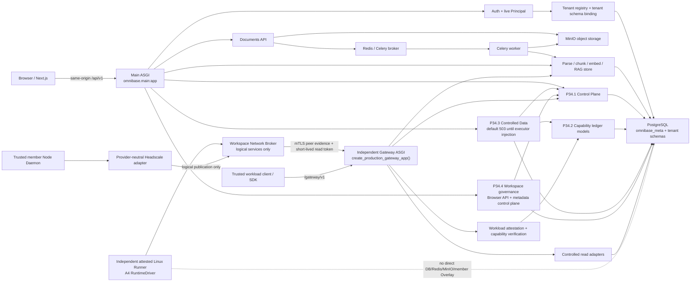

# OmniBase 本地 AI 维护者地图

本文面向未来在本地仓库中工作的 AI 维护者。目标不是复述产品愿景，而是给出一条可以从公开源码重建、定位、修改、验证和恢复 OmniBase 的最短可靠路径。

本文只描述当前源码已经存在的边界。阶段完成情况和历史验证证据仍以 `docs/handover-report.md` 为准；本文中的模块关系不能代替源码、数据库约束、迁移、契约快照或测试结果。

## 1. 开始任何修改前

按以下顺序读取：

1. `AGENTS.md`：仓库级维护契约、冻结边界和安全工作流。
2. `docs/maintainers/maintenance-map.json`：机器可读模块、依赖、不变量、验证和恢复入口。
3. `docs/maintainers/security-invariants.md`：INV-001 至 INV-021 的权威维护约束。
4. 本文：运行入口、调用方向、边界和影响矩阵。
5. 目标模块源码，以及机器地图列出的迁移、契约和测试。
6. `docs/handover-report.md`：当前阶段状态、最近验证证据和尚未授权的动作。

发生冲突时，不要猜测。运行时源码、数据库约束、Alembic 迁移、OpenAPI/SDK 契约和通过的测试优先于叙述性文档；阶段是否解锁、是否迁移过业务数据库等历史事实则以交接报告中的直接证据为准。发现维护文档过期时，应在获得相应修改范围后同步修正，不能让本地记忆或私有对话成为隐藏的事实来源。

## 2. 当前系统总图



图中的两个 HTTP 入口不是同一个应用：

- 浏览器和用户 API 的组合根是 `backend/src/omnibase/main.py:app`，Dockerfile 当前以 `uvicorn omnibase.main:app ...` 启动。
- Capability Gateway 由 `backend/src/omnibase/capability_gateway/app.py:create_gateway_app` 创建，是独立、非浏览器 ASGI 应用；P34.5D 的 production composition 入口是 `create_production_gateway_app()`。当前源码没有把它挂载到 Main ASGI，也没有在主 `docker-compose.yml` 中定义 Gateway 服务。
- Gateway 的默认 `RejectingWorkloadAttestor`、`RejectingCapabilityVerifier` 和 unavailable adapters 会拒绝或不可用；只有部署方显式注入可信 attestation、capability verifier、cursor secret 和 adapters 后才能开放对应能力。
- 不得为了“先跑起来”把 Gateway 挂入 `/api/v1`、用浏览器 JWT/cookie 替代 workload identity，或让 SDK 直连数据库。

## 3. Main ASGI 与 `/api/v1` 路由

`backend/src/omnibase/main.py:create_app` 负责：

- 初始化 Request Body Limit、CORS 和 Request Context middleware；
- 在 lifespan 中预热数据库、确保 `omnibase_meta` schema 和 `public.vector` extension 存在，并检查 MinIO；
- 把业务 Router 统一挂到 `APIRouter(prefix="/api/v1")`；
- 提供根路径 `/health`、`/health/ready` 作为探针兼容入口；
- 在开发环境开放 `/docs`、`/redoc` 和 `/openapi.json`，生产环境关闭这些入口。

应用启动只确保基础 schema/extension 存在，不会代替完整 Alembic migration。数据库版本变更必须走受控 migration 流程。

### 3.1 当前路由面

| 路由族 | 当前入口 | 身份/权限 | 关键边界 |
|---|---|---|---|
| Health | `/health`, `/health/ready`, `/api/v1/health`, `/api/v1/health/ready` | 探针 | liveness 不访问依赖；readiness 检查 PostgreSQL、MinIO、Redis |
| Auth | `/api/v1/auth/register`, `/login`, `/refresh`, `/me` | register/login/refresh 按各自契约；`me` 需用户身份 | Access token 只作为重新解析实时 Principal 的起点 |
| Tenant 管理 | `/api/v1/tenants`, `/by-slug/{slug}`, `/{tenant_id}` | `require_platform_admin`；默认配置关闭时返回 404 | 平台管理 token 与用户 JWT 是不同边界；删除是停用，保留 schema |
| Documents | `/api/v1/documents...` | `get_current_tenant` | 不接受 tenant 参数；MinIO key 以 tenant schema 命名空间隔离 |
| Database browser | `/api/v1/database/tables` | `get_current_tenant` + tenant DB | 仅允许列出白名单表/列的 metadata；没有任意 SQL HTTP 接口 |
| RAG | `/api/v1/rag/search`, `/playground`, `/ask` | `get_current_tenant` + RAG rate limit | Browser 用户通道；`ask` 使用 SSE，和 workload Gateway 通道不同 |
| P34.1 Control Plane | `/api/v1/control-plane/resources`, `/operations`, `/approvals`, `/audit/events` 及单项读取 | tenant admin + tenant DB | 当前 HTTP 面只读；跨 tenant ID 与不存在统一按 404 处理 |
| P34.3 Controlled Data | `/api/v1/controlled-data/rows/mutate` | `get_current_principal` | 只接受逻辑 Resource/Column UUID 和结构化 mutation；默认未安装 executor 时稳定 503 |
| P34.4 Workspace governance | `/api/v1/workspace-templates`, `/api/v1/workspaces...` | `get_current_tenant` + tenant DB；模板 POST 额外要求实时 tenant admin；其余按 Workspace membership/RBAC | Browser 只管理模板注册/读取、Workspace、成员、scope grant、命名 lifecycle、Run、snapshot/restore；不暴露 Node attestation、lease、fencing、Overlay activation 或 authority |

当前没有公开的任意 SQL、公开 DDL apply、浏览器 Capability 签发、Node/lease/fencing/Overlay 内部入口、真实 Workspace Runtime 或 Agent Runtime 路由。

## 4. Auth、Principal 与 Tenant schema 链

受保护的浏览器请求必须沿以下链路完成，不能删减为“JWT 验签通过”：

```text
Authorization: Bearer <access token>
  -> auth.security.decode_access_token()
     验证签名、过期时间和 access token 类型
  -> 要求 token 含 tenant_id 与 sub
  -> tenants.service.get_tenant_by_id()
     从 omnibase_meta.tenants 重新读取当前有效 Tenant
  -> validate_schema_name(tenant.schema_name)
  -> set_current_schema() 写入请求 ContextVar
  -> _load_active_user()
     创建显式 tenant-bound Session，重新读取当前 active User 与角色
  -> CurrentPrincipal(tenant, user, token)
  -> get_current_tenant() / require_tenant_admin() / get_tenant_db()
  -> SQLAlchemy after_begin hook
     校验 ContextVar 与 Session schema 一致
     SET LOCAL search_path TO tenant_schema, omnibase_meta, public
```

维护要点：

- `tenant_id` 和 `sub` 来自已验证 token，但 tenant 是否启用、user 是否启用、user 当前角色必须重新查数据库。
- token 中历史 `schema_name` 或角色信息不是当前授权事实。Refresh 也会重新解析 canonical Tenant 和 active User。
- `get_tenant_db()` 同时设置 `TENANT_SCHEMA_SESSION_KEY` 与 `TENANT_CONTEXT_REQUIRED_SESSION_KEY`。缺少活跃 context、context/session 不一致或 schema 名不合法都必须失败。
- 连接从池中 checkout 时先恢复 `omnibase_meta, public` baseline；tenant search path 使用事务级 `SET LOCAL`，避免连接复用残留。
- 业务表 ORM 位于无固定 schema 的 `TENANT_METADATA`，因此正确的 tenant binding 是访问 `users`、`documents`、`embeddings` 等表的前置安全条件。
- Login 在 tenant 尚未知时会遍历 active tenant schemas 查找用户，这是登录发现流程，不得复制为受保护请求的授权捷径。

## 5. Documents、Celery 与 RAG

### 5.1 上传和异步摄取

当前调用方向：

```text
POST /api/v1/documents
  -> documents.router.upload_endpoint
  -> documents.service.upload_document
     -> 校验 filename / MIME / size
     -> MinIO put_object: <tenant_schema>/<document_id>/<filename>
     -> tenant documents row: pending
     -> 可选同步 PDF metadata 提取
     -> 持久化 queued
     -> enqueue_ingest() 只发送五个 durable identifiers
  -> Redis broker
  -> workers.tasks.ingest_document_task
     -> 从 MinIO 下载对象
     -> tenant_scope(schema_name)
     -> documents row: processing
     -> rag.ingest.ingest_document
        -> parse -> chunk -> embedding
        -> 删除该 document 的旧 V1 chunks
        -> 写入 authoritative V1 embeddings
        -> 配置允许时 best-effort 写入 V2 shadow lane
     -> documents row: indexed 或 failed
```

关键语义：

- 上传在 dispatch 前先持久化 `queued`，避免快速 Worker 把状态推进后又被上传线程覆盖。
- Broker dispatch 失败只在 row 仍为 `queued` 时 compare-and-set 为 `failed`。
- Celery task 只接收 `schema_name`、`document_id`、`minio_key`、`filename`、`mime_type`，不传文件字节、JWT、Header 或请求上下文。
- Worker 对有限的基础设施异常做有界重试；终止错误写入安全裁剪后的 `failed` 状态，不能伪造 `indexed`。
- 删除文档时，`pending`、`queued`、`processing` 状态会阻止删除；对象存储、数据库和 RAG chunks 的一致性修改必须一起审查。
- Phase 1.6 当前仍以 V1 为唯一权威主通道。V2 是可重建 shadow lane；生产回填、cutover 和删除 V1 均冻结。

### 5.2 Browser RAG 与 Gateway RAG

Browser RAG：

- `rag.router` 通过 `get_current_tenant` 获得 schema；
- `hybrid_search()` 在同一个 index lane 中执行 vector 与 BM25，RRF 融合后可进入 reranker；
- `/rag/ask` 把检索结果作为 citation context 交给 LLM，并以 SSE 输出 citations、chunks 和 done/error；
- embedding/reranker/LLM 的可用性和降级语义由各自模块与测试约束，不能通过在线下载或无界线程绕过配置边界。

Gateway RAG：

- workload 只能调用 `/gateway/v1/rag/search` 和 `/gateway/v1/rag/citations/read`；
- Gateway 先完成 workload attestation、capability verification、budget reservation、logical Resource 解析和 policy 检查，再调用 `CanonicalRagReadAdapter`；
- Gateway adapter 可以复用 canonical retriever/reranker，但身份、预算、审计和响应 DTO 仍由 Gateway 强制执行；
- Browser JWT、前端 localStorage token 和 Gateway capability 不可互换。

## 6. P34.1–P34.4 调用方向

### 6.1 P34.1 Control Plane：治理事实底座

`backend/src/omnibase/control_plane` 定义和管理：

- `resource_registry`：逻辑资源、tenant/workspace/owner、版本、状态与 policy class；
- `resource_lineage`：资源派生关系；
- `operations`：持久操作状态、版本、风险、进度和 deadline；
- `approval_requests`：高风险审批及其 operation/resource/request hash 绑定；
- `idempotency_records`：actor scope + operation name + key 的幂等事实；
- `audit_events`：append-only 审计事件。

Control Plane 是 Capability 与 Controlled Data 的上游，不应反向依赖具体 UI 或 SDK。当前 HTTP Router 只给 tenant admin 提供 tenant-scoped 读取；mutation service 保持内部调用。

### 6.2 P34.2 Capability Ledger 与独立 Gateway：只读 workload 能力

调用方向：

```text
Python/TypeScript SDK
  -> 每次请求向 WorkloadCredentialProvider 取短期 credential
  -> POST /gateway/v1/*
  -> WorkloadAttestor
  -> CapabilityVerifier
     -> capabilities.service.verify_capability
     -> grant ancestry / tenant / workspace / runtime / workload / action
     -> resource/version / time window / revocation / online budgets
  -> budget reservation commit
  -> Resource Registry logical lookup
  -> policy check
  -> data or RAG read adapter
  -> durable allowed/denied/error audit
  -> bounded DTO response
```

公开 Gateway 动作只有：

- `data.schema.read`
- `data.rows.read`
- `rag.search`
- `rag.citation.read`

Gateway 不接受任意 SQL、物理 schema/table/column、浏览器 cookie 或长期静态 service secret 作为授权替代。Capability grants、usage、revocations 和 signing-key registry 位于 `omnibase_meta`；revocation 是 append-only。

### 6.3 P34.3 Controlled Data：结构化写入与内部 DDL

当前浏览器写入调用方向：

```text
POST /api/v1/controlled-data/rows/mutate
  -> live CurrentPrincipal
  -> 必须存在显式安装且声明 supports_atomic_lifecycle 的 executor
  -> server 在同一 lifecycle 中解析/锁定：
     Tenant -> User -> Resource -> DataTableBinding -> DataColumnBindings
     -> AuthorizationContext -> Operation -> Idempotency
  -> 从 logical UUID 深冻结 TrustedMutationLocator
  -> executor 在锁内重新验证 tenant/schema/resource/version/authorization
  -> 参数化 INSERT / UPDATE / DELETE
  -> mutation + Operation + Idempotency + success Audit 同事务提交
  -> 失败时写事务回滚，再以独立事务写 code-only failure Audit
```

必须保留的边界：

- HTTP 请求只接受逻辑 Resource/Column UUID、结构化 predicate、版本、幂等键和预算；不接受 SQL、schema、table、column、CTID、AuthorizationContext 或 Operation ID。
- User-RBAC row mutation 当前直接从 Main ASGI 进入 Controlled Data lifecycle，不通过 Capability Gateway；它仍使用实时 tenant/user/role 复核。
- `create_table_bootstrap`、DDL plan/authorize/apply、outbox 和 compensation 是内部服务契约，没有公开任意 DDL HTTP 面。
- Workspace/Agent write capability 未开放。不能把现有 User-RBAC route 改名后当成 Agent 写入口。
- Main ASGI 默认不安装 `controlled_crud_executor`；缺失或 marker 不可信时返回 `503 controlled_write_unavailable`。这是生产 feature gate，不是待删除的临时代码。

P34 的依赖方向应保持为：

```text
Control Plane
  -> Capability Ledger
  -> Capability Gateway / SDK read path

Control Plane + Capability model bindings + Tenant/Principal
  -> Controlled Data CRUD/DDL lifecycle

Gateway adapters
  -> Controlled read/RAG implementation

不得形成：Adapter -> 绕过 Gateway 的公共入口，或 Controlled Data -> 接受公共 physical locator。
```

### 6.4 P34.4 Workspace 控制面：治理、生命周期与 fake/local harness

Browser 调用方向：

```text
/api/v1/workspace-templates + /api/v1/workspaces/*
  -> live TenantContext / tenant-bound Session
  -> template registration re-locks and revalidates the live tenant admin in the write transaction
  -> Workspace aggregate lock + locked actor/target membership + closed role/action matrix
  -> template/scope/generation/version validation
  -> named lifecycle or aggregate service
  -> Resource/Idempotency/Audit facts in caller-owned transaction
  -> strict logical DTO (no tenant self-claim, locator, secret, provider handle or fencing)
```

内部 trusted-service 方向：

```text
trusted Node/Reconciler context
  -> Run lease + heartbeat + generation + Node fencing + live attestation validation
  -> Node attestation / Peer Grant / Service Advertisement / logical Network Lease cursor
  -> Workspace authority epoch + SyncEnvelope digest/sequence validation
  -> unavailable production component or isolated metadata-only fake/local harness
```

关键入口：

- `workspaces.router`：`template_router`、`register_template_version` 与 Browser `router`；模板 POST 是 tenant-admin-only。
- `workspaces.service`：`register_template`、`create_workspace`、`authorize_workspace_action`、`request_workspace_state`、`reconcile_workspace`、`create_run`、`claim_run_lease`、`heartbeat_run_lease`、`submit_run_state`、`get_active_attested_node`、`create_snapshot`、`restore_snapshot_new_workspace`。
- `workspaces.overlay`：`register_attested_node`、`revoke_node`、`create_peer_grant`、`publish_service`、`acquire_network_lease`、`validate_network_lease` 与可替换 `PeerOverlayProvider`。
- `workspaces.collaboration`：`claim_workspace_authority`、`heartbeat_workspace_authority`、`mark_workspace_authority_offline`、`validate_sync_envelope`、`commit_sync_envelope`。

必须保留的边界：

- 同 Tenant 不自动跨 Workspace；membership/scope/grant 缺失时 fail-closed。
- membership mutation 先锁 tenant-bound Workspace aggregate，再锁后重验 actor 与 target；改变 active owner 时才在该串行化边界内判断 last-owner，不能使用事务外角色快照或未串行化 owner count。
- scope grant 公共 action allowlist 只有 `resource.read` 与 `resource.list`；模板、membership 与 scope-grant mutation 都必须写脱敏 Audit。
- 模板 POST 保留实时 `require_tenant_admin` 早期拒绝，并在 `register_template()` 的 caller-owned transaction 中再次锁定、重验 active tenant-admin User；PostgreSQL `(tenant_id, template_key, version)` 自然键通过 `ON CONFLICT DO NOTHING` 支持并发 exact replay，spec/display name/supersedes/digest 任一不同均冲突。
- 新建 Workspace 默认 stopped；创建逻辑治理资源不得隐式启动 runtime、分配 lease 或调用 provider。
- Run Lease 同时绑定 Workspace/Run generation、单调 run fencing token、当前 Node fencing token与实时未过期 attestation；Node 重新 fencing 后旧 lease 失效。Run 进入 stopped/succeeded/failed/cancelled 后关闭或撤销 lease、清除 runtime/workload identity，不能被旧 holder 复活。
- `acquire_network_lease()` 只在数据库事务中推进 `network_lease_cursors` 并签发逻辑授权，不调用真实或 fake provider。production default 不运行代码、不创建 socket/peer/runtime；fake/local provider 只是独立测试 harness。
- authority、Peer Grant、Service Advertisement、Network Lease 与 Node revoke 的权威锁阶段使用共同前缀：Workspace aggregate → 按稳定 ID 的 live-attested Node → authority/peer/service/cursor/lease。撤销 Node 会提高 Node fencing，并级联撤销 Run/Peer/Service/Network/Authority。
- Node/lease/fencing/authority 不挂到 Browser ASGI，不从 Browser Header/JSON 构造可信 Node 或 holder。
- P34.4 不访问真实 Workspace 文件、Git credential、业务 PostgreSQL、MinIO、Redis 或 canonical RAG，也不开放 Workspace/Agent data write capability。

### 6.5 P34.5A0-A4 Sandbox：控制闭环、独立 Runner seam 与宿主攻击 Gate

`backend/src/omnibase/sandbox/` 同时包含 A0-A3 的副作用前控制闭环与 A4 的独立 Linux Runner seam。源码存在不等于任意宿主已经获得生产执行资格：

```text
server-owned P34.4 Run/runtime/Node/lease/fencing facts
        + P34.2 token-free Sandbox capability verifier
        + operation-idempotent capability budget reservation
                         │
                         ▼
              ComposedSandboxAuthorizer
      default rejecting lease/capability verifiers
                         │
                         ▼
                  SandboxProvider
          default UnavailableSandboxProvider
                         │
             test-only explicit injection
                         ▼
        FakeInMemorySandboxProvider
        metadata lifecycle only; exec/cancel denied

trusted controller identity + current generation/fencing
                         │
                         ▼
             SandboxControlAuthorizer
      default RejectingSandboxControlAuthorizer
                         │
                         ▼
       SqlAlchemySandboxOperationStore
  current pointer + append-only transition + Audit
                         │
                         ▼
              RunnerHostAttestor
       profile + identity + Node fencing proof
                         │
                         ▼
           SandboxExecutionCoordinator
                         │
                         ▼
                RunnerTransport
        default UnavailableRunnerTransport
                         │
                         ▼
       AuthenticatedRunnerService / transport auth
                         │
                         ▼
          AttestedLinuxSandboxRunner
                         │
                         ▼
        AttestedLinuxLocalRuntimeDriver
   pinned launcher + per-operation cgroup kill
```

关键入口：

- `sandbox.contracts.SandboxOperationRequest`：只携带待在线复核的 tenant/workspace/run/runtime instance/node/lease/generation/Run fencing/Node fencing/workload identity/action；它不是 bearer token，调用方持有这些值不产生授权。
- `sandbox.contracts.SandboxRuntimeSpec`：强制资源上限、只读 root、non-root、`no_new_privileges`、drop-all capabilities、无 host mount/device/runtime socket，并且 P34.5A0 网络只能 `deny_all`。
- `sandbox.contracts.SandboxCommandSpec` 与 `SandboxRelativePath`：只允许 immutable argv 与 canonical Workspace-relative POSIX path；不接受 shell string、env、绝对/drive/traversal/保留凭据路径。
- `sandbox.provider.UnavailableSandboxProvider`：生产默认全部 unavailable，不能因为 provider 缺失回退到 Core API、Celery、Docker 或宿主 shell。
- `sandbox.provider.FakeInMemorySandboxProvider`：只在内存中演练 create/start/stop/destroy、空 logs/stats、provider-owned metadata-only snapshot 与 restore-new-generation；拒绝伪造 snapshot、同一 Run 的销毁后重建和 restore 重放，`exec`/`cancel` 永久拒绝，没有进程、文件、socket、网络、容器、挂载或 provider side effect。
- `workspaces.service.bind_run_runtime_identity` 与 `verify_run_lease_for_sandbox`：只在 live fenced Run lease 下单次绑定 runtime instance/workload identity，并在每次 Sandbox 操作时重新验证 Workspace/Run/Node/Lease/generation/Run+Node fencing、实时 attestation 和 DB clock。
- `sandbox.authorization.SqlAlchemySandboxLeaseVerifier`：每次验证创建并关闭一个新 SQLAlchemy transaction，把 P34.4 server-owned facts 映射为无 bearer material 的 lease proof；拒绝 stale/unbound runtime identity。`ComposedSandboxAuthorizer` 再与 P34.2 capability proof 做完整 binding 与有效期交集。
- `capabilities.service.create_sandbox_grant`：只创建与 read profile 互斥的 `sandbox.*` lifecycle closed set；Grant 绑定单一 Workspace、runtime instance 与 workload identity，最长五分钟、不可委派，也不能由 `issue_token()` 签发为 Gateway bearer token。
- `capabilities.service.verify_and_reserve_sandbox_capability` 与 `sandbox.authorization.SqlAlchemySandboxCapabilityVerifier`：每次新事务重读 Grant/Workspace，按 operation ID 幂等追加 budget reservation；exact replay 不重复扣 calls/cost，tenant/grant/workspace/runtime/action drift 一律拒绝，verification digest 不含实时 clock，合法重放保持稳定。
- `sandbox.control.SandboxControlRequest`：仅用于可信 controller 的 emergency stop/destroy，独立于 workload capability，绑定 controller identity、runtime handle、generation、Run/Node fencing、reason 与 deadline；缺少控制授权时默认拒绝。
- `sandbox.operations.SandboxOperationStore` 与 `sandbox.persistence.SqlAlchemySandboxOperationStore`：production store 将 immutable intent binding、current state/version、append-only transition 与 redacted Audit 放在同一短事务；Workspace/Run/Grant 使用复合 tenant 外键，transition/reservation 的 UPDATE/DELETE 由数据库 trigger 拒绝。`UnavailableSandboxOperationStore` 仍是未装配时的安全默认，`InMemorySandboxOperationStore` 仅供 test。
- `sandbox.host.RunnerHostAttestor`：绑定 Runner/Node identity、Node fencing、isolation profile digest、有效期和 evidence digest；默认拒绝。`scripts/sandbox/probe_runner_host.py` 只读探测宿主控制，不会降低目标 profile。
- `sandbox.coordinator.SandboxExecutionCoordinator`：按 durable reservation → live authorization → host attestation → dispatch marker → transport → receipt binding 排序；terminal exact replay 不重复 dispatch，崩溃后的 dispatching 与 transport timeout/receipt drift 都进入 ambiguous/reconciliation-required。
- `sandbox.transport.RunnerTransport`：Core 与独立 Runner 的传输 seam；默认 unavailable，Core 文件不导入 Docker、socket、subprocess、HTTP client 或 host filesystem control。
- `sandbox.runner.UnavailableSandboxRunner`：真实独立 Linux Runner 的拒绝默认。`RunnerIsolationProfile` 冻结 cgroup v2、user/PID/mount/network namespace、seccomp、LSM 和有界 kill 契约，但不声称宿主已经实现这些控制。
- `sandbox.dispatch_digest`：Core 与 Runner 共用 request/spec/execution canonical digest；Coordinator 会在 durable begin 前重新计算 request/spec，并要求 receipt 精确绑定 operation、Runner、runtime instance 与 host proof。
- `sandbox.transport_auth` 与 `sandbox.transport_service`：认证 envelope 绑定 Runner、operation、sequence、deadline 和 payload digest；拒绝过期、篡改和 replay。production 入口是 `TrustedRunnerMtlsPeer` + `MtlsRunnerTransportAuthenticator` + 私有显式路径的 `SqliteRunnerReplayStore`；peer certificate thumbprint 必须与 `VerifiedRunnerHost.runner_identity_thumbprint` 精确一致，不能只依赖 runner/node UUID，nonce/sequence replay 在进程重启后仍被拒绝。`HmacRunnerTransportAuthenticator` 和 `InMemoryRunnerReplayStore` 仅用于 local/dev/tests，不是 production identity 或 durability。
- `sandbox.runtime_probe.SystemLinuxRuntimeProbe`：读取目标 Linux cgroup、namespace identity、seccomp、LSM 和受信路径证据；目标 runtime 的 user/PID/mount/network namespace 必须与 host 初始 namespace 不同。host reference 只能是直接 VM 的 `/proc/1/ns/*` namespace symlink handle，或 root-owned、非 group/world-writable 的 `/run/omnibase-host-ns/*` regular snapshot，snapshot 内容严格保存 host namespace `dev:ino`；绝不能比较普通 snapshot 文件自身 inode。
- `sandbox.runtime_driver.AttestedLinuxLocalRuntimeDriver`：只在 attestation 与 profile digest 完整匹配时调用固定 launcher；stdin、stdout/stderr 和 deadline 都有界。超时或输出溢出先对 operation cgroup 写 `cgroup.kill` 并确认 `cgroup.events populated 0`，随后才清理 launcher process group。
- `sandbox.runner_service.AttestedLinuxSandboxRunner`：把 host proof、execution plan、RuntimeDriver receipt 和 canonical binding 聚合为 Runner receipt；非零 exit、截断、binding drift 或无法证明强杀都不能冒充 success。

该包仍没有 Browser Router、Docker/Podman socket、Core 数据凭据或宿主目录注入。A4 源码必须部署到真正独立、满足 profile 的 Linux Runner，并由 `RUN-03/04/05`、`FS-01/02/03`、`NET-01/02`、`PROC-01/02`、`HOST-01` 与 `CROSS-01` 的目标宿主 artifact 决定能否装配。`RUN-05` 专门验证 requested non-root UID/GID、空 supplementary groups、精确单项 uid/gid map 与非法身份拒绝。普通 Docker Desktop/WSL smoke、focused 单测或源码审计都不能替代该 Gate。

### 6.6 P34.5B-D：Broker、Overlay publication 与 Gateway workload bridge

调用方向固定为：

```text
trusted member Node Daemon
  -> HeadscaleOverlayAdapter
     -> live Workspace/Peer/Service/Network Lease + dual Node attestation
     -> durable OverlayOperationLedger
     -> opaque short-lived credential reference
     -> daemon transport
     -> OverlayLogicalServicePublication
  -> VerifiedOverlayLogicalServiceMapper
  -> LogicalNetworkService

isolated Sandbox network namespace
  -> ControlledWorkspaceNetworkBroker
     -> live SandboxNetworkAuthorizer
     -> NetworkNamespaceAttestor
     -> logical service resolve
     -> destination/private/metadata policy
     -> resolve again and require exact service/protocol/port/address/route-kind/digest stability
     -> private SqliteNetworkBudgetLedger (pending/committed/unknown)
     -> private daemon-owned PID/starttime/live netns evidence distinct from host net namespace
     -> dedicated-UID AF_UNIX transport with socket continuity, SO_PEERCRED and pinned-key challenge
     -> independent PrivateNetwork Linux Broker daemon
        -> root-owned short-lived exact permit
        -> durable consumed-operation no-replay marker
        -> verified setns worker + measured TCP receipt
  -> trusted mTLS Gateway peer evidence
  -> independent Capability Gateway read path
```

修复入口与边界：

- `sandbox.network` 冻结 logical service、network authorization、protocol/port/deadline/budget 与 destination classification；Sandbox 不能提交 IP、URL、route、provider handle 或 credential。
- `sandbox.broker.ControlledWorkspaceNetworkBroker` 固定授权 → namespace attestation → 双解析 → durable budget → transport → receipt binding → commit；receipt 必须先验证再 commit，transport/receipt/commit 异常把 reservation 保持为 pending 或单向标记 unknown，禁止自动重放。默认 authorizer/resolver/attestor/ledger/transport/Broker 全部拒绝。
- `sandbox.network_ledger.SqliteNetworkBudgetLedger` 使用私有绝对 POSIX SQLite path、原子创建、`BEGIN IMMEDIATE` aggregate CAS 与 append-only trigger；pending/unknown 继续占用预算，committed exact replay 只返回原 receipt，不再次调用 transport。
- `sandbox.network_runtime.FilesystemNetworkNamespaceAttestor` 从 daemon-owned 私有证据文件重建 Runner/namespace/runtime/workload/generation/fencing 绑定，并重新验证可信 PID/starttime 与 live `/proc/<pid>/ns/net` `dev:ino`；host reference 仅为 `/proc/1/ns/net` 或固定 root/private snapshot。`UnixSocketBrokerTransport` 只走显式私有 AF_UNIX socket，要求专用 daemon UID/GID、连接前后 socket inode 连续、`SO_PEERCRED` PID/starttime 稳定和 pinned-key nonce challenge；它不自行开放公网或加入成员 Overlay。
- `deployment/network-broker/omnibase-network-broker.py` 是独立、非 Browser、非 Core 数据进程。systemd supervisor 使用专用非 root UID、`PrivateNetwork=yes` 与受限 capability；每次请求重开 live PID netns、核对 starttime/`dev:ino`/host snapshot/短期 permit，在网络副作用前 durable 消费 operation，再由短生命周期 worker `setns` 建立一次 TCP 连接。`scripts/network-broker/run-network-broker-attack-gate.py` 必须在独立 Linux Runner 运行，普通 Docker/WSL 不算 production 证据。
- `workspaces.overlay_adapters.HeadscaleOverlayAdapter` 只面向受信 Node Daemon。`OverlayOperationLedger` 必须在 credential issuance/transport 前 reserve；mutation outcome unknown 禁止自动重放。
- `OverlayLogicalServicePublication` 与 `sandbox.overlay_publication.VerifiedOverlayLogicalServiceMapper` 只传 Tenant/Workspace/logical service、协议/端口、generation/fencing/version/expiry；地址、route、provider handle、Headscale/Tailscale key 和 Sandbox identity 不存在于该 DTO。
- `capability_gateway.workload.TrustedGatewayPeerEvidence` 只能由受信 Runner/Broker mTLS ingress 注入 ASGI scope，普通 Header/cookie/source IP 无法构造。
- `SqlAlchemyRunLeaseWorkloadAttestor` 每个请求重新验证 live P34.4 Run/Node/Lease/fencing/runtime/certificate binding；`SqlAlchemyGatewayCredentialIssuer` 在 Core 内加载私钥，token 最长五分钟且不能晚于 Run Lease expiry。
- `create_production_gateway_app()` 显式组合可信 workload attestor、Core capability verifier、只读 PostgreSQL/RAG adapters 与 append-only Audit；它仍是独立 Gateway ASGI，不挂入 Browser Main app。

P34.5B 已在独立 Hyper-V Ubuntu Runner 上完成两轮 26/26 Network Broker Gate，覆盖真实 `setns` namespace-only connect、direct egress default-deny、地址分类、预算、challenge、PID/starttime/netns、socket identity、durable no-replay 与清理；证据位于 `docs/evidence/p34-5/network-broker-attack-gate.{json,md}`。该 Gate 不自动证明 Core↔Broker production mTLS 联合激活。P34.5C 已从 fresh Windows clone 构建专用 Runner 并通过真实 disposable Headscale control-plane Gate：161 文件 source manifest 同时封存 `.gitattributes`、锁文件、完整 build inputs 与 upstream digests；mTLS Node Daemon 对 Headscale provider records 完成 activate/status/rotate/revoke，验证 ambiguous no-replay、离线/重连、凭据 containment 与 `0/0/0` 清理。该 Gate 注册的真实成员设备为 0，因此不能冒充 production Node Daemon、两节点数据面、DERP relay 或节点失陷证据；这些继续属于 P34.7。P34.5D 已从 clean checkout 构建独立 Gateway 与 stdlib-only client 镜像并通过真实 split-process mTLS Gateway Gate：249 文件 source manifest 封存 `.gitattributes`、完整 `backend/src`/`backend/tests` 和全部 build inputs；独立受限 client 经 server-owned registry/live lease/fencing 领取短期 credential，并在 guarded `omnibase_test_*` sentinel 内完成 schema/rows/RAG/citation 四读及 stale/revocation 矩阵，最终 `0/0/0` 清理。该闭环仍不允许 Runner/Sandbox 直连 PostgreSQL、Redis 或 MinIO，也不自动证明非 disposable production tenant/RAG。

### 6.7 P34.6 Workspace 数据、Derived RAG、Promotion 与 Snapshot lineage

P34.6 复用 P34.1–P34.5 的 Resource、Operation、Approval、Idempotency、Audit、Workspace membership、Run/Node/Lease/fencing 和 Controlled CRUD，不建立第二套鉴权或 SQL 执行器：

```text
trusted Runner/Broker mTLS peer
  -> live Run/Node/Lease/generation/fencing attestation
  -> short-lived non-delegable WORKSPACE_DATA grant
  -> independent Gateway logical data route
  -> operation-idempotent calls/bytes/cost reservation
  -> P34.3 private CRUD or explicitly installed WorkspaceDataAdapter
  -> result + Operation/Idempotency/Audit, or pending/unknown reconciliation

Browser control plane
  -> live Workspace membership and tenant-admin decision
  -> R2 Approval + Operation + exact source version/digest/request hash
  -> copy-on-publish to a new controlled_shared Resource
  -> published_from lineage; source remains immutable
```

关键边界：

- `capabilities.service.WORKSPACE_DATA_ACTIONS` 与 READ/SANDBOX profiles 互斥；Grant 绑定单一 Workspace、runtime instance 和 workload identity，最长五分钟、不可委派。Promotion action 不存在于 runtime token。
- `capability_gateway.write_service.WorkspaceDataGatewayService` 只接受逻辑 ID 和 strict DTO；Browser Bearer/read token、canonical/controlled-shared write、physical locator/schema/table/object key/SQL 都在 adapter 前拒绝。Production composition 的 write adapter 默认 unavailable。
- `workspace_data` 的 Artifact、DerivedIndex、Publication、SnapshotItem 和 DataEffect 都是 durable metadata。Artifact/derived output 不可原地覆盖；每次修订创建新的 Resource/generation，并追加 lineage。
- tenant `workspace_derived_chunks_v2` 是独立 derived lane；任何 P34.6 build/search/promotion/restore 都不能写 canonical `documents`、`embeddings`、`embeddings_v2` 或 RAG index metadata。
- provider/object-store/index boundary 前先持久化 pending effect；跨边界后结果不明确进入 `unknown`，禁止自动 replay。不能通过删除 reservation、effect、Audit 或 lineage 伪造 fresh attempt。
- Promotion 只创建新的 `controlled_shared` target 和 `published_from` lineage；P34.6 不允许直接创建/修改 `canonical_readonly`，也不允许 requester self-approval 或 source 原地 policy flip。
- Snapshot 只有在 server-generated resource/version/digest/size inventory 全部验证后才能 ready；Restore 创建新 Workspace/generation 和新 Resource ID，不恢复旧 Run、Lease、token、runtime/workload identity、PID、socket、连接或 provider handle。

P34.6 的 unit/fresh-sentinel Gate 证明源码、migration、DB trigger、逻辑路由和失败语义；真实非 disposable object store/index worker、生产 snapshot payload 传输、恢复演练、容量/SLA 与 production cutover 继续由 P34.7 验收。

## 7. 数据库与 migration 边界

### 7.1 物理边界

| 区域 | 当前数据 |
|---|---|
| `omnibase_meta` global schema | Tenant registry；P34.1 Resource/Lineage/Operation/Approval/Idempotency/Audit；P34.2 signing keys/grants/usage/revocations；P34.3 table/column/index bindings、authorization contexts、schema plans、outbox、compensations；P34.4 Workspace/Run/Node/Network/Authority 元数据；P34.5 Sandbox durable dispatch；P34.6 `workspace_artifacts`、`workspace_derived_indexes`、`workspace_publications`、`workspace_snapshot_items`、`workspace_data_effects`、`workspace_data_usage_reservations` |
| 每个 `tenant_*` schema | users、documents、V1/V2 canonical embeddings、RAG index state、P34.3 `controlled_data_operation_payloads` 与受控动态业务表，以及 P34.6 独立 `workspace_derived_chunks_v2` lane |
| MinIO | 原始文档对象，key 以 tenant schema 前缀隔离 |
| Redis | Celery broker/result backend、限流与相关短期状态；不是 tenant 业务事实的最终来源 |

### 7.2 Alembic 方向

- migration 链当前为 `0001` 至 `0009`。
- `migrations/env.py` online 模式先迁移 `omnibase_meta`，再读取 registry 中所有 retained tenants（包括 inactive tenants），逐一迁移各自 schema。
- 每个 schema 有自己的 Alembic version table；不能只检查 global revision。
- `migration_schema_scope` 是闭集 `global | tenant`。缺失、大小写错误或未知值必须失败。
- offline `--sql` 只生成 global SQL，不能代替 tenant online staging 演练。
- `0006` downgrade 在存在动态资源、payload、outbox 或 compensation 状态时会拒绝执行，避免静默丢失数据。
- `0007` 只在 global scope 创建 17 张 P34.4 控制面表（包括持久化 Network fencing 的 `network_lease_cursors`）并收紧现有 Resource tenant 复合绑定；ResourceScopeBinding→Workspace/Run、Workspace→restore snapshot、CollaborationEvent→artifact/parent event 均使用 tenant/workspace 复合 FK。tenant scope 为显式 no-op。populated downgrade fail-closed，避免静默丢失 Workspace/lease/authority 元数据。
- ORM 模型、迁移约束和运行服务必须同步审查；只修改 ORM 不会改变已部署数据库。
- 普通业务数据库 migration、downgrade、restore、cleanup 都需要部署所有者明确授权。单元测试或 sentinel integration 通过不等于已经迁移业务数据库。

## 8. SDK、Frontend 与 Operator 边界

### 8.1 Python/TypeScript SDK

- `sdk/python` 与 `sdk/typescript` 只包装独立 Gateway 的四个 P34.2 只读动作。
- SDK transport 只允许 `POST /gateway/v1/...`，每次请求重新获取 workload credential，并限制 base URL、deadline、响应大小和 DTO 类型。
- SDK 不是 Browser API client，不负责 `/api/v1/auth`、Documents、Control Plane 或 Controlled Data User-RBAC。
- `sdk/contracts/p34-2-openapi.snapshot.json` 是冻结契约证据。Gateway DTO 有意变更时必须同步 Gateway、snapshot、Python SDK、TypeScript SDK 和各自测试。
- SDK 不能接受或输出物理 locator、数据库 URL、凭据字段、宽松数值转换或额外未声明字段。

### 8.2 Next.js Frontend

- `frontend/lib/api.ts` 使用同源 `/api/v1`，由 `next.config.js` rewrite 到 Main ASGI。
- Frontend 当前消费 Auth、Documents、metadata-only Database 和 Browser RAG；未消费独立 Gateway SDK。
- 浏览器 access/refresh token 当前保存在 localStorage，并由 Axios interceptor/Bootstrap 管理。这是用户会话实现，不是 workload credential 实现。
- UI 隐藏不能代替后端授权。新增页面或按钮时，后端 route、Principal、tenant predicate 和错误边界仍是权威。
- 主 Compose 的 backend 使用 Uvicorn reload、frontend 使用 Next dev；`docker-compose.frontend-production.yml` 是独立 frontend production smoke/benchmark 配置，不会把后端或 Gateway 自动变为生产部署。

### 8.3 Operator、Compose 与恢复工具

- 主 Compose 当前编排 PostgreSQL/pgvector、MinIO、Redis、Main backend、Celery worker 和开发 frontend；普通 `omnibase-net` 是开发 bridge，不是 P34.5 Sandbox 网络隔离证明。
- 当前 Compose 没有 Capability Gateway、Workspace Runtime、Sandbox Broker、Overlay provider 或 Agent Runtime 服务。
- `omnibase migrate`、Makefile migration targets 和 Alembic 是 schema 变更入口；应用 startup 不是 migration runner。
- `scripts/database/backup.py`、`restore_to_new_database.py`、`verify_restore.py` 和 `docs/runbooks/*` 是 operator 恢复边界。
- 恢复只能创建新的 `omnibase_restore_*` 数据库，校验后由人工切换；不能覆盖、自动删除或原地猜修普通业务数据库。
- `.github/workflows/infrastructure-gates.yml`、锁文件、Dockerfile 和 Compose 是 clean checkout 可重建性的组成部分。直接修改 `.venv`、运行容器、`site-packages`、`node_modules` 或本地数据库不构成源码修复。

## 9. Source of Truth 顺序

判断“系统实际上做什么”时使用以下顺序：

1. 当前运行路径的源码和数据库级约束/trigger。
2. Alembic `0001`–`0008`，包括 upgrade、downgrade 和 scope guard。
3. OpenAPI 与 SDK contract snapshot，以及严格 DTO parser。
4. 与目标行为对应且刚刚通过的单元测试、HTTP contract 测试和 disposable PostgreSQL integration tests。
5. `security-invariants.md` 和 `maintenance-map.json` 中的维护契约。
6. `handover-report.md` 中的阶段状态、授权边界和历史验证证据。
7. Roadmap/实施计划中的未来设计。

未来设计不能证明当前实现已经存在。P34.5A4 旧目标 Hyper-V/Linux 11/11 artifact 只证明旧 launcher 哈希；当前 UID/GID hardening 已把矩阵扩展为 12 项并使旧 artifact 失效，新的 12/12 target-host evidence 在真实 VM 重跑前明确为 `pending/not_proven`。P34.5B 已有独立 PrivateNetwork Broker daemon 两轮 26/26 artifact；P34.5C 已有 fresh-clone/source-built Headscale control-plane + mTLS Node Daemon test-double disposable artifact；P34.5D 已有 clean-checkout/source-built split-process mTLS guarded disposable 四读 artifact。它们都不自动证明 Core↔Runner/Broker production mTLS 联合激活、非 disposable production tenant/RAG、production Node Daemon、真实成员数据面、DERP relay、节点失陷、容量/SLA 或生产总验收。普通 Docker bridge、fake provider、in-memory ledger 或 metadata-only reconciler不能作为这些外部部署证据。

## 10. 模块改动影响矩阵

| 修改区域 | 直接影响 | 必须联动检查 | 最容易破坏的不变量 |
|---|---|---|---|
| `main.py`, middleware, `core/config.py` | 所有 Browser API、health、CORS、request ID、body limit | Frontend proxy、HTTP boundary、Compose healthcheck | INV-005, INV-010 |
| `auth/**`, `tenants/**`, `core/db.py` | 所有受保护路由、tenant schema、当前角色 | Documents、RAG、Database、Control Plane、Controlled Data、Celery tenant scope | INV-001, INV-002, INV-005 |
| `documents/**`, `storage/**`, `workers/**` | 上传、MinIO、durable status、异步 ingest | RAG chunks、delete 一致性、Redis/Celery、tenant object prefix | INV-002, INV-005, INV-010 |
| `rag/**`, embedding/index config | Browser RAG、Gateway RAG、V1/V2 lane | Workers、Gateway adapter、citations、reranker/LLM fallback | INV-002, INV-003, INV-005 |
| `control_plane/**` | Resource、Operation、Approval、Idempotency、Audit | Capability ledger、Gateway resolver/policy、Controlled Data lifecycle、0004/0006 | INV-003, INV-006, INV-007 |
| `capabilities/**` | Grant、token、delegation、revocation、usage budget | Gateway security/service、authorization contexts、SDK contract | INV-003, INV-004, INV-005, INV-006 |
| `capability_gateway/**` | 独立 workload read surface、P34.5D mTLS peer evidence/live lease attestation/短期 read credential | Capability ledger、Control Plane、Workspace Run/Node/Lease、RAG/data adapters、OpenAPI snapshot、两种 SDK | INV-003–INV-006, INV-012–INV-015, INV-021 |
| `controlled_data/**` | User-RBAC mutation、内部 CRUD/DDL、atomic lifecycle | Principal、Control Plane、Capability FK、0006、integration concurrency/timeout | INV-002–INV-007 |
| `workspaces/**` | Workspace aggregate membership/scope、lifecycle、Node-fenced Run lease、logical Network lease cursor、authority/collaboration metadata，以及 provider-neutral Overlay adapter | Principal、Control Plane、0007、Browser OpenAPI、Network Broker、真实 Node Daemon Gate | INV-001–INV-008, INV-011–INV-016, INV-019, INV-020 |
| `sandbox/coordinator.py`, `runner*.py`, `runtime_*.py`, `transport_*.py`, `scripts/sandbox/**`, `deployment/sandbox/**` | P34.5A durable dispatch、mTLS Runner identity、跨进程 replay ledger、attested Linux RuntimeDriver、canonical binding、全异常 cgroup fail-safe cleanup、namespace/seccomp/LSM 与 bounded kill | Workspace Run/Node/lease/fencing、Capability ledger、目标 Linux profile、deployment fault tests 与 attack artifacts | INV-003–INV-005, INV-010, INV-012–INV-018 |
| `sandbox/network.py`, `broker.py`, `network_ledger.py`, `network_runtime.py`, `overlay_publication.py`, `deployment/network-broker/**`, `scripts/network-broker/**` | P34.5B logical-service-only Broker、双解析、durable network budget、private namespace proof、AF_UNIX/SO_PEERCRED transport、独立 PrivateNetwork daemon 与 Linux attack Gate | Workspace Network Lease、Overlay publication、Gateway mTLS ingress | INV-003, INV-005, INV-012–INV-015, INV-017–INV-019 |
| `workspaces/overlay_adapters/**`, `scripts/overlay/**`, `deployment/overlay/**` | P34.5C trusted Node Daemon mutation、durable operation seam、短期 credential reference、真实 Headscale control-plane Gate 与 logical publication | P34.4 Peer/Service/Network/Node facts、Network Broker、P34.7 production Node/relay/compromise Gate | INV-003, INV-005, INV-013–INV-015, INV-019, INV-020 |
| `migrations/**`, ORM models | fresh install、升级、所有 global/tenant schema | backup/restore、downgrade guard、sentinel tests、应用兼容窗口 | INV-002, INV-006, INV-008, INV-009 |
| `sdk/**` | workload client public contract | Gateway OpenAPI、snapshot、Python/TS parsers、deadline/credential handling | INV-003, INV-004, INV-005, INV-010 |
| `frontend/**` | Browser UX、same-origin `/api/v1` client、session bootstrap | Main API paths、production build、production frontend smoke | INV-001, INV-005, INV-010 |
| Compose、Dockerfile、CI、operator scripts | clean rebuild、服务连通、migration/recovery 操作 | 锁文件、health、secret injection、restore verification | INV-008, INV-009, INV-010 |

跨两行以上的修改应取各行验证命令的并集；涉及 Principal、tenant binding、Gateway、Controlled Data 或 migration 时，不能只运行局部 happy-path 测试。

## 11. 最小验证命令

命令默认从仓库根目录运行。项目以容器为首选执行环境，宿主机没有 Python 不应成为跳过 Backend Gate 的理由。

所有仓库根目录 Compose 命令必须显式使用 `--env-file .env.example`。禁止裸运行 `docker compose config --format json`：它会隐式读取并展开根 `.env`。只有受保护的 disposable overlay 可改用其专用 Compose/env 文件，且不得把业务数据库或真实凭据带入测试。

### 11.1 任意维护者地图或共享 Backend 边界改动

```powershell
docker compose --env-file .env.example run --rm --no-deps -v "${PWD}:/workspace" -w /workspace backend `
  python scripts/maintenance/validate_maintainer_map.py --repo-root .
docker compose --env-file .env.example config --quiet
docker compose --env-file .env.example run --rm --no-deps backend mypy src
docker compose --env-file .env.example run --rm --no-deps backend pytest -m "not integration" -q
```

维护者地图 validator 还会对 `backend/src/omnibase` 做保守的 source→map
反向 HTTP 入口审计。扫描范围只包括 AST 可无歧义确认的顶层
`APIRouter`/`FastAPI` 赋值、直接创建并返回 `FastAPI` 的顶层应用工厂，以及
同文件对该工厂的顶层实例化；发现项必须被某个 module `entrypoints` 覆盖。
它有意不枚举所有 public function、dependency 或被 router decorator 修饰的
handler，避免把实现细节误报为架构入口。新增未映射入口时，错误会列出完整的
`relative/path.py:symbol`。

Ruff 当前由 `.github/workflows/infrastructure-gates.yml` 维护精确的基础设施
路径 Gate；各模块的最小路径在 `maintenance-map.json` 中。维护者必须将明确
的本次修改路径传给 `ruff check` 与 `ruff format --check`，不能把占位符直接
交给 shell。未实际运行并通过 `ruff check src tests` 时，不得声称全仓 Ruff
已清零。

### 11.2 Identity/Tenant

```powershell
docker compose --env-file .env.example run --rm --no-deps backend pytest `
  tests/test_auth_service.py `
  tests/test_auth_security.py `
  tests/test_tenants.py `
  tests/test_p0_exposure_lockdown.py -q
```

### 11.3 Documents/Celery/RAG

```powershell
docker compose --env-file .env.example run --rm --no-deps backend pytest `
  tests/test_documents.py `
  tests/test_document_lifecycle.py `
  tests/test_workers.py `
  tests/test_rag_store.py `
  tests/test_rag_sse.py `
  tests/test_reranker_boundary.py -q
```

### 11.4 P34.1/P34.2/P34.3

```powershell
docker compose --env-file .env.example run --rm --no-deps backend pytest `
  tests/test_p34_1_control_plane_api.py `
  tests/test_p34_1_control_plane_models.py `
  tests/test_p34_1_control_plane_service.py `
  tests/test_p34_2_capability_models.py `
  tests/test_p34_2_capability_service.py `
  tests/test_p34_2_gateway_api.py `
  tests/test_p34_2_gateway_query.py `
  tests/test_p34_3_controlled_data_api.py `
  tests/test_p34_3_controlled_data_crud.py `
  tests/test_p34_3_controlled_data_executor.py `
  tests/test_p34_3_controlled_data_execution_service.py -q
```

涉及 migration、锁、并发、timeout、append-only trigger、真实 PostgreSQL transaction 或 downgrade 的修改，还必须运行受 sentinel/一次性数据库保护的：

```powershell
make test-destructive
```

不得把该命令指向普通业务数据库，也不得删掉 sentinel、数据库名或受限角色 guard。

### 11.5 P34.4 Workspace 控制面

```powershell
docker compose --env-file .env.example run --rm --no-deps backend pytest `
  tests/test_p34_4_api_contract.py `
  tests/test_p34_4_workspace_service.py `
  tests/test_p34_4_overlay_collaboration.py -q
docker compose --env-file .env.example run --rm --no-deps backend mypy src/omnibase/workspaces
docker compose --env-file .env.example run --rm --no-deps backend ruff check `
  src/omnibase/workspaces `
  src/omnibase/migrations/versions/0007_p34_4_workspace_control_plane.py `
  tests/test_p34_4_api_contract.py `
  tests/test_p34_4_workspace_service.py `
  tests/test_p34_4_overlay_collaboration.py `
  tests/integration/test_p34_4_workspace_foundation.py
docker compose --env-file .env.example run --rm --no-deps backend ruff format --check `
  src/omnibase/workspaces `
  src/omnibase/migrations/versions/0007_p34_4_workspace_control_plane.py `
  tests/test_p34_4_api_contract.py `
  tests/test_p34_4_workspace_service.py `
  tests/test_p34_4_overlay_collaboration.py `
  tests/integration/test_p34_4_workspace_foundation.py
```

`0007`、17 表清单、复合 tenant/workspace FK、partial unique active lease/authority、Network lease cursor fencing 和 populated downgrade 必须在 fresh `omnibase_test_*` sentinel PostgreSQL 中验证。使用 guarded destructive target；不得把普通业务数据库作为 migration 或 downgrade 目标。P34.4 tests 通过只证明 metadata control plane、逻辑授权和 fake harness，不证明 P34.5 Sandbox、VPN 或真实 Overlay 安全。

### 11.6 P34.5A-D Sandbox、Broker、Overlay 与 Gateway workload bridge

```powershell
docker compose --env-file .env.example run --rm --no-deps backend pytest `
  tests/test_p34_5_sandbox_foundation.py `
  tests/test_p34_5_sandbox_a1_control.py `
  tests/test_p34_5_sandbox_a2_dispatch.py `
  tests/test_p34_5_sandbox_a3_persistence.py `
  tests/test_p34_5_sandbox_a4_runtime.py `
  tests/test_p34_5_sandbox_a4_transport.py `
  tests/test_p34_5_sandbox_deployment_launcher.py `
  tests/test_p34_5_sandbox_network_broker.py `
  tests/test_p34_5_overlay_adapter.py `
  tests/test_p34_5_gateway_workload.py `
  tests/test_p34_2_capability_models.py `
  tests/test_p34_2_capability_service.py `
  tests/test_p34_2_gateway_api.py `
  tests/test_p34_2_gateway_query.py `
  tests/test_p34_4_overlay_collaboration.py `
  tests/test_p34_4_workspace_service.py -q
docker compose --env-file .env.example run --rm --no-deps backend mypy `
  src/omnibase/capabilities `
  src/omnibase/sandbox `
  src/omnibase/workspaces
docker compose --env-file .env.example run --rm --no-deps backend ruff check `
  src/omnibase/sandbox `
  src/omnibase/workspaces/contracts.py `
  src/omnibase/workspaces/service.py `
  tests/test_p34_5_sandbox_foundation.py `
  tests/test_p34_5_sandbox_a1_control.py `
  tests/test_p34_5_sandbox_a2_dispatch.py `
  tests/test_p34_5_sandbox_a3_persistence.py `
  tests/test_p34_5_sandbox_a4_runtime.py `
  tests/test_p34_5_sandbox_a4_transport.py `
  tests/test_p34_5_sandbox_network_broker.py `
  tests/test_p34_5_overlay_adapter.py `
  tests/test_p34_5_gateway_workload.py `
  tests/integration/test_p34_5_sandbox_persistence.py `
  tests/test_p34_4_workspace_service.py
docker compose --env-file .env.example run --rm --no-deps backend ruff format --check `
  src/omnibase/sandbox `
  src/omnibase/workspaces/contracts.py `
  src/omnibase/workspaces/service.py `
  tests/test_p34_5_sandbox_foundation.py `
  tests/test_p34_5_sandbox_a1_control.py `
  tests/test_p34_5_sandbox_a2_dispatch.py `
  tests/test_p34_5_sandbox_a3_persistence.py `
  tests/test_p34_5_sandbox_a4_runtime.py `
  tests/test_p34_5_sandbox_a4_transport.py `
  tests/test_p34_5_sandbox_network_broker.py `
  tests/test_p34_5_overlay_adapter.py `
  tests/test_p34_5_gateway_workload.py `
  tests/integration/test_p34_5_sandbox_persistence.py `
  tests/test_p34_4_workspace_service.py
python scripts/sandbox/probe_runner_host.py
python scripts/sandbox/probe_linux_runtime.py --config <target-host-config>
python scripts/sandbox/run_a4_attack_matrix.py <target-host-config>
make test-destructive
```

这些命令覆盖 A0-A3 strict DTO/authorization/durable ledger、A4 canonical digest/Runner transport/RuntimeDriver/deployment fault cleanup、B logical Network Broker、C provider-neutral Overlay adapter/publication，以及 D mTLS workload identity/read Gateway bridge。`0008`、append-only trigger、并发和 downgrade 必须只在 guarded disposable `omnibase_test_*` sentinel PostgreSQL 中验证。最后两个 host 命令必须在目标独立 Linux Runner 上使用真实配置执行；占位符不能直接交给 shell，也不能用普通 Docker/WSL 结果替代。Overlay 单元测试仍不能替代 `scripts/overlay/run_disposable_overlay_gate.ps1`，而该 disposable Gate 又不能替代 P34.7 的真实成员节点、DERP relay 与节点失陷生产 Gate。

### 11.7 P34.6 Workspace 数据与 RAG 通道

```powershell
docker compose --env-file .env.example run --rm --no-deps backend pytest `
  tests/test_p34_6_workspace_data_contracts.py `
  tests/test_p34_6_workspace_data_service.py `
  tests/test_p34_6_gateway_workload_write.py `
  tests/test_p34_6_artifact_derived_lifecycle.py `
  tests/test_p34_6_promotion_snapshot.py -q
docker compose --env-file .env.example run --rm --no-deps backend mypy `
  src/omnibase/workspace_data `
  src/omnibase/capabilities `
  src/omnibase/capability_gateway `
  src/omnibase/controlled_data
docker compose --env-file .env.example run --rm --no-deps backend ruff check `
  src/omnibase/workspace_data `
  src/omnibase/capabilities `
  src/omnibase/capability_gateway `
  src/omnibase/controlled_data `
  src/omnibase/migrations/versions/0009_p34_6_workspace_data.py `
  tests/test_p34_6_workspace_data_contracts.py `
  tests/test_p34_6_workspace_data_service.py `
  tests/test_p34_6_gateway_workload_write.py `
  tests/test_p34_6_artifact_derived_lifecycle.py `
  tests/test_p34_6_promotion_snapshot.py `
  tests/integration/test_p34_6_workspace_data_foundation.py
docker compose --env-file .env.example run --rm --no-deps backend ruff format --check `
  src/omnibase/workspace_data `
  src/omnibase/capabilities `
  src/omnibase/capability_gateway `
  src/omnibase/controlled_data `
  src/omnibase/migrations/versions/0009_p34_6_workspace_data.py `
  tests/test_p34_6_workspace_data_contracts.py `
  tests/test_p34_6_workspace_data_service.py `
  tests/test_p34_6_gateway_workload_write.py `
  tests/test_p34_6_artifact_derived_lifecycle.py `
  tests/test_p34_6_promotion_snapshot.py `
  tests/integration/test_p34_6_workspace_data_foundation.py
make test-destructive
```

`0009`、canonical/policy transition guard、lineage append-only/cycle、workspace-data reservation/effect state、tenant derived lane、跨 Workspace/tenant 和 populated downgrade 必须只在 fresh `omnibase_test_*` sentinel PostgreSQL 中验证。真实对象存储/index worker、production snapshot payload/restore rehearsal 和 canonical cutover 仍是 P34.7 Gate；不得用 metadata/unit 结果冒充。

### 11.8 SDK contracts

```powershell
Set-Location backend
uv run pytest ../sdk/contracts/test_openapi_contract.py -q
$env:PYTHONPATH = "../sdk/python/src"
uv run pytest ../sdk/python/tests -q
Set-Location ../sdk/python
& ../../backend/.venv/Scripts/ruff.exe check .
Set-Location ../..
pnpm --dir frontend install --frozen-lockfile
& ./frontend/node_modules/.bin/tsc.cmd -p sdk/typescript/tsconfig.json
node --test sdk/typescript/tests/client.test.mjs
& ./frontend/node_modules/.bin/tsc.cmd -p sdk/typescript/tsconfig.json --noEmit
```

### 11.9 Frontend

```powershell
cd frontend
pnpm test
pnpm typecheck
pnpm lint
$env:NODE_ENV = "production"
pnpm build
```

只报告实际运行过的命令、退出码和测试数量。未执行 disposable integration、production build、restore rehearsal 或业务 migration 时必须明确写“未执行”。

## 12. 故障恢复路径

### 12.1 身份或跨 Tenant 风险

1. 立即关闭受影响 Router 或恢复严格的 `get_current_principal`/tenant-bound dependency。
2. 撤销可能仍有效的用户会话和相关 capabilities；保留日志与数据库证据。
3. 在隔离数据库中复现 inactive user、role downgrade、same UUID、decoy schema 和 mismatched session/context。
4. 恢复实时 Tenant/User/role 复核和显式 tenant predicate 后再开放。
5. 禁止以默认 Tenant、管理员 fallback 或延长 token TTL 止血。

### 12.2 Capability Gateway 风险

1. 切回 `RejectingWorkloadAttestor`、`RejectingCapabilityVerifier` 和 unavailable adapters。
2. 撤销受影响 grant/JTI；若 signing key 可能泄露，走审计化 key rotation/forward-fix。
3. 停止真实 adapter，验证 ancestry、revocation、budget race、resource/version 和 workload binding。
4. Gateway 不可用时返回稳定拒绝/503；不得回退到浏览器 JWT、cookie、raw identifier 或直连数据库。

### 12.3 Controlled Data 风险

1. 移除或不安装 `controlled_crud_executor`，让 HTTP 写入口恢复默认 503。
2. 停止新的 operation dispatch，保留 Operation、Approval、Idempotency、Audit、outbox 和 compensation 证据。
3. 不直接 UPDATE operation/approval/audit 行；修复必须保持锁序、version、request hash 和同事务 success audit。
4. 在 fresh sentinel PostgreSQL 中重跑 CRUD/DDL、wrong schema、timeout、concurrency、replay 和 audit rollback Gate。
5. 无法证明 atomic lifecycle 完整时，回退整个 lifecycle 变更，而不是只保留 mutation。

### 12.4 Documents/Celery/RAG 风险

1. 停止 Celery consumer 或对应 queue，防止继续推进错误状态。
2. 以 `documents.status`、MinIO object 和 tenant RAG rows 作为取证对象；不要把未知状态直接标为 indexed。
3. 修复后仅使用 durable identifiers 重新入队；保留有界重试和 tenant prefix。
4. V2 shadow/backfill 异常时关闭 shadow lane，继续使用 V1；不得删除或覆盖 V1。

### 12.5 Migration 或数据库故障

1. 停止 migration 和新版本写流量，记录 global 与每个 retained tenant 的 revision、对象、锁、WAL 和错误。
2. 默认使用 forward-fix；不要改写已发布 revision 或手工伪造 `alembic_version`。
3. 若数据库不可继续服务，使用已验证 backup 恢复到新的 `omnibase_restore_*` 数据库。
4. 运行 `verify_restore.py`、tenant/schema/trigger 检查和应用 smoke 后，由人工批准切换。
5. 保留原故障数据库只读取证；不得原地覆盖、自动 drop 或用普通业务数据库跑 destructive tests。

### 12.6 Frontend 或 SDK 故障

- Frontend 可独立回退到上一 production build；不要通过放宽后端授权来兼容 UI。
- Gateway 契约不兼容时先恢复原 OpenAPI/DTO，或显式升级 contract version并同步两种 SDK；不要只修改生成产物或关闭严格 parser。

### 12.7 P34.4 Workspace/Run/Node/authority 风险

1. 关闭 `/api/v1/workspaces*` 与 `/api/v1/workspace-templates` 受影响入口；保留 Resource、Idempotency 和 append-only Audit 证据。
2. runtime 路径切回 `UnavailableWorkspaceReconciler`，真实 Overlay adapter 保持未装配/拒绝；P34.4 的 logical Network Lease 签发本来就不调用 provider，也不应启动容器、打开 socket 或连接真实数据。
3. 撤销可疑 Workspace scope grant、Run/Network lease、Node/Peer/Service 和 Workspace authority；过期/旧 fencing holder 不得续租或提交。
4. generation/fencing/authority 冲突时进入 stopped/failed/只读，不手工降低 generation/token/epoch，不改写旧 collaboration digest/sequence。
5. 在 fresh sentinel 重跑跨 Workspace、复合 FK、partial unique、lease expiry、fencing、authority conflict、restore-new-identity 和 populated downgrade Gate 后再开放。

### 12.8 P34.5 Runner/Broker/Overlay/Gateway 风险

1. 立即恢复 `UnavailableSandboxRunner`、`UnavailableLinuxRuntimeDriver`、`UnavailableRunnerTransport`、rejecting Broker/Overlay/Gateway defaults；禁止把失败 workload 转交 Core/Celery/宿主 shell。
2. 撤销相关 Run/Network Lease、Sandbox/Read Grant、workload certificate、Peer Grant、Service Advertisement 与 credential reference；保留 fencing、operation、budget、receipt、cgroup 和 Audit 证据。
3. Runner outcome、cgroup empty、Broker receipt 或 Overlay mutation 任一不明确时进入 reconciliation-required，不自动重放，也不删除 reservation/transition。
4. 真实 Overlay 故障先隔离 Node Daemon 和 service publication；禁止把物理 IP/key/route 暴露给 Sandbox 作为临时绕行。
5. Gateway 故障返回拒绝/503；禁止回退 Browser JWT/cookie、静态 service secret、数据库连接串或直接 infrastructure route。
6. 分别重跑目标 Linux attack matrix、Broker/DNS/跨 Workspace负例、真实 disposable Overlay Gate 和 Gateway live lease/mTLS tests 后再逐层装配。

### 12.9 P34.6 Workspace 数据、Promotion 或 Snapshot 风险

1. 立即恢复 unavailable `WorkspaceDataAdapter` 和 rejecting workload-data Grant issuance，撤销受影响 Grant/Run Lease/workload certificate；Browser Controlled Data 的 `workspace_private` 拒绝保持不变。
2. 停止 derived build、publication、snapshot/restore worker，保留 reservation、effect、Operation、Approval、Idempotency、Audit、snapshot inventory 和 lineage；pending/unknown 不自动重放。
3. canonical 或物理 locator 边界不明确时，关闭全部 Workspace data route并对 canonical tables/index metadata做 count/digest取证；禁止通过 policy flip、直接 SQL、删除 lineage 或改写 Audit修复。
4. Promotion 重新执行必须使用新的、由另一名 live tenant admin 决定的 Approval 和精确 source version/digest/request hash；P34.6 目标仍只能是新的 `controlled_shared` Resource。
5. Snapshot/restore 故障时保持新 Workspace stopped/unavailable，验证完整 inventory/object digest后 forward-fix；不能覆盖原 Workspace或恢复旧 token、Run、Lease、runtime/workload identity、PID、socket、连接和 provider handle。
6. 在新的 guarded `omnibase_test_*` sentinel 中重跑 `0009`、trigger、cross-tenant/workspace、unknown no-replay、canonical unchanged、promotion并发与 restore-new-identity Gate 后再开放。

## 13. 解冻与继续冻结边界：P34.4 / P34.5+

截至当前源码和交接状态：

- P34.4A–D 已完成工程 Gate：`backend/src/omnibase/workspaces/`、migration `0007` 的 17 张 global metadata 表、Browser Workspace governance、Node-fenced Run lease、cursor-fenced logical Network Lease、实时 attestation、Node/Peer/Service/Authority 统一锁序与无真实数据 authority/collaboration harness 已实现。
- P34.5A0-A3 已实现 strict Sandbox contracts、DB-backed P34.4 lease/runtime identity proof、互斥 lifecycle capability/幂等预算、独立 emergency control、SQLAlchemy durable operation/transition/Audit 与 no-auto-replay coordinator。
- P34.5A4 已实现独立 Linux Runner/RuntimeDriver seam、production mTLS peer authenticator、私有 SQLite durable replay store、canonical execution binding、全异常 cgroup fail-safe cleanup 与 namespace/seccomp/LSM attestation；本轮修复了 requested UID/GID 只进入 digest、实际 workload 却以 namespace root 执行的问题，并把目标矩阵扩展为含 `RUN-05` 的 12 项。旧 11/11 artifact 与当前 launcher 哈希不匹配，不能继续作为 pass；新的 Hyper-V 12/12 在取得真实 VM 控制台/SSH 访问前保持 `pending/not_proven`，production Runner 继续 unavailable/fail-closed。
- P34.5B 已实现 default-deny Workspace Network Broker、logical service、双解析/DNS rebinding 防护、私有 SQLite durable budget ledger、daemon-owned non-host namespace proof、AF_UNIX/SO_PEERCRED+pinned-key transport，以及独立 PrivateNetwork Linux daemon；当前部署哈希已在 Hyper-V Ubuntu Runner 上两轮通过 26/26 namespace/egress/identity/budget/replay attack Gate。默认 Core wiring 仍为 unavailable，Core↔Broker production mTLS 联合激活继续在 P34.7 验收。
- P34.5C 已实现 provider-neutral Headscale adapter、mTLS Node Daemon transport、短期 credential reference、durable ledger 与 Overlay→Broker logical publication，并从 fresh Windows clone 使用 source-built dedicated Runner 通过真实 Headscale 0.26.1 provider-record activate/status/rotate/revoke、ambiguous no-replay、掉线/重连、secret containment 与 `0/0/0` cleanup Gate。161 文件 manifest 封存 `.gitattributes`、锁文件、完整 build inputs 与 upstream digests；该 Gate 使用 test-double Node Daemon且注册真实成员设备为 0，production Node Daemon、两节点数据面、DERP relay、真实 node revoke 与节点失陷继续留给 P34.7。
- P34.5D 已实现可信 Runner/Broker mTLS scope evidence、live Run/Node/Lease/fencing workload attestor、Core-only 最长五分钟 read credential issuer、server-owned credential vending 和独立 Gateway composition；clean-checkout source-built Gateway 与 stdlib-only client 已在 guarded `omnibase_test_*` sentinel 通过 split-process schema/rows/RAG/citation Gate、stale/revocation 矩阵与 `0/0/0` cleanup。249 文件 manifest 封存 `.gitattributes`、完整 `backend/src`/`backend/tests`、Dockerfiles、Compose、wrapper/client 与 upstream digests；默认 production wiring 与非 disposable tenant/RAG 仍保持关闭，等待 P34.7 联合激活与生产验收。
- P34.4 的 fake/local reconciler、独立 Overlay provider harness 与 collaboration transport 只处理合成元数据；logical Network Lease 签发不调用 provider。它们不执行代码、不打开真实 peer/socket、不接真实 Git credential、业务 PostgreSQL、MinIO、Redis 或 canonical RAG。
- 主 Compose 的 bridge network、tenant schema 隔离、P34.4 logical Network Lease、fake transport 或 in-memory ledger 都不能被表述为 P34.5 production deployment 已交付。
- 当前独立 Hyper-V Linux Runner 的旧 profile 曾通过 11/11 敌对输入 Gate，但当前 UID/GID hardening 后必须重跑新的 12/12；在真实 VM 证据到位前 A4 保持 `pending/not_proven` 且 production Runner 不得启用。disposable Headscale control-plane Gate也没有被误称为“成员无中心服务器协作”的生产虚拟局域网。
- 在对应 production Runner/Broker/Gateway/Overlay 联合 Gate 通过前，任何 Sandbox/Workspace Runtime 都不得访问真实 tenant 数据、canonical RAG、数据库、MinIO、Redis、成员设备 Overlay 或宿主凭据。
- P34.5 的源码/协议解冻与 production deployment Gate 必须分开报告。当前已有目标 Linux、Broker、Headscale control-plane 和 split-process Gateway disposable evidence，但 production Core wiring、真实成员 Overlay 数据面或非 disposable tenant/RAG 任一直接证据缺失时，对应 wiring 仍继续 fail-closed；不能用字段预留、单元测试或本地 smoke 自动解冻。

Agent Runtime 编排也继续冻结在这些基础设施之后。未来 Agent 只能作为 Workspace 内受约束 workload，通过 Capability Gateway/SDK 使用宿主能力，不能继承 Main backend 的数据库连接、用户 JWT 或宿主网络权限。

## 14. 修改完成时的交接格式

每次维护交接至少写清：

1. 修改了哪些源码、迁移、契约、测试或文档。
2. 影响矩阵中的哪些模块和 INV 编号被触及。
3. 哪些命令实际通过，包含测试数量/退出状态。
4. 哪些 Gate 未执行，以及原因。
5. 是否修改数据库、运行中容器、外部服务或业务数据；若没有，明确写没有。
6. 当前 fail-closed 状态是否保持，例如 Gateway rejecting defaults、Controlled Data 默认 503、V1 authoritative lane、P34.4 metadata-only/fake 边界与 P34.5+ freeze。
7. 出现故障时应先禁用哪个入口、撤销什么凭据、保留哪些证据，以及采用 forward-fix 还是 restore-to-new。

本地 AI 的正确目标不是“让当前机器暂时能跑”，而是让干净 checkout 能从源码、锁文件、迁移、测试和公开维护文档中重建同一行为。
